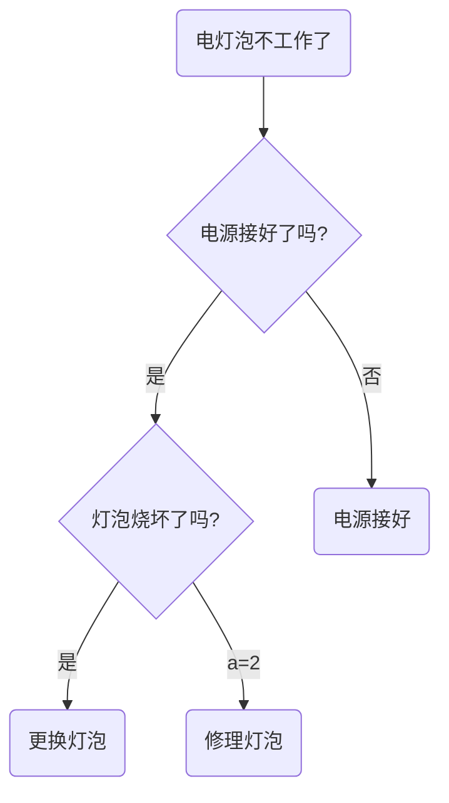
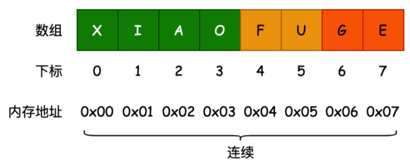

# 邂逅数据结构和算法-线性结构-数组

## 一、邂逅数据结构与算法

编程源头和尽头，都是数据结构。

很多语言在底层封装好了数据结构。

## 二、编程的真相，对数据的处理

编程的最终目的只有一个：对数据进行处理。

- 评判程序员编程能力、水平的高低，要看你是否可以更好的处理数据。
- 可以说，所有的编程领域（前端、后端、算法、人工智能、区块链...），所有的编程语言（JavaScript、Java、C++、...），最终的目的，都是为了处理数据。

方便、高效的**处理（组织，存储、操作）**数据，是评判一个开发人员能力的重要指标（甚至是唯一的指标）。

- 目前，虽然很多的系统、框架，已经提供了足够多好用的 API，在大多数时候，我们只需要调用这些 API 即可。
- 但是，如何更好的组织数据和代码，以及当数据变得复杂时，以什么方式处理这些数据，依然非常重要。
- 只有可以更好的处理数据，才能成为一个真正的开发工程师，而不只是一个“API 调用程序员”。

以前端、后端为例：

- 前端，从后端获取数据，对数据进行处理、展示；和用户进行交互产生新的数据，传递给后端，
- 后端进行处理、保存到数据库，以便后续读取、操作、展示等等；

## 三、数据结构与算法的本质

数据结构与算法的本质就是：一门研究数据如何**组织、存储、操作**的科目。

Pascal 之父，Nicklaus Wirth 凭借一个公式，获得图灵奖：

- `算法 + 数据结构 = 程序（Algorithm + Data Structures = Programs）`。

所以，数据结构与算法，是程序的核心，是所有编写的程序的灵魂。

勿在浮沙筑高台 只有掌握了扎实的数据结构与算法，

- 才能更好的理解编程，编写高效的程序。
- 对于程序的理解，不再停留于表面，
- 在学习其他的系统、编程语言时，也可以做到高屋建瓴、势如破竹。

## 四、数据结构与算法的实际应用

### 1.底层构建

随处可见数据结构与算法：

- 操作系统（Windows、MacOS、...）;
- 编程语言（JavaScript、Java、C++、Python、...）
- 框架（Vue、React、Spring、Flask、...）；

它们的底层实现，到处都是数据结构与算法。

以前端为例：

前端框架中，会大量使用**栈结构、队列结构**，来解决问题，比如：

- Vue 源码、 React 源码、Webpack 源码中，可以看到**队列结构、栈结构、树结构...**；
- Webpack 源码中，还可以看到很多**图结构（Graph）**；

实现一门语言，或者引擎本身，也需要大量的数据结构，比如：

- **哈希表结构、队列结构**（微任务队列、宏任务队列）

前端无处不在的数据结构：

- DOM Tree（**树结构**）：AST（**抽象语法树**）。

### 2.大场面试

对于很多企业来说，想要短时间考察一个人的能力以及未来的潜力，数据结构与算法，是非常重要指标，也会成为考察的硬性条件。

- 将数据结构与算法，掌握很好的开发人员，通常对于业务的把握肯定是没有问题的。
- 并且对于系统的设计也会更加合理，可以写出更加高效的代码。

对于想要进入大厂的开发者，经常会刷 leetcode：

- 只有系统的掌握了数据结构与算法，才能将 leetcode 上的题目融会贯通，面试遇到相关的题目，就可以对答如流。

逻辑思维、代码能力提升离不开对于数据的处理：

- 所有的编程，最终的目的，都是为了处理数据。
- 数据结构与算法，就是专为研究数据应该如何**存储、组织、操作**的。
- 所以，学习数据结构与算法，可以更好的锻炼逻辑思维能力，代码编程能力；锻炼在处理一些复杂数据时，写出更高效的程序。

掌握数据结构与算法后，如果想要转向其他的领域（比如从前端转到后端、算法工程师等）也会更加容易：

- 因为所有的编程思想，都是想通的，只是换了一种语言来处理数据而已。
- 对于未来更多的领域，比如人工智能、区块链，数据结构与算法也是它们的基石，是必须要掌握的一门课程。

## 五、数据结构和算法如何学习

学习方法：

- 高质量文章。
- 经典书籍阅读。
- Leetcode 刷题。

分为两个阶段：

阶段一：TS 常见数据结构和算法：

1. 邂逅数据结构和算法。
2. 常见的线性结构。
3. 链表（LinkedList）
4. 哈希表（HashMap）
5. Tree 树以及操作。
6. Graph 图以及操作。

阶段二：TS 高阶数据结构与算法：

1. 高阶链表结构。
2. 高阶队列结构。
3. 二叉堆最大堆
4. AVL树-红黑树
5. 动态规划算法。
6. 排序算法。
7. 大厂算法面试题。

## 六、数据结构是什么？

这是一种相对抽象概念，并没有官方的定义：

可分开来理解它们是什么。

《数据结构、算法与应用》中的定义，非常抽象.

- “数据结构是数据对象，以及存在于该对象的实例和组成实例的数据元素之间的各种联系。这些联系可以通过定义相关的函数来给出。”

《数据结构与算法分析》中的定义，也非常抽象.

- “数据结构是 ADT（抽象数据类型 Abstract Data Type）的物理实现。”

中文维基百科中的定义，相对好理解：

- “数据结构（data structure）是计算机中**存储、组织**数据的方式。通常情况下，精心选择的数据结构，可以带来最优效率的算法。”

:egg: 案例理解：

我们知道，计算机中数据量非常庞大的，如何以高效的方式组织、存储呢？

这就好比一个庞大的图书馆中，存放了大量的书籍，我们不仅仅要把书放进去，还应该在合适的时候能够取出来。

涉及到的两个操作，分别是：

- 操作1：新书怎么插入？
- 操作2：怎么找到某本指定的书？

在自家的书房中，书籍相对较少，可以随便放。

- 插入操作：哪里有空放哪里，一步到位！
- 查找操作：找某本书，累死...


在一家大型书店中，书的数量相对较多，可以按照书名的拼音字母顺序排放。

- 插入操作：新进一本《阿Q正传》《理想国》，按照字母顺序找到位置，插入；
- 查找操作：二分查找法。


在一个图书馆中，书的数量相当庞大，我们可以把书架划分成几块区域，按照类别存放，类别中再按照字母顺序排列：

- 插入操作：先定类别，二分查找确定位置，移出空位；
- 查找操作：先定类别，再二分查找。


结论：

解决问题方法的效率，与数据的组织方式有关；

计算机中，存储的数据量，相对于图书馆的书籍来说，数据量更大，数据种类更多；

以什么样的方式，来存储和组织我们的数据，才能在使用数据时，更加方便和有效呢？

这就是数据结构需要考虑的问题。

## 七、常见的数据结构

在计算机中，对于数据的**组织、存储**，会影响数据**操作**的效率。

常见的数据结构较多，每一种都有其应用场景，不同的操作，性能是不同的。

- 有的，查询性能很快（数组）；有的，插入速度很快（链表）；有的，是插入头和尾速度很快；有的，做范围查找很快；
- 有的，允许元素重复；有的，不允许重复等等。

在开发中如何选择，要根据具体的需求来选择。

> 注意：数据结构和语言无关，常见的编程语言，都有直接或者间接的使用上述常见的数据结构。

在 JavaScript 中，似乎没有接触过数据结构，只见过 Array 数组。

- 这是因为，很多数据结构，是需要再进行高阶开发（比如设计框架源码）时才会用到的。
- 某些数据结构，在 JavaScript 中本身是没有的，需要从零去实现。

使用封装好的数据结构，是“API 调用程序员”的思考方式，

理解数据结构如何实现，再如何使用。了解真相，你才能获得真正的自由。

常见的数据结构有：

- 数组（Array）
- 链表（LinkedList）
- 队列（Queue）
- 栈结构（Stack）
- 散列表（Hash）
- 树结构（Tree）
- 堆结构（Heap）
- 图结构（Graph）

> 补充一：
>
> Set / Map 不算数据结构，它们底层用到的 Hash 表，才是数据结构。
>
> 像 Java 中的 HashMap、TreeMap，是基于数据结构封装的，本身不是数据结构。底层的 Hash 表，Tree 树，才是数据结构。
>
> 补充二：
>
> 堆结构，基于树结构，又基于完全二叉树结构。获取最值的时候，非常方便。用于解决 TopK 的问题。
>

## 八、算法是什么？

算法（Algorithm）的认识：

- 很多人以前可能接触过几种排序算法，并且知道不同的算法，执行效率是不一样的。
- 也就是说，解决问题的过程中，不仅仅数据的存储方式会影响效率，算法的优劣也会影响着效率。

算法的定义：

- 一个有限指令集，每条指令的描述，不依赖于语言；
- 接收一些输入（有些情况下不需要输入）；
- 产生输出；
- 一定会在有限步骤之后终止。

算法通俗理解：

- Algorithm 这个单词，本意就是解决问题的办法/步骤逻辑。

- 所以，下面简单的几行代码，也可以定义为算法：：

  ```js
  let num1 = 10
  let num2 = 20
  const res = num1 + num2
  ```

数据结构的实现，离不开算法。

- 编写一段指令（逻辑），去实现某一种数据结构。
- 这里的指令，就是算法。

> 不同的算法，比如排序算法有：冒泡排序、快速排序、插入排序...，适用于不同的场景。
>
> 评判算法效率的方式：【大 O 表示法（标记法）】

举例：电灯泡不工作的解决办法：



## 九、生活中的数据结构

前面我们提到了图书的摆放案例。

- 为了更加方便的插入和搜索书籍，需要合理的组织数据，并且通过更加高效的算法，插入、查询数据。
- 除了这些，生活中还有很多案例。

另一个生活中的案例，快递员的快递：

- 快递通常会放在某个固定的地方，让收件者自己去拿。
- 此时有两种情况：情况一，自己在海量的快递中找，情况二，快递员让你报出名字，它帮你找。
- 自己寻找相当于**线性查找**，一个个挨着看。
- 快递员帮我们找。快递员通常是对快递进行分类，比如按照名字分类。
  - 当你报出名字，他会根据姓氏锁定到某一个区域的快递中，再根据名字马上帮你找到。
  - 这就体现了合理的组织数据，对于我们获取数据效率的重要性至关重要。

## 十、生活中的算法

找出线缆出问题的地方：

- 假如上海和杭州之间，有一条高架线，长度是 1,000,000 米，某天高架线中有其中一米出现了故障。
- 需要一种算法，可以快速定位到出问题的地方。

线性查找：

- 从上海的起点开始，一米一米的排查，最终一定能找到出问题的线段。
- 但是坏的情况，需要排查 1,000,000 米（出问题的线段在另一头）。
- 平均也需要排查 500,000 米。

二分查找：

- 从中间位置开始排查，看一下问题出在上海到中点这一段，还是中点到杭州这一段。
- 查找对应的问题后，再从中间位置分开，重新锁定一半的路程。
- 最坏的情况，需要多少次可以排查完呢？ 最坏的情况是 20 次，就可以找到出问题的地方。
  - 计算公式：`log(1000000，2)`，以 2 为底，1000000 的对数，约等于 20。

结论：

- 解决问题的办法有很多。
- 但是，好的算法，对比于差的算法，效率天壤之别。

后续还会介绍【大 O 表示法】来评定算法的效率。

## 十一、线性结构

维基百科对于线性结构的定义：

线性结构（Linear List），是由 `n（n ≥ 0)` 个数据元素（结点），如：`a[0]，a[1]，a[2]…，a[n-1]` 组成的有限序列。

其中，数据元素的个数 n，定义为表的长度，`“list”.length()`；

- `“list”.length() = 0`（表里没有一个元素）时，称为空表；
- 将非空的线性表（`n>=1`）记作：`a[0]，a[1]，a[2]，…，a[n-1]`。
- 数据元素 `a[i]`（`0 ≤ i ≤ n-1`）只是个抽象符号，其具体含义在不同情况下可以不同。
  - 可以是一个数字，字符串，或是一个数组...。

线性结构有：

- 数组结构（Array）；
- 链表结构（LinkedList）；
- 栈结构（Stack）（受限的线性结构）；
- 队列结构（queue）（受限的线性结构）。

## 十二、数组结构

**数组（Array）结构**，是一种重要的数据结构：

- 几乎每种编程语言，都会提供的一种原生数据结构；

  > Java 中的 ArrayList 是根据原生 Array 封装的，提供了好用的方法和属性，本质上还是一种数组结构。

- 并且可借助于该数据结构，来实现其他的数据结构，比如：
  
  - 栈（Stack）、队列（Queue）、堆（Heap）；
  
  > 堆（Heap）结构，基于完全二叉树（节点都是固定的）实现的，底层还是基于数组（Array）实现的。

通常，数组的内存是**连续的**，所以在有下标值的情况下，访问数组中的元素，效率是非常高的。

- 数组根据索引，和内存寻址，查找元素；效率很高。但插入、删除元素效率低（需要从插入、删除的地方，向后替换元素）。
- 链表插入、删除、插入元素效率高。查询效率相对较低。



> 早期的 JavaScript，实现的数组，不是连续的内存地址，而是类似于链表结构的数据结构。造成查询效率相对较低。

TypeScript 中，数组的各种用法，和 JavaScript 是一致的，[参考文档](https://developer.mozilla.org/zh-CN/docs/Web/JavaScript/Reference/Global_Objects/Array)。

后续在讨论数组和链表的关系区别时，会通过【大O表示法】，来分析数组操作元素的时间复杂度问题。

