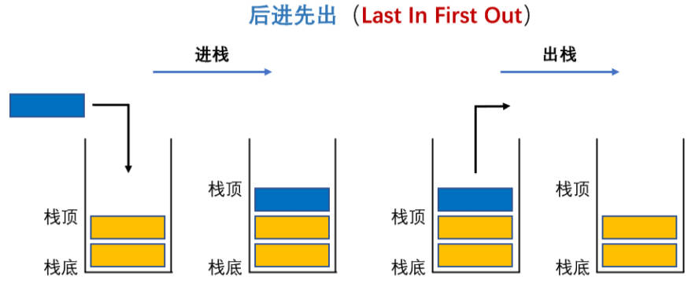
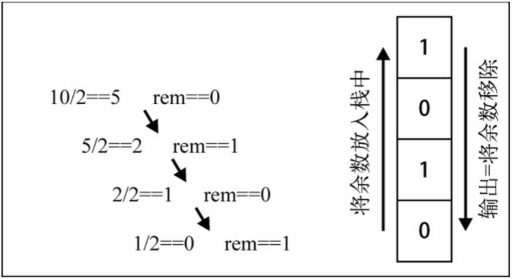

# 栈结构

## 一、栈结构（stack）是什么？

栈（Stack）是一种常见的数据结构，在程序中的应用，非常广泛。

回顾，数组结构：

- 数组是一种线性结构，可以在任意位置，插入、删除元素。

有时候，为了实现某些数据结构的**特性**，必须基于某一数据结构，对操作的任意性，加以限制。

栈，队列，就是**受限的线性结构**。

栈结构示意图



栈（stack），的特性是：**后进先出（Last in First out）** / **先进后出（First in Last out）**:

其限制体现在，仅允许在一端进行插入、删除操作。这一端被称为**栈顶**，另一端称为**栈底**。

LIFO（last in first out）表示后进入的元素，第一个弹出栈空间。

在栈中，插入新元素，又称作：**进栈/入栈/压栈**，它是把新元素，放到栈顶元素的上面，使之成为新的栈顶元素；

在栈中，删除元素，又称作：**出栈/退栈/弹栈**，它是把栈顶元素，删除掉，使其相邻的元素，成为新的栈顶元素。

生活中，类似于栈结构的场景：

- 自助餐的托盘，最新放上去的，最先被客人拿走使用。
- 收到很多的邮件(实体的)， 从上往下依次处理这些邮件。(最新到的邮件，最先处理)；
  - 注意: 如果改变邮件的次序，比如从最小开始，或者处于最紧急的邮件开始处理，就不再是栈结构了。而是**队列**或者**优先级队列**结构。

## 二、面试题一

有六个元素按照 6, 5, 4, 3, 2, 1，的顺序进栈，问下列哪一个不是合法的出栈序列：

A. 5，4，3，6，1，2

B. 4，5，3，2，1，6

C. 3，4，6，5，2，1

D. 2，3，4，1，5，6

正确答案：C

解析：

- A答案: 65进栈， 5出栈， 4进栈出栈， 3进栈出栈， 6出栈， 21进栈，1出栈， 2出栈
- B答案: 654进栈， 4出栈， 5出栈， 3进栈出栈， 2进栈出栈， 1进栈出栈， 6出栈
- D答案: 65432进栈， 2出栈， 3出栈， 4出栈， 1进栈出栈， 5出栈， 6出栈

## 三、栈结构的实现

栈结构实现，有两种常见方式:

- 基于数组实现；
- 基于链表实现。

> 链表是一种数据结构，JavaScript 中并没有内置链表结构。
>

基于数组，实现栈结构：

demo-project\01-栈结构\01-ArrayStack.ts

```typescript
import { IStack } from './type';

/**
 * @description: 此类用于：封装栈（Stack)数据结构。
 * @Author: ZeT1an
 * @return {*}
 */
export class ArrayStack<T> implements IStack<T> {
  private data: T[] = [];

  push(item: T): void {
    this.data.push(item);
  }

  pop(): T | undefined {
    return this.data.pop();
  }

  // 此函数用于：获取栈顶的元素
  peek(): T | undefined {
    return this.data[this.data.length - 1];
  }

  isEmpty(): boolean {
    return this.data.length === 0;
  }

  size(): number {
    return this.data.length;
  }
}

// 示例使用
const stack = new ArrayStack<number>();
stack.push(1);
stack.push(2);
stack.push(3);

console.log(stack.pop());    // 输出：3
console.log(stack.peek());   // 输出：2
console.log(stack.size());   // 输出：2
console.log(stack.isEmpty());  // 输出：false
```

使用 ts-node 在 Node 环境中，运行代码。

### 1.栈的操作有哪些？

`push(element)`: 添加一个新元素，到栈顶位置。

`pop()`：移除栈顶的元素，同时返回被移除的元素。

`peek()`：返回栈顶的元素，不对栈做任何修改。

`isEmpty()`：如果栈里没有任何元素，就返回 `true`，否则返回 `false`。

`size()`：返回栈里的元素个数。这个方法和数组的 `length` 属性类似。

为封装栈结构的类，实现一个接口。

demo-project\01-栈结构\type.d.ts

```typescript
export interface IStack<T> {
  push(item: T): void; // 添加元素到栈顶
  pop(): T | undefined; // 移除栈顶元素并返回
  peek(): T | undefined; // 返回栈顶元素但不移除
  isEmpty(): boolean; // 判断栈是否为空
  size(): number; // 获取栈的大小
}
```

> 不用继承，而是用接口；
>
> - 当父类中，可实现方法时，用继承。
> - 这个地方用接口。
>
> 继承/接口，是多态的前提。

## 四、面试题二，十进制转二进制

前面，我们封装好了 `ArrayStack` 类，现在用它解决一些计算机科学中的问题。

将十进制转成二进制。

为什么需要十进制转二进制？

- 现实生活中，我们主要使用十进制。
- 但在计算科学中，二进制非常重要，因为计算机里的所有内容，都是用二进制数字表示（0 和 1）。
- 没有十进制和二进制相互转化的能力，与计算机交流就很困难。
- 转换二进制是计算机科学和编程领域中经常使用的算法。

如何实现十进制转二进制？

- 要把十进制转化成二进制，我们可以将该十进制数字，整除 2（二进制是满二进一），直到结果是 0 为止。

举个例子，把十进制的数字 10 转化成二进制的数字，过程大概是这样：



demo-project\01-栈结构\02-面试题-十进制转二进制.ts

```typescript
import { ArrayStack } from './01-ArrayStack';

function dec2bin(dec:number): string {
  const stack = new ArrayStack()

  while (dec > 0) {
    stack.push(dec % 2)
    dec = Math.floor(dec / 2)
  }

  let bin = ''
  while (!stack.isEmpty()) {
    bin += stack.pop()
  }

  return bin
}

console.log(dec2bin(10))
console.log('---')
console.log(dec2bin(100))
```

> while / for 循环如何选择：
>
> - while 循环，不确定次数。
> - for 循环，知道次数。
>
> 多去做题，不做，肯定想不到。

## 五、面试题三，有效的括号

有效的括号

给定一串字符串，其中包括 '('，')'，'{'，'}'，'['，']'，判断字符串中的括号，是否有效。

[Leetcode 20](https://leetcode.cn/problems/valid-parentheses/description)

有效字符串，需满足：

- 左括号必须用相同类型的右括号闭合；
- 左括号必须以正确的顺序闭合；
- 每个右括号，都有一个对应的相同类型的左括号。

demo-project\01-栈结构\03-面试题-有效的括号.ts

```typescript
import { ArrayStack } from './01-ArrayStack';

function isValid(str:string) {
  const stack = new ArrayStack()

  for (let i = 0; i < str.length; i++) {
    const c = str[i];
    switch (c) {
      case '(':
        stack.push(')')
        break;
      case '{':
        stack.push('}')
        break;
      case '[':
        stack.push(']')
        break;
      default:
        // 一旦有一个括号未匹配，就返回 false
        if (c !== stack.pop()) return false
        break;
    }
  }

  // 如果栈中，还有元素，表示有左括号，没闭合，返回 false，否则返回 true
  return stack.isEmpty()
}

console.log(isValid("()"))
console.log(isValid("([]){}"))
console.log(isValid("(]"))
```

关键在于一一对应。
