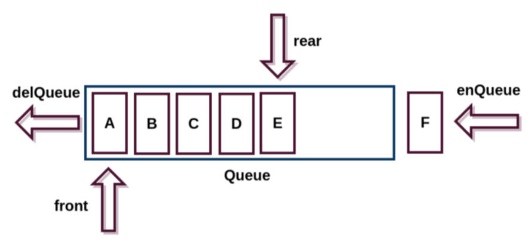

# 队列结构

## 一、队列结构是什么？

受限的线性结构：

- 前面介绍了一种受限的线性结构：栈结构。
- 这种受限的数据结构，对于解决某些特定问题，会有特别的效果。

队列(Queue)，它也是一种受限的线性表，它的特性是：**先进先出(FIFO First In First Out)**

- 受限之处在于，它只允许在队列的前端（front），进行删除操作；
- 而在队列的后端（rear）进行插入操作；



>遍历二叉树的几种方式：
>1.先序遍历；
>2.中序遍历；
>3.后序遍历；
>4.层序遍历（要用到队列）。

## 二、生活中的队列结构

电影院，商场，排队。

优先排队的人，优先处理。（买票，结账，WC）。

## 三、开发中的队列结构

打印队列：

- 有若干文档需要打印，打印机会按照文档放入队列的次序，依次从队列中取出文档打印，直到队列中不再有新的文档。

线程队列：

- 在开发中，为了让任务可以并行处理，通常会开启多个线程。
- 但是，不会让大量的线程同时运行处理任务，否则会占用过多的资源；
- 这时，会使用线程队列，依照次序来启动线程，并且处理对应的任务。

当然，队列还有很多应用，后续很多算法中，都会用到队列（比如二叉树的层序遍历）。

## 四、队列的实现

队列的实现，和栈一样，有两种方案：

- 基于数组实现；
- 基于链表实现。

> 基于链表实现更好；在列表中删除指针，就可以实现元素的删除。
>
> 数组是一段连续的内存，删除了前面的内容，后面的要向前移，浪费性能。

创建类，封装一个队列

demo-project\02-队列\01-ArrayQueue.ts

```typescript
import type { IQueue } from './iqueue';

class ArrayQueue<T> implements IQueue<T> {
  private data: T[];

  constructor() {
    this.data = [];
  }

  enqueue(item: T) {
    this.data.push(item);
  }

  dequeue(): T | undefined {
    return this.data.shift();
  }

  peek(): T | undefined {
    return this.data[0];
  }

  isEmpty(): boolean {
    return this.data.length === 0;
  }

  size(): number {
    return this.data.length;
  }

  clear() {
    this.data = [];
  }
}

// 示例用法
const queue = new ArrayQueue<number>();
queue.enqueue(1);
queue.enqueue(2);
queue.enqueue(3);

console.log(queue.dequeue()); // 输出: 1
console.log(queue.peek()); // 输出: 2
console.log(queue.isEmpty()); // 输出: false
console.log(queue.size()); // 输出: 2

queue.clear();
console.log(queue.isEmpty()); // 输出: true
```

代码解析：

- 创建了一个 ArrayQueue 类，它是一个泛型类。
- 在类中，定义了一个属性 data，这个属性用于保存当前队列对象中所有的元素 (和创建栈非常相似)。
- 这个属性，是一个数组类型，之后在队列中，添加、删除元素，都是在这个数组中完成的。
- 队列和栈一样，有一些相关的操作方法，无论是什么语言，操作都是比较类似的。

### 1.常见操作

`enqueue(element)`：向队列尾部添加一个（或多个）新的元素。

`dequeue()`：移除队列的第一（即排在队列最前面的）元素，并返回被移除的元素。

`front/peek()`：返回队列中第一个元素，队列不做任何变动。

`isEmpty()`：如果队列中不包含任何元素，返回 `true`，否则返回 `false`。

`size()`：返回队列包含的元素个数，与数组的 `length` 属性类似。

### 2.封装一个接口

demo-project\02-队列\type.d.ts

```typescript
export interface IQueue<T> {
  enqueue(item: T): void
  dequeue(): T | undefined
  peek(): T | undefined
  isEmpty(): boolean
  size(): number
  clear(): void
}
```

抽取栈、队列中相同的方法。

demo-project\type\ilist.ts

```typescript
export interface IList<T> {
  peek(): T | undefined; // 返回栈顶元素但不移除
  isEmpty(): boolean; // 判断栈是否为空
  size(): number; // 获取栈的大小
}
```

demo-project\02-队列\iqueue.ts

```typescript
import type { IList } from "../type/ilist"

export interface IQueue<T> extends IList<T> {
  enqueue(item: T): void
  dequeue(): T | undefined
  clear(): void
}
```

## 五、面试题，击鼓传花

击鼓传花，是一个常见的面试算法题： 使用队列，可以非常方便的实现最终的结果。

原游戏规则：

- 所有学生围成一圈，从某位同学手里开始向旁边的同学传一束花。
- 此时，某个人在击鼓，鼓声停下的一刻，花落在谁手里，谁就出来表演节目。

修改游戏规则：

- 几个朋友一起玩一个游戏，围成一圈，开始数数，数到某个数字的人自动淘汰。
- 最后剩下的这个人，会获得胜利，请问最后剩下的是原来在哪一个位置上的人?

封装一个基于队列的函数：

- 参数：所有参与人的姓名组成的数组；
- 结果：最终剩下的一个人，在原数组中的索引；

代码实现

demo-project\02-队列\02-面试题-击鼓传花.ts

```typescript
import { ArrayQueue } from './01-ArrayQueue';

function hotPotato(players: string[], num: number): number {
  if (players.length === 0) return -1

  // 1.创建队列
  const queue = new ArrayQueue<string>()

  // 2.所有玩家入队
  players.forEach(item => {
    queue.enqueue(item)
  })

  while (queue.size() > 1) {
    // 1、2 不淘汰
    for (let i = 1; i < num; i++) {
      queue.enqueue(queue.dequeue()!)
    }
    // 3 淘汰
    queue.dequeue()
  }

  // 返回获胜者的索引
  return players.indexOf(queue.dequeue()!)
}

console.log(hotPotato(['zzt', 'messi', 'ronaldo', 'krose', 'kevin'], 3))
```

## 六、面试题，约瑟夫环问题

阿桥问题（也称为**约瑟夫斯置换**），是一个出现在计算机科学和数学中的问题。在计算机编程的算法中，类似问题又称为约瑟夫环。

- 人们站在一个等待被处决的圈子里。
- 计数从圆圈中的指定点开始，并沿指定方向围绕圆圈进行。
- 在跳过指定数量的人之后，处刑下一个人。
- 对剩下的人重复该过程；
- 直到只剩下一个人，并被释放。

在给定数量的情况下，站在第几个位置可以避免被处决？

> 这个问题是以弗拉维奥·约瑟夫命名的，他是1世纪的一名犹太历史学家。
>
> - 他在自己的日记中写道，他和他的 40 个战友被罗马军队包围在洞中。
> - 他们讨论是自杀还是被俘，最终决定自杀，并以抽签的方式决定谁杀掉谁。

击鼓传花和约瑟夫环其实是同一类问题，这种问题还会有其他解法（后续讲解）同样的题目在 Leetcode 上也有：

- [Leetcode 上也有](https://leetcode.cn/problems/yuan-quan-zhong-zui-hou-sheng-xia-de-shu-zi-lcof/)
- 0,1,···,n-1 这 n 个数字，排成一个圆圈，从数字 0 开始，每次从这个圆圈里，删除第 m 个数字（删除后从下一个数字开始计数）。求出这个圆圈里剩下的最后一个数字。
- 例如，0、1、2、3、4 这 5 个数字组成一个圆圈，从数字 0 开始每次删除第 3 个数字，则删除的前 4 个数字依次是 2、0、4、1，因此最后剩下的数字是 3。

代码实现：

demo-project\02-队列\03-面试题-约瑟夫环.ts

```typescript
import { ArrayQueue } from './01-ArrayQueue';

/**
 * @description: 此函数用于：解决与瑟夫环问题。
 * @Author: ZeT1an
 * @param {number} members 所有成员的编号总数，最小值为 1。
 * @param {number} num 间隔的个数。
 * @return {number} 或者者的编号。
 */
function josephusProblem<T>(members: number, num: number): number {
  const queue = new ArrayQueue<number>();

  for (let i = 1; i <= members; i++) {
    queue.enqueue(i);
  }

  while (queue.size() > 1) {
    for (let i = 0; i < num; i++) {
      queue.enqueue(queue.dequeue()!);
    }
    const index = queue.dequeue();
    console.log(`淘汰成员编号: ${index}`);
  }

  return queue.dequeue()!;
}

// 示例用法
const winner = josephusProblem(5, 3);
console.log(`最后幸存者编号: ${winner}`);
```

也可用动态规划来做。

demo-project\02-队列\04-约瑟夫环（动态规划）.ts

```typescript
function lastRemaining(n: number, m: number): number {
  let position = 0;

  for (let i = 2; i <= n; i++) {
      position = (position + m) % i;
  }

  return position;
}

console.log(lastRemaining(5, 3)) // 3
console.log(lastRemaining(10, 17)) // 2
```

> 优先级队列，可用数组，链表，堆（要先学二叉树）来实现。
