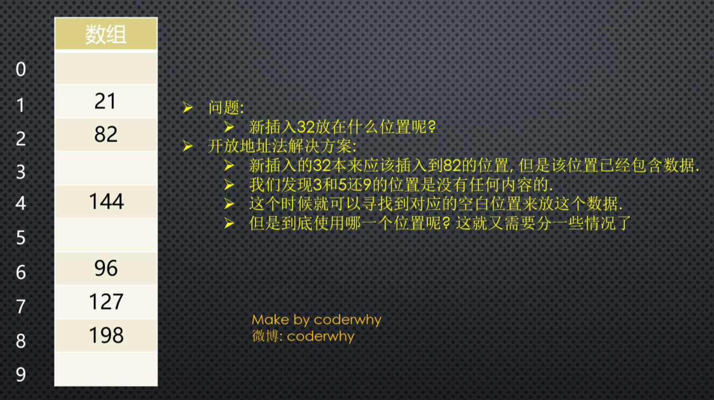

# 算法复杂度 & 哈希表

## 一、大 O 表示法

**大O表示法（Big O notation）**英文置译为“大 O 符号”。

这个记号，是在德国数论学家爱德蒙·兰道的著作中推广的，因此它有时又称为**兰道符号（Landau symbols）**。

代表“order of ...”（……阶）的大 O，最初是一个大写希腊字母“Ο”（omicron），现今用的是大写拉丁字母“O”。

大 O 符号，在分析算法效率的时候非常有用。

- 比如，解决一个规模为 n 的问题，所花费的时间（或者所需步骤的数目）可以表示为：当 n 增大时，n² 项开始占据主导地位，其他各项可以被忽略；
- 说明：当 n = 500
  - 4n² 项是 2n 项的 1000 倍，因此在大多数场合下，后者（2n 项），对表达式的值的影响，是可以忽略不计的。
  - 进一步看，如果我们与任一其他级的表达式比较，n² 的系数（4）也是无关紧要的。
- 所以，我们说该算法，具有 n² 阶（平方阶）的时间复杂度，表示为 `O(n²)`。

:egg: 案例理解：

顺序查找：

```typescript
function sequentSearch(array: number[], num: number) {
  const length = array.length
  for (let i = 0; i < length; i++) {
    if (array[i] === num) {
      return i
    }
  }
  return -1
}
```

上面代码，指令执行的次数，大致是 5n + 2。推导成大 O 表示法为 `O(n)`。

### 1.常见对数阶

常用的函数阶：

| 符号                   | 名称                                              |
| ---------------------- | ------------------------------------------------- |
| O(1)                   | 常数阶                                            |
| O(log n)               | 对数阶                                            |
| O(n)                   | 线性，次线性阶                                    |
| O(nlog n)              | 线性对数/对数线性/拟线性/超线性阶段，如快速排序。 |
| O(n²)                  | 平方阶                                            |
| O(n²)， Integer(c > 1) | 多项式/代数阶，效率低                             |
| O(c^n^)                | 指数/几何阶，效率低                               |

表达式推导大 O 表示法

| 案例                 | 时间复杂度 | 术语       |
| -------------------- | ---------- | ---------- |
| 123456789            | 0(1)       | 常数阶     |
| 2n + 1               | O(n)       | 线性阶     |
| 6n^2^ + 3n + 2       | O(n^2^)    | 平方阶     |
| 6n^3^ + 3n + 2       | O(n^3^)    | 立方阶     |
| 3log(2^n^) + 3n + 2  | O(log n)   | 对数阶     |
| 3nlog(2^n^) + 3n + 2 | O(nlog n)  | 线性对数阶 |
| 2^n^                 | O(2^n^)    | 指数阶     |

函数阶的效率：


> 如果要在无序的数组中查找，有两种方式：
>
> - 先排序，再二分查找。
> - 如不想打乱顺序，就线性查找。
>
> tree 结构，可到达 O(log n)
>
> Hash 表，可到达 O(1)

## 二、空间复杂度

空间复杂度，指的是：程序运行过程中，所需要的额外存储空间。

空间复杂度，也可以用大 O 表示法来表示；

空间复杂度的计算方法，与时间复杂度类似，通常需要分析程序中，需要额外分配的内存空间：

- 比如：数组、变量、对象、递归调用（栈）等。

举个栗子🌰：

- 对于一个递归算法来说，每次调用，都会在内存中分配新的**栈帧**，占用了额外的空间，因此，该算法的空间复杂度是 `O(n)`，其中 n 是递归深度。
- 对于一个迭代算法来说，每次迭代，不需要分配额外的空间，因此，其空间复杂度为 `O(1)`。

当空间复杂度很大时，可能会导致内存不足，程序崩溃（比如递归）。

在平时进行算法优化时，我们通常会进行如下的考虑：

- 使用尽量少的空间（优化空间复杂度）；
- 使用尽量少的时间（优化时间复杂度）；
- 特定情况下：使用**空间换时间**或使用**时间换空间**；
  - 比如：动态规划，其中可以使用递归，但不推荐。

> 一般对比算法的复杂度，还是以“时间复杂度”为主。

## 三、数组和链表的复杂度对比

大 O 表示法，对比数组和链表的**时间复杂度**。

| 数据结构    | 访问 | 查找                                | 插入 | 删除 |
| ----------- | ---- | ----------------------------------- | ---- | ---- |
| Array       | O(1) | O(n)（有序数组，可优化成 O(log n)） | O(n) | O(n) |
| Linked list | O(n) | O(n)                                | O(1) | O(1) |

数组，是一种连续的存储结构，通过下标，可以直接访问数组中的任意元素。

- 时间复杂度：使用下标访问为 `O(1)`，插入和删除操作为 `O(n)`。
- 空间复杂度：数组是连续的存储空间，空间复杂度为 `O(n)`。

链表，是一种链式存储结构，通过指针链接起来的节点组成，访问链表中元素需要从头结点开始遍历。

- 时间复杂度：访问或查找为 `O(n)`，插入和删除操作为 `O(1)`。
- 空间复杂度：链表需要为每个节点分配存储空间，空间复杂度为 `O(n)`。

在实际开发中，选择使用数组还是链表 需要根据具体应用场景来决定。

- 如果数据量不大，或者需要频繁随机访问元素，使用数组会更好。
- 如果数据量大，或者需要频繁插入和删除元素，使用链表会更好。

## 四、哈希表的优势/劣势

几乎所有的编程语言，都有直接或者间接地应用 Hash 表这种数据结构。

哈希表通常是**基于数组**进行实现的，但是相对于数组，它有很多的优势：

- 无论多少数据，都可提供非常快速的**插入-删除-查找**操作；时间复杂度接近**常量阶**的：即 `O(1)`，只需要几个机器指令即可完成；

- 哈希表的速度，比树（Tree）还要快，基本可以瞬间查找到想要的元素；
- 哈希表相对于树来说，编码要容易很多；

哈希表相对于数组的一些不足：

- 哈希表中的数据，是**没有顺序**的，所以不能以一种固定的方式（比如：从小到大）来遍历其中的元素（没有特殊处理情况下）。
- 通常情况下，哈希表中的 key 是不允许重复的，不能放置相同的 key，来保存不同的元素。

## 五、哈希表是什么？

哈希表不像数组、链表，树一样，可以直观地画出空间结构。

事实上，它的结构就是数组，但是它的特点在于，对数组下标值的一种变换，

这种变换，就是哈希化的过程，即通过哈希函数获取到 HashCode。


哈希表中，桶（bucket）可以使用数组和链表。

## 六、两个案例

下面两个案例，需要你挑选某种数据结构，来实现；而你会发现，最好的选择，就是哈希表。

- 案例一：公司使用一种数据结构，来保存所有员工信息；
- 案例二：使用一种数据结构，存储单词信息；
  - 比如有 50000 个单词。找到单词后，每个单词有自己的翻译 & 读音 & 应用...；

### 1.公司员工存储

案例介绍：

- 一家公司有 1000 个员工，使用某种数据结构，将他们的信息保存起来。

方案一：数组

- 按照顺序，将所有的员工，依次存入一个长度为 1000 的数组中。
- 每个员工的信息，都保存在数组的某个位置上。
- 然而，要查看某个具体员工的信息，效率较低。
- 因为，数组最大的优势是通过下标值去获取信息。
- 所以，为了可以通过数组快速定位到某个员工，最好给员工信息中，添加一个员工编号(工号)，而编号对应的就是员工的数组下标值。

- 当查找某个员工的信息时，通过员工编号，可以快速定位到员工的信息位置。

方案二：链表

- 链表对应插入和删除数据有一定的优势。
- 但是对于查找员工的信息，每次都必须从头遍历到尾，这种方式显然不是特别适合这里，效率很低。

最终方案：

- 这样看，最终方案似乎就是数组了。但是数组还是有缺点。
- 如果不知道员工的编号，要根据员工的姓名查找，数组结构就没有优势了。
- 有没有一种办法，让“zzt“的名字，和它的员工编号，产生直接的关系？
- 也就是通过”zzt“这个名字，就能获取到它在数组中的索引值，再通过索引值，就能获取到”zzt“的信息？
- 这样的方案已经存在了，就是使用**哈希函数**，让某个 key 的信息，和索引值对应起来。

### 2.50000 个单词的存储

案例介绍：

- 使用一种数据结构，存储 50000 个单词信息；
- 找到单词后，每个单词有自己的翻译 & 读音 & 应用...
- 这个案例，能更加明显地感受到数组的缺陷。

方案一：数组

- 比如一个单词 Iridescent，为了找到这个单词的翻译/读音/应用。怎么可以从数组中查到这个单词的位置呢？
- 线性查找？50000 次比较？如果你使用数组来实现这个功能，效率会非常非常低，而且你一定没有学习过数据结构。

方案二：链表？

- 效率低，更不需要考虑了。

方案三：有没有一种方案，可以将单词转成数组的下标值呢？

- 如果单词转成数组的下标，那么以后我们要查找某个单词的信息，直接按照下标值，一步即可访问到想要的元素。

## 七、字符串转下标值

似乎所有的案例，都指向了一个目标：将字符串转成下标值。

怎么转呢？其实就是字母/文字，转数字。

现在，我们需要设计一种方案，可以将单词转成适当的下标值：

- 其实，计算机中有很多的编码方案，就是用数字代替单词的字符。即**字符编码**。
- 比如 ASCII 编码：`a` 是 `97`，`b` 是 `98`，依次类推 `122` 代表 `z`
- 我们也可以设计一个自己的编码系统，比如 `a` 是 `1`，`b` 是 `2`，`c` 是 `3`，依次类推，`z` 是 `26`。
- 当然我们可以加上空格用 `0` 代替，共 27 个字符（不考虑大写问题）。

有了编码系统后，一个单词如何转成数字呢？

将查询的关键词，与数组下标（索引）联系起来。有以下两种方案：

### 1.方案一：数字相加

一种转换单词的简单方案，就是把单词每个字符的编码相加。

- 例如：单词 cats 转成数字：`3 + 1 + 20 + 19 = 43`，那么，43 就作为 cats 单词的下标存在数组中。

这种方案，有一个很明显的问题，就是很多单词，最终的下标，可能都是 43。

- 比如 was/tin/give/tend/moan/tick...。
- 我们知道，数组中一个下标值位置，只能存储一个数据。
- 如果存入后来的数据，必然会造成数据的覆盖。
- 一个下标存储这么多单词显然是不合理的。
- 虽然后面的方案也会出现，但是要尽量避免。

### 2.方案二：幂的连乘

数字相加的方案就有些过于普通了。

现在，我们想通过一种算法，让 cats 转成数字后，不那么普通。

有一种方案，就是使用**幂的连乘**，什么是幂的连乘呢？

- 其实我们平时使用的大于 10 的数字，可以用一种幂的连乘来表示它的唯一性：
  - 比如：`7654 = 7 * 10³ + 6 * 10² + 5 * 10 + 4`
- 单词也可以使用这种方案来表示：
  - 比如 cats = `3 * 27³ + 1 * 27² + 20 * 27 + 17 = 60337`
- 这样得到的数字可以基本保证它的唯一性，不会和别的单词重复。

问题：如果一个单词是 zzzzzzzzzz（一般英文单词不会超过 10 个字符）。那么，得到的数字将超过 7000000000000。

- 数组可以表示这么大的下标值吗？
- 而且就算能创建这么大的数组，也会有很多冗余的空间。
- 创建这么大的数组是没有意义的。

## 八、下标的压缩

现在需要一种压缩方法，把幂的连乘方案，得到的巨大整数范围，压缩到可接受的数组范围中。

对于英文词典，多大的数组才合适呢？

- 如果有 50000 个单词要保存，那么要定义一个长度为 50000 的数组。
- 但是实际情况中，往往需要更大的空间，来存储这些单词。比如两倍的大小：100000。
- 因为不能保证单词会映射到每一个位置。

如何压缩呢？

- 把 0 到超过 7000000000000 的范围， 压缩为从 0 到 100000。
- 有一种简单的方法，就是使用**取余操作符**，它的作用是得到一个数被另外一个数整除后的余数。

取余操作的实现：

- 先来看一个较小的数字范围，压缩到一个更小的空间中。
- 假设把从 `0~199` 的数字（用 `largeNumber` 代表），压缩为从 `0-9` 的数字（用 `smallRange` 代表）。
- 下标值的结果：`index = largeNumber % smallRange`;
- 当一个数被 10 整除时，余数一定在 0~9 之间；
- 比如：`13 % 10 = 3`，`157 % 10 = 7`。
- 当然，这中间还是会有重复，不过重复的数量明显变小了。 因为我们的数组的长度是 100000，而只有 50000 个单词要保存。
- 就好比，你在 0~199 中，选取 5 个数字，放在长度为 10 的数组中，也会重复，但是重复的概率非常小。

后面我们会介绍，发生重复了，应该怎么解决。

## 九、哈希表的一些概念

通过上面的内容，我们初步了解了，哈希表的原理，再来看看几个概念：

- **哈希化**：将大数字，转化成数组范围内下标（hashcode）的过程。
- **哈希函数**：实现哈希化的函数。
- **哈希表**：插入数据的数组，以及对整个数组结构的封装，称之为是一个哈希表。

但是，我们还有问题需要解决：

- 虽然，我们在一个 100000 的数组中，放 50000 个单词已经足够。
- 但是，通过哈希化后的下标值，依然可能会重复，如何解决这种重复的问题呢？

## 十、冲突是什么？

尽管 50000 个单词，我们使用了 100000 个位置来存储，并且通过一种相对比较好的哈希函数来完成。但是依然有可能会发生冲突。

- 比如”melioration“这个单词，通过哈希函数得到它数组的下标值后，发现那个位置上已经存在一个单词”demystify“。
- 因为它经过哈希化后和“melioration”得到的下标是相同的。

这种情况我们成为**冲突**。


虽然我们不希望这种情况发生，而是希望每个下标，对应一个数据项，但是通常这是不可能的。

就像之前 0~199 中的数字，选取 5 个，放在长度为 10 的单元格中。

- 如果我们随机选出来的是 33，82，11，45，90，那么最终它们的位置 会是 3-2-1-5-0，没有发生冲突。
- 但是如果其中有一个 33，还有一个 73 呢？就会发生冲突了。

我们需要针对这种冲突 提出一些解决方案：

- 即使冲突的可能性比较小，你依然需要考虑到这种情况。
- 以便发生的时候进行对应的处理。

冲突不可避免，我们只能解决冲突：

如何解决这种冲突呢？常见的情况有两种方案。

- 链地址法。
- 开放地址法（用的少，复杂，性能低，不推荐）。

## 十一、冲突解决方案

### 1.链地址法

**链地址法**，是一种比较常见的解决冲突的方案，也称为**拉链法**。


图片解析：

- 从图片中我们可以看出，链地址法解决冲突的办法是：每个数组单元中，存储的不再是单个数据，而是一个链条，它通常被称为桶（bucket）。
- 这个链条使用什么数据结构呢？常见的是数组或者链表。
- 比如是链表，也就是每个数组单元中，存储着一个链表。一旦发现重复，将重复的元素，插入到链表的首端或者末端即可。
- 当查询时，先根据哈希化后的下标值，找到对应的位置，再取出链表，依次查询数据。

选择数组还是链表？

- 这里其实都可以，效率上也差不多。
- 因为根据哈希化的下标值，找出这个桶（数组或者链表）时，通常就会使用线性查找，这个时候，数组和链表的效率是差不多的。
- 依据实际情况选择，
  - 比如：新插入的数据取出的可能性更大。这种情况最好采用链表，
    - 因为数组和链表，查找的时间复杂度都是 `O(n)`；
    - 所以这种情况下，新插入的数据，放在列表的头部，被找到，花费的时间更少；
    - 然而数数组在首位插入数据，是需要所有其他项后移的，即时间复杂度是 `O(n)`，链表没有这样的问题，它插入的时间复杂度是 `O(1)`。
  - 反之。新插入的数据取出的可能性更小，这种情况最好采用数组。

> 通常，填充因子 > 0.75，就会扩容。

### 2.开放地址法（了解）

开放地址法的主要工作方式是：寻找空白的单元格，来添加重复的数据。

如下图所示：



开放地址法，其实就是要寻找空白的位置，来放置“冲突”的数据项。

探测这个位置，有三种方法：

- 线性探测；
- 二次探测；
- 再哈希法。

#### 1.线性探测

线性探测非常好理解：线性的查找空白的单元。

插入的 32：

- 经过哈希化，得到的 index = 2，但是在插入的时候，发现该位置已经有了 82。怎么办呢？
- 线性探测就是从 index 位置 +1 开始，一点点查找合适的位置来放置 32，什么是合适的位置呢？
- 空的位置就是合适的位置，在我们上面的例子中，就是 index = 3 的位置，这个时候 32 就会放在该位置。

查询 32 呢？

- 查询 32 和插入 32 比较相似。
- 首先，经过哈希化，得到 index = 2，比如 2 的位置结果，和查询的数值是否相同，相同那么就直接返回。
- 不相同呢？线性查找，从 index 位置 +1 开始，查找和 32 一样的。
- 这里有一个特别需要注意的地方：如果 32 的位置，我们之前没有插入，是否要将整个哈希表查询一遍来确定 32 存不存在？
- 当然不是，查询过程有一个约定，就是**查询到空位置，就停止**。
- 因为插入 32 时，不可能跳过空位置，去其他的位置。

删除 32 呢？

- 删除操作，和插入查询比较类似，但是也有一个特别注意点。
- 注意：删除操作一个数据项时，不可以将这个位置下标的内容设置为 null，为什么呢？
- 因为将它设置为 null 可能会影响之后其他查询操作，所以通常删除一个位置的数据项时，将它进行特殊处理(比如设置为 -1)。
- 以后看到 -1 的数据项，查询时就会跳过，插入时这个位置可以放置数据。

线性探测的问题：

- 线性探测有一个比较严重的问题，就是**聚集**。什么是聚集呢？
- 比如我在没有任何数据的时候，插入的是 22-23-24-25-26，那么意味着下标值：2-3-4-5-6 的位置都有元素。
- 这种一连串填充单元就叫做聚集。
- 聚集会影响哈希表的性能，无论是插入/查询/删除都会影响。
- 比如：我们插入一个 32，会发现连续的单元都不允许我们放置数据，并且在这个过程中我们需要探测多次。
- 下面的二次探测方案，可以解决一部分这个问题。

#### 2.二次探测

我们刚才谈到，线性探测存在的问题：

- 如果之前的数据，是连续插入的，那么新插入的一个数据可能需要探测很长的距离。

二次探测在线性探测的基础上进行了优化：

- 二次探测，主要优化的是探测时的**步长**，什么意思呢？
- 线性探测，我们可以看成是步长为 1 的探测；
  - 比如：从下标值 x 开始，那么线性探测就是 x+1，x+2，x+3，...依次探测。
- 二次探测，对步长做了优化，比如从下标值 x 开始，x+1²，x+2²，x+3²。
- 这样就可以一次性探测比较长的距离，避免那些聚集带来的影响。

二次探测的问题：

- 二次探测依然存在问题，比如我们连续插入的是 32-112-82-2-192，那么它们依次累加的时候，步长是相同的。
- 也就是这种情况下，会造成步长不一样的一种聚集。还是会影响效率(当然这种可能性相对于连续的数字会小一些)。
- 怎么根本解决这个问题呢？让每个项的步长不一样，一起来看看再哈希法吧。

#### 3.再哈希法

为了消除线性探测和二次探测中无论步长 +1 还是步长 +平方 中存在的问题, 还有一种最常用的解决方案: 再哈希法：

- 二次探测的算法，产生的探测序列步长是固定的: 1, 4, 9, 16, 依次类推.
- 现在需要一种方法: 产生一种依赖关键字的探测序列, 而不是每个关键字都一样.
- 那么, 不同的关键字，即使映射到相同的数组下标, 也可以使用不同的探测序列.
- 再哈希法的做法就是: 把关键字用另外一个哈希函数, 再做一次哈希化, 用这次哈希化的结果作为步长.
- 对于指定的关键字, 步长在整个探测中是不变的, 不过不同的关键字使用不同的步长.

第二次哈希化需要具备如下特点:

- 和第一个哈希函数不同（不要再使用上一次的哈希函数了, 不然结果还是原来的位置）。
- 不能输出为 0（否则, 将没有步长. 每次探测都是原地踏步, 算法就进入了死循环）。

其实, 我们不用费脑细胞来设计了, 计算机专家已经设计出一种工作很好的哈希函数:

- stepSize = constant - (key % constant)
- 其中 constant 是质数, 且小于数组的容量.
- 例如: stepSize = 5 - (key % 5), 满足需求, 并且结果不可能为 0.

## 十二、哈希化的效率

哈希表中，执行插入和搜索操作，效率是非常高的：

- 如果没有产生冲突，那么效率就会更高。
- 如果发生冲突，存取（操作）时间就依赖后来的探测长度。
- 平均探测长度，以及平均存取时间，取决于**填装因子**，随着填装因子变大，探测长度也越来越长。
- 随着填装因子变大，开放地址法，相比链地址法，效率下降更严重。

什么是装填因子？

- 装填因子表示：当前哈希表中，已经包含的数据项和整个哈希表长度的比值。
- 装填因子 = 总数据项 / 哈希表长度。
- 开放地址法的装填因子最大是 1，因为它必须寻找到空白的单元，才能将元素放入。
- 链地址法的装填因子最大值可以大于 1，因为拉链法可以无限的延伸下去，只要你愿意（当然后面效率就变低了）。

### 1.开放地址发效率（了解）

#### 1.线性探测效率

下面的等式，显示了线性探测时，探测序列(P)和填装因子(L)的关系

公式来自于 Knuth（算法分析领域的专家，现代计算机的先驱人物)，

公式的推导自行了解，这里仅仅说明它的效率。


图片解析：

- 当填装因子是 1/2 时，成功的搜索需要 1.5 次比较，不成功的搜索需要2.5次
- 当填装因子为 2/3 时，分别需要 2.0 次和 5.0 次比较
- 如果填装因子更大，比较次数会非常大。
- 应该使填装因子保持在 2/3 以下，最好在 1/2 以下，另一方面，填装因子越低，对于给定数量的数据项，就需要越多的空间。
- 实际情况中，最好的填装因子取决于存储效率和速度之间的平衡，随着填装因子变小，存储效率下降，而速度上升。

#### 2.二次探测、再哈希化效率

二次探测和再哈希法的性能相当。它们的性能比线性探测略好。


图片解析：

- 当填装因子是 0.5 时，成功和不成功的查找，平均需要 2 次比较。
- 当填装因子为 2/3 时，分别需要 2.37 和 3.0 次比较。
- 当填装因子为 0.8 时，分别需要 2.9 和 5.0 次。
- 因此对于较高的填装因子，对比线性探测，二次探测和再哈希法还是可以忍受的。

### 2.链地址法效率

链地址法的效率分析有些不同，一般来说，它比开放地址法简单。我们来分析一下这个公式应该是怎么样的。

- 假如哈希表包含 arraySize 个数据项，每个数据项有一个链表，在表中一共包含 N 个数据项。
- 那么，平均起来每个链表有多少个数据项呢？非常简单，N / arraySize。
- 有没有发现这个公式有点眼熟？其实就是装填因子 `localFactor = N / arraySize`。

那么现在，就可以求出查找成功和不成功的次数了：

- 成功，可能只需要查找链表的一半即可：`1 + loadFactor / 2`；
- 不成功呢？可能需要将整个链表查询完才知道不成功：1 + loadFactor。

经过上面的比较，我们可以发现，链地址法效率，好于开放地址法。

所以在真实开发中，使用链地址法的情况较多：

- 因为它不会因为添加了某元素后性能急剧下降。
- 比如在 Java 的 HashMap 中，使用的就是链地址法。


