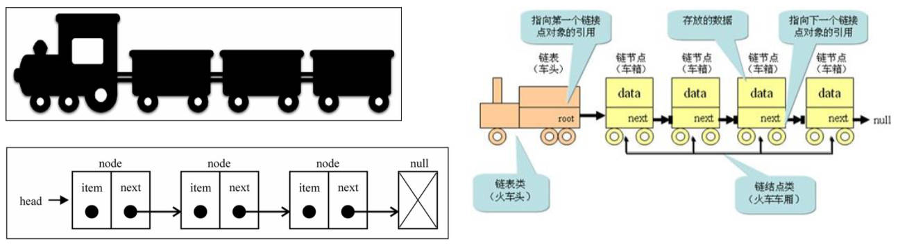

# 链表结构

## 一、链表和数组

链表、数组，都是常用的用于存储元素的数据结构，但是它们的实现机制**完全不同**。

几乎每一种编程语言，都默认实现数组结构。但是数组结构，也有很多缺点：

- 数组的创建，通常需要申请一段**连续的内存空间（一整块的内存）**，并且（大多数编程语言）**大小是固定**的；
  - 当数组不能满足容量需求时，需要扩容，一般情况下，是申请一个更大的数组（比如2倍），
  - 然后将原数组中的元素，复制过去。
  - Java 中，就是真么做的。
- 在数组开头，或中间位置，插入、删除数据的成本很高，需要进行大量元素的位移。

## 二、链表的优势/劣势

不同于数组，链表中的元素，在内存中，不必是连续的空间。

链表的每个元素，由一个存储元素本身的节点，和该节点中指向下一个节点的引用（指针/链接）组成。

链表的优点：

- 链表不必在创建时就确定大小，并且大小可以无限的延伸下去。充分利用计算机的内存，实现灵活的内存动态管理。
- 链表在插入和删除数据时，时间复杂度可以达到 `O(1)`。相对数组效率高很多。

链表的缺点：

- 链表访问任何一个位置的元素时，都需要从头开始访问。(无法跳过第一个元素访问任何一个元素)。

## 三、链表是什么？

链表，类似于火车：有一个火车头，火车头会连接一个节点；

节点上有乘客(类似于数据)；

并且这个节点会连接下一个节点；

以此类推。



> “节点”/“结点”两种写法都可以，它们是由 Node 翻译过来的。

## 四、链表封装

### 1.结构的封装

封装一个 Node 类，其中有节点上的信息（包括存储值、指向下一个节点的引用），它是一个泛型类。

封装一个 LinkedList 类，用于表示链表结构（和 Java 中的链表同名，不过 Java 中的这个类，是一个双向链表）

- 后续会实现双向链表结构。
- 链表中我们保存两个属性，一个是链表的长度，一个是链表中第一个节点。

demo-project\03-链表\01-LinkedList.ts

```typescript
class Node<T> {
  next: Node<T> | null = null
  constructor(public value: T) {}
}

class LinkedList<T>  {
  head: Node<T> | null = null
  private size: number = 0

  get length() {
    return this.size
  }
}

const linkedList = new LinkedList<string>()
console.log('linkedList.head:', linkedList.head)

export {}
```

### 2.常见操作

`append(element)`：或者 `add`，向链表尾部，添加一个新的元素；

`insert(position，element)`：向链表的特定位置，插入一个新的元素。

`get(position)` ：获取对应位置的元素。

`indexOf(element)`：返回元素在链表中的索引。如果链表中没有该元素，则返回 `-1`。

`update(position，element)` ：修改某个位置的元素。

`removeAt(position)`：从链表的特定位置，移除一个元素。

`remove(element)`：从链表中，移除元素。

`isEmpty()`：如果链表中不包含任何元素，返回 `true`，如果链表长度大于 0 则返回 `false`。

`size()`：返回链表包含的元素个数。与数组的 length 属性类似。

链表的操作方法，和数组非常类似，因为链表本身，就是一种可以代替数组的结构。

### 3.append 方法

向链表尾部追加元素，可能有两种情况：

情况一：链表本身为空，新添加的元素，存放在链表的唯一节点中。

情况二：链表不为空，在链表的末尾节点后面，追加节点。

- 需要有一个临时（局部）变量 `current`，指向 `next` 为空的 node。

demo-project\03-链表\01-LinkedList.ts

```typescript
class Node<T> {
  next: Node<T> | null = null
  constructor(public value: T) {}
}

class LinkedList<T>  {
  head: Node<T> | null = null
  private size: number = 0

  get length() {
    return this.size
  }

  append(value: T) {
    const newNode = new Node(value)

    if(!this.head) {
      // 情况一：链表本身为空
      this.head = newNode
    } else {
      // 情况二：链表不为空。
      let current = this.head
      while(current.next) {
        current = current.next
      }
      current.next = newNode
    }
    this.size++
  }
}

export {}
```

### 4.traverse 方法

为了可以方便的看到链表上的每一个元素，实现一个遍历展示链表中，每一个元素的方法：

1. 将当前结点设置为链表的头结点。
2. 在 while 循环中，遍历链表，并打印当前结点的数据。
3. 在每次迭代中，我们将当前结点，设置为其下一个结点，直到遍历完整个链表。

同样的，也需要一个临时变量 `current`。

demo-project\03-链表\01-LinkedList.ts

```typescript
class Node<T> {
  next: Node<T> | null = null
  constructor(public value: T) {}
}

class LinkedList<T>  {
  head: Node<T> | null = null
  private size: number = 0

  get length() {
    return this.size
  }

  append(value: T) {
    const newNode = new Node(value)

    if(!this.head) {
      // 情况一：链表本身为空
      this.head = newNode
    } else {
      // 情况二：链表不为空。
      let current = this.head
      while(current.next) {
        current = current.next
      }
      current.next = newNode
    }
    this.size++
  }

  traverse() {
    const values: T[] = []

    let current = this.head
    while(current) {
      values.push(current.value)
      current = current.next
    }

    console.log(values.join('->'))
  }
}

const linkedList = new LinkedList<string>()
linkedList.append('aaa')
linkedList.append('bbb')
linkedList.append('ccc')
linkedList.append('ddd')
linkedList.traverse()

export {}
```

### 5.insert 方法

实现另外一个，往链表中，添加元素的方法：在任意位置插入数据。

可能有两种情况：

情况一：添加到链表头部（第一个）位置，

1. 需要将原来的头节点，作为新节点的 `next`。
2. 链表的 `head`，应该指向新节点。

情况二：添加到链表的非头部位置：

1. 找到这个节点位置。通过 `while` 循环向下找，在这个过程中，保存上一个节点和下一个节点；
2. 找到正确的位置后，将新节点的 `next` 指向下一个节点，将上一个节点的 `next` 指向新的节点（先用双指针操作）。

判断边界情况，抛出异常。

> JS 中，通常不轻易抛出异常，如果出翔错误，一般静默处理，或者返回 false

demo-project\03-链表\01-LinkedList.ts

```typescript
class Node<T> {
  next: Node<T> | null = null
  constructor(public value: T) {}
}

class LinkedList<T>  {
  head: Node<T> | null = null
  private size: number = 0

  get length() {
    return this.size
  }

  append(value: T) {
    const newNode = new Node(value)

    if(!this.head) {
      // 情况一：链表本身为空
      this.head = newNode
    } else {
      // 情况二：链表不为空。
      let current = this.head
      while(current.next) {
        current = current.next
      }
      current.next = newNode
    }
    this.size++
  }

  traverse() {
    const values: T[] = []

    let current = this.head
    while(current) {
      values.push(current.value)
      current = current.next
    }

    console.log(values.join('->'))
  }

  insert(value: T, position: number): boolean {
    // 边界情况处理
    if (position < 0 || position > this.size) {
      return false
    }

    const newNode = new Node(value)

    if (position === 0) {
      // 情况一：情况一：添加到链表头部（第一个）位置，
      newNode.next = this.head
      this.head = newNode
    } else {
      let current = this.head
      let previous: Node<T> | null = null
      let index = 0
      while (index++ < position && current) {
        previous = current
        current = current.next
      }
      // 插入操作，下面两行代码的顺序，一定是不变的。
      newNode.next = current
      previous!.next = newNode
    }

    this.size++
    return true
  }
}

const linkedList = new LinkedList<string>()
linkedList.append('aaa')
linkedList.append('bbb')
linkedList.append('ccc')
linkedList.append('ddd')
linkedList.traverse()

console.log('insert-------------')
linkedList.insert('abc', 0)
linkedList.traverse()
linkedList.insert('cba', 2)
linkedList.insert('nba', 6)
linkedList.traverse()

export {}
```

### 6.removeAt 方法

根据位置，删除元素。

也分为两种情况：

情况一：删除链表头部元素。

- 直接让链表的 `head`，指向第二节点即可。

情况二：删除链表头部元素以外的元素。

1. 首先，通过 `while` 循环，找到正确的位置。
2. 找到正确位置后，将上一项的 `next` 指向 `current` 项的 `next`；
3. 这样中间的项就没有引用指向它，也就不再存在于链表后，会面会被回收掉。

先进行越界判断。

同样，也用双指针实现。

demo-project\03-链表\01-LinkedList.ts

```typescript
class Node<T> {
  next: Node<T> | null = null
  constructor(public value: T) {}
}

class LinkedList<T>  {
  head: Node<T> | null = null
  private size: number = 0

  get length() {
    return this.size
  }

  append(value: T) {
    const newNode = new Node(value)

    if(!this.head) {
      // 情况一：链表本身为空
      this.head = newNode
    } else {
      // 情况二：链表不为空。
      let current = this.head
      while(current.next) {
        current = current.next
      }
      current.next = newNode
    }
    this.size++
  }

  traverse() {
    const values: T[] = []

    let current = this.head
    while(current) {
      values.push(current.value)
      current = current.next
    }

    console.log(values.join('->'))
  }

  insert(value: T, position: number): boolean {
    // 越界处理
    if (position < 0 || position > this.size) {
      return false
    }

    const newNode = new Node(value)

    if (position === 0) {
      // 情况一：情况一：添加到链表头部（第一个）位置，
      newNode.next = this.head
      this.head = newNode
    } else {
      let current = this.head
      let previous: Node<T> | null = null
      let index = 0
      while (index++ < position && current) {
        previous = current
        current = current.next
      }
      // 插入操作，下面两行代码的顺序，一定是不变的。
      newNode.next = current
      previous!.next = newNode
    }

    this.size++
    return true
  }

  removeAt(position: number): T | null {
    // 越界处理
    if (position < 0 || position >= this.size) return null

    let current = this.head
    if (position === 0) {
      this.head = current?.next ?? null
    } else {
      let previous: Node<T> | null = null
      let index = 0
      while(index++ < position && current) {
        previous = current
        current = current.next
      }
      previous!.next = current?.next ?? null
    }

    this.size--
    return current?.value ?? null
  }
}

const linkedList = new LinkedList<string>()
linkedList.append('aaa')
linkedList.append('bbb')
linkedList.append('ccc')
linkedList.append('ddd')
linkedList.traverse()

console.log('insert-------------')
linkedList.insert('abc', 0)
linkedList.traverse()
linkedList.insert('cba', 2)
linkedList.insert('nba', 6)
linkedList.traverse()

console.log('removeat----------')
linkedList.removeAt(0)
linkedList.traverse()
linkedList.removeAt(2)
linkedList.traverse()

export {}
```

### 7.get 方法

获取对应位置的元素

demo-project\03-链表\01-LinkedList.ts

```typescript
class Node<T> {
  next: Node<T> | null = null
  constructor(public value: T) {}
}

class LinkedList<T>  {
  head: Node<T> | null = null
  private size: number = 0

  get length() {
    return this.size
  }

  append(value: T) {
    const newNode = new Node(value)

    if(!this.head) {
      // 情况一：链表本身为空
      this.head = newNode
    } else {
      // 情况二：链表不为空。
      let current = this.head
      while(current.next) {
        current = current.next
      }
      current.next = newNode
    }
    this.size++
  }

  traverse() {
    const values: T[] = []

    let current = this.head
    while(current) {
      values.push(current.value)
      current = current.next
    }

    console.log(values.join('->'))
  }

  insert(value: T, position: number): boolean {
    // 越界处理
    if (position < 0 || position > this.size) {
      return false
    }

    const newNode = new Node(value)

    if (position === 0) {
      // 情况一：情况一：添加到链表头部（第一个）位置，
      newNode.next = this.head
      this.head = newNode
    } else {
      let current = this.head
      let previous: Node<T> | null = null
      let index = 0
      while (index++ < position && current) {
        previous = current
        current = current.next
      }
      // 插入操作，下面两行代码的顺序，一定是不变的。
      newNode.next = current
      previous!.next = newNode
    }

    this.size++
    return true
  }

  removeAt(position: number): T | null {
    // 越界处理
    if (position < 0 || position >= this.size) return null

    let current = this.head
    if (position === 0) {
      this.head = current?.next ?? null
    } else {
      let previous: Node<T> | null = null
      let index = 0
      while(index++ < position && current) {
        previous = current
        current = current.next
      }
      previous!.next = current?.next ?? null
    }

    this.size--
    return current?.value ?? null
  }

  get(position: number): T | null {
    if (position < 0 || position >= this.size) return null

    let index = 0
    let current = this.head
    while(index++ < position && current) {
      current = current.next
    }

    return current?.value ?? null
  }
}

const linkedList = new LinkedList<string>()
linkedList.append('aaa')
linkedList.append('bbb')
linkedList.append('ccc')
linkedList.append('ddd')
linkedList.traverse()

console.log('insert-------------')
linkedList.insert('abc', 0)
linkedList.traverse()
linkedList.insert('cba', 2)
linkedList.insert('nba', 6)
linkedList.traverse()

console.log('removeat----------')
linkedList.removeAt(0)
linkedList.traverse()
linkedList.removeAt(2)
linkedList.traverse()

console.log('get---------------')
console.log(linkedList.get(0))
console.log(linkedList.get(1))
console.log(linkedList.get(2))


export {}
```

### 8.getNode 方法

在 `LinkedList` 类中，封装一个私有方法，根据 position 获取到当前的节点对象。

重构 `LinkedList` 类。

demo-project\03-链表\01-LinkedList.ts

```typescript
class Node<T> {
  next: Node<T> | null = null
  constructor(public value: T) {}
}

class LinkedList<T>  {
  head: Node<T> | null = null
  private size: number = 0

  get length() {
    return this.size
  }

  private getNode(position: number): Node<T> | null {
    let index = 0
    let current = this.head
    while (index++ < position && current) {
      current = current.next
    }

    return current
  }

  append(value: T) {
    const newNode = new Node(value)

    if(!this.head) {
      // 情况一：链表本身为空
      this.head = newNode
    } else {
      // 情况二：链表不为空。
      let current = this.head
      while(current.next) {
        current = current.next
      }
      current.next = newNode
    }
    this.size++
  }

  traverse() {
    const values: T[] = []

    let current = this.head
    while(current) {
      values.push(current.value)
      current = current.next
    }

    console.log(values.join('->'))
  }

  insert(value: T, position: number): boolean {
    // 越界处理
    if (position < 0 || position > this.size) {
      return false
    }

    const newNode = new Node(value)

    if (position === 0) {
      // 情况一：情况一：添加到链表头部（第一个）位置，
      newNode.next = this.head
      this.head = newNode
    } else {
      const previous = this.getNode(position - 1)
      // 插入操作，下面两行代码的顺序，一定是不变的。
      newNode.next = previous!.next
      previous!.next = newNode
    }

    this.size++
    return true
  }

  removeAt(position: number): T | null {
    // 越界处理
    if (position < 0 || position >= this.size) return null

    let current = this.head
    if (position === 0) {
      this.head = current?.next ?? null
    } else {
      const previous = this.getNode(position - 1)
      previous!.next = previous?.next?.next ?? null
    }

    this.size--
    return current?.value ?? null
  }

  get(position: number): T | null {
    if (position < 0 || position >= this.size) return null

    return this.getNode(position)?.value ?? null
  }
}
```

### 9.update 方法

修改某个位置的元素

demo-project\03-链表\01-LinkedList.ts

```typescript
class Node<T> {
  next: Node<T> | null = null
  constructor(public value: T) {}
}

class LinkedList<T> {
  head: Node<T> | null = null
  private size: number = 0

  get length() {
    return this.size
  }

  private getNode(position: number): Node<T> | null {
    let index = 0
    let current = this.head
    while (index++ < position && current) {
      current = current.next
    }

    return current
  }

  append(value: T) {
    const newNode = new Node(value)

    if (!this.head) {
      // 情况一：链表本身为空
      this.head = newNode
    } else {
      // 情况二：链表不为空。
      let current = this.head
      while (current.next) {
        current = current.next
      }
      current.next = newNode
    }
    this.size++
  }

  traverse() {
    const values: T[] = []

    let current = this.head
    while (current) {
      values.push(current.value)
      current = current.next
    }

    console.log(values.join('->'))
  }

  insert(value: T, position: number): boolean {
    // 越界处理
    if (position < 0 || position > this.size) {
      return false
    }

    const newNode = new Node(value)

    if (position === 0) {
      // 情况一：情况一：添加到链表头部（第一个）位置，
      newNode.next = this.head
      this.head = newNode
    } else {
      const previous = this.getNode(position - 1)
      // 插入操作，下面两行代码的顺序，一定是不变的。
      newNode.next = previous!.next
      previous!.next = newNode
    }

    this.size++
    return true
  }

  removeAt(position: number): T | null {
    // 越界处理
    if (position < 0 || position >= this.size) return null

    let current = this.head
    if (position === 0) {
      this.head = current?.next ?? null
    } else {
      const previous = this.getNode(position - 1)
      previous!.next = previous?.next?.next ?? null
    }

    this.size--
    return current?.value ?? null
  }

  get(position: number): T | null {
    if (position < 0 || position >= this.size) return null

    return this.getNode(position)?.value ?? null
  }

  update(position: number, value: T): boolean {
    if (position < 0 || position >= this.size) return false

    const node = this.getNode(position)
    node!.value = value
    return true
  }
}

const linkedList = new LinkedList<string>()
linkedList.append('aaa')
linkedList.append('bbb')
linkedList.append('ccc')
linkedList.append('ddd')
linkedList.traverse()

console.log('insert-------------')
linkedList.insert('abc', 0)
linkedList.traverse()
linkedList.insert('cba', 2)
linkedList.insert('nba', 6)
linkedList.traverse()

console.log('removeat----------')
linkedList.removeAt(0)
linkedList.traverse()
linkedList.removeAt(2)
linkedList.traverse()

console.log('get---------------')
console.log(linkedList.get(0))
console.log(linkedList.get(1))
console.log(linkedList.get(2))

console.log('update------------')
linkedList.update(0, 'haha')
linkedList.update(3, 'hehe')
linkedList.traverse()

export {}
```

### 10.indexOf 方法

根据元素，获取它在链表中的位置

demo-project\03-链表\01-LinkedList.ts

```typescript
class Node<T> {
  next: Node<T> | null = null
  constructor(public value: T) {}
}

class LinkedList<T> {
  head: Node<T> | null = null
  private size: number = 0

  get length() {
    return this.size
  }

  private getNode(position: number): Node<T> | null {
    let index = 0
    let current = this.head
    while (index++ < position && current) {
      current = current.next
    }

    return current
  }

  append(value: T) {
    const newNode = new Node(value)

    if (!this.head) {
      // 情况一：链表本身为空
      this.head = newNode
    } else {
      // 情况二：链表不为空。
      let current = this.head
      while (current.next) {
        current = current.next
      }
      current.next = newNode
    }
    this.size++
  }

  traverse() {
    const values: T[] = []

    let current = this.head
    while (current) {
      values.push(current.value)
      current = current.next
    }

    console.log(values.join('->'))
  }

  insert(value: T, position: number): boolean {
    // 越界处理
    if (position < 0 || position > this.size) {
      return false
    }

    const newNode = new Node(value)

    if (position === 0) {
      // 情况一：情况一：添加到链表头部（第一个）位置，
      newNode.next = this.head
      this.head = newNode
    } else {
      const previous = this.getNode(position - 1)
      // 插入操作，下面两行代码的顺序，一定是不变的。
      newNode.next = previous!.next
      previous!.next = newNode
    }

    this.size++
    return true
  }

  removeAt(position: number): T | null {
    // 越界处理
    if (position < 0 || position >= this.size) return null

    let current = this.head
    if (position === 0) {
      this.head = current?.next ?? null
    } else {
      const previous = this.getNode(position - 1)
      previous!.next = previous?.next?.next ?? null
    }

    this.size--
    return current?.value ?? null
  }

  get(position: number): T | null {
    if (position < 0 || position >= this.size) return null

    return this.getNode(position)?.value ?? null
  }

  update(position: number, value: T): boolean {
    if (position < 0 || position >= this.size) return false

    const node = this.getNode(position)
    node!.value = value
    return true
  }

  indexOf(value: T): number {
    let index = 0
    let current = this.head
    while (current) {
      if (current.value === value) return index
      current = current.next
      index++
    }
    return -1
  }

}

const linkedList = new LinkedList<string>()
linkedList.append('aaa')
linkedList.append('bbb')
linkedList.append('ccc')
linkedList.append('ddd')
linkedList.traverse()

console.log('insert-------------')
linkedList.insert('abc', 0)
linkedList.traverse()
linkedList.insert('cba', 2)
linkedList.insert('nba', 6)
linkedList.traverse()

console.log('removeat----------')
linkedList.removeAt(0)
linkedList.traverse()
linkedList.removeAt(2)
linkedList.traverse()

console.log('get---------------')
console.log(linkedList.get(0))
console.log(linkedList.get(1))
console.log(linkedList.get(2))

console.log('update------------')
linkedList.update(0, 'haha')
linkedList.update(3, 'hehe')
linkedList.traverse()

console.log('indexOf-----------')
console.log(linkedList.indexOf('haha'))
console.log(linkedList.indexOf('ccc'))

export {}
```

### 11.remove 方法

根据元素，去删除链表中的节点。

有了上面的 `indexOf` 方法，可以非常方便地，实现根据元素来删除信息。

demo-project\03-链表\01-LinkedList.ts

```typescript
class Node<T> {
  next: Node<T> | null = null
  constructor(public value: T) {}
}

class LinkedList<T> {
  head: Node<T> | null = null
  private size: number = 0

  get length() {
    return this.size
  }

  private getNode(position: number): Node<T> | null {
    let index = 0
    let current = this.head
    while (index++ < position && current) {
      current = current.next
    }

    return current
  }

  append(value: T) {
    const newNode = new Node(value)

    if (!this.head) {
      // 情况一：链表本身为空
      this.head = newNode
    } else {
      // 情况二：链表不为空。
      let current = this.head
      while (current.next) {
        current = current.next
      }
      current.next = newNode
    }
    this.size++
  }

  traverse() {
    const values: T[] = []

    let current = this.head
    while (current) {
      values.push(current.value)
      current = current.next
    }

    console.log(values.join('->'))
  }

  insert(value: T, position: number): boolean {
    // 越界处理
    if (position < 0 || position > this.size) {
      return false
    }

    const newNode = new Node(value)

    if (position === 0) {
      // 情况一：情况一：添加到链表头部（第一个）位置，
      newNode.next = this.head
      this.head = newNode
    } else {
      const previous = this.getNode(position - 1)
      // 插入操作，下面两行代码的顺序，一定是不变的。
      newNode.next = previous!.next
      previous!.next = newNode
    }

    this.size++
    return true
  }

  removeAt(position: number): T | null {
    // 越界处理
    if (position < 0 || position >= this.size) return null

    let current = this.head
    if (position === 0) {
      this.head = current?.next ?? null
    } else {
      const previous = this.getNode(position - 1)
      previous!.next = previous?.next?.next ?? null
    }

    this.size--
    return current?.value ?? null
  }

  get(position: number): T | null {
    if (position < 0 || position >= this.size) return null

    return this.getNode(position)?.value ?? null
  }

  update(position: number, value: T): boolean {
    if (position < 0 || position >= this.size) return false

    const node = this.getNode(position)
    node!.value = value
    return true
  }

  indexOf(value: T): number {
    let index = 0
    let current = this.head
    while (current) {
      if (current.value === value) return index
      current = current.next
      index++
    }
    return -1
  }

  remove(value: T): T | null {
    const index = this.indexOf(value)
    return this.removeAt(index)
  }

  isEmpty(): boolean {
    return this.size === 0
  }
}

const linkedList = new LinkedList<string>()
linkedList.append('aaa')
linkedList.append('bbb')
linkedList.append('ccc')
linkedList.append('ddd')
linkedList.traverse()

console.log('insert-------------')
linkedList.insert('abc', 0)
linkedList.traverse()
linkedList.insert('cba', 2)
linkedList.insert('nba', 6)
linkedList.traverse()

console.log('removeat----------')
linkedList.removeAt(0)
linkedList.traverse()
linkedList.removeAt(2)
linkedList.traverse()

console.log('get---------------')
console.log(linkedList.get(0))
console.log(linkedList.get(1))
console.log(linkedList.get(2))

console.log('update------------')
linkedList.update(0, 'haha')
linkedList.update(3, 'hehe')
linkedList.traverse()

console.log('indexOf-----------')
console.log(linkedList.indexOf('haha'))
console.log(linkedList.indexOf('ccc'))

console.log('remove-----------')
linkedList.remove('hehe')
linkedList.traverse()

export {}
```

### 12.isEmpty 方法

见上方。

## 五、面试题：设计链表

[707.设计链表](https://leetcode.cn/problems/design-linked-list/)

设计链表的实现。

- 您可以选择使用单链表或双链表。
- 单链表中的节点应该具有两个属性：val 和 next。val 是当前节点的值，next 是指向下一个节点的指针/引用。
- 如果要使用双向链表，则还需要一个属性 prev 以指示链表中的上一个节点。假设链表中的所有节点都是 0-index 的。

在链表类中实现这些功能：

- `get(index)`：获取链表中第 index 个节点的值。如果索引无效，则返回 -1。
- `addAtHead(val)`：在链表的第一个元素之前添加一个值为 val 的节点。插入后，新节点将成为链表的第一个节点。
- `addAtTail(val)`：将值为 val 的节点追加到链表的最后一个元素。
- `addAtIndex(index, val)`：在链表中的第 index 个节点之前，添加值为 val 的节点。
  - 如果 index 等于链表的长度，则该节点将附加到链表的末尾。
  - 如果 index 大于链表长度，则不会插入节点。如果 index 小于 0，则在头部插入节点。
- `deleteAtIndex(index)`：如果索引 index 有效，则删除链表中的第 index 个节点。

> 双向链表，后续再介绍。

从上面的封装的链表类中，加以调整，可得出答案。

## 六、面试题：删除链表中的节点

[237.删除链表中的节点](https://leetcode.cn/problems/delete-node-in-a-linked-list/description/)

有一个**单链表**的 head，我们想删除它其中的一个节点 node。

- 给你一个需要删除的节点 node 。
- 你将无法访问第一个节点 head。

链表的所有值都是唯一的，并且保证给定的节点 node 不是链表中的最后一个节点。\

删除给定的节点。注意，删除节点并不是指从内存中删除它。这里的意思是：

- 给定节点的值不应该存在于链表中。
- 链表中的节点数应该减少 1。
- node 前面的所有值顺序相同。
- node 后面的所有值顺序相同。

```typescript
/**
 * Definition for singly-linked list.
 * class ListNode {
 *     val: number
 *     next: ListNode | null
 *     constructor(val?: number, next?: ListNode | null) {
 *         this.val = (val===undefined ? 0 : val)
 *         this.next = (next===undefined ? null : next)
 *     }
 * }
 */

/**
 Do not return anything, modify it in-place instead.
 */
function deleteNode(node: ListNode | null): void {
    node.val = node.next.val
    node.next = node.next.next
};
```

## 七、了解反转列表
