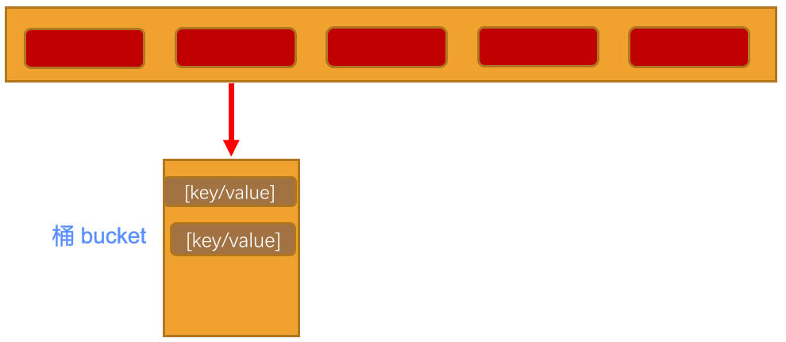

# 哈希表

## 一、哈希函数

上文中，介绍了哈希表理论知识，另外还有一个非常重要的东西：哈希函数？

好的哈希函数，应该尽可能让计算的过程，变得简单，提高计算的效率。

- 哈希表的主要优点，是它的速度，如果在速度上，不能体现优势，那么就达不到设计的目的了。
- 提高速度的一个办法，就是让哈希函数中，尽量少的做乘法、除法。因为它们的性能是比较低的。

设计好的哈希函数应该具备哪些优点呢？

- 快速的计算
  - 哈希表的优势就在于效率，所以快速获取到对应的 hashCode 非常重要。

- 均匀的分布
  - 哈希表中，无论是链地址法，还是开放地址法，当多个元素，映射到同一个位置的时候，都会影响效率。
  - 所以，优秀的哈希函数，应该尽可能将元素映射到不同的位置，让元素在哈希表中均匀的分布。

## 二、霍纳法则

在前面介绍中，计算哈希值的时候，使用的方式：

- `cats = 3 * 27³ + 1 * 27² + 20 * 27 + 17 = 60337`

这种方式，直观的计算出了结果，那么这种计算方式，会进行几次乘法几次加法呢？

- 当然，一个单此中，可能不止 4 项字符（字母），可能有更多项。
- 抽象一下，这个表达式，其实是一个多项式：`a(n)x^n^ + a(n-1)x^(n-1)^ + … + a(1)x + a(0)`

现在问题就变成了，多项式有多少次乘法和加法：

- 乘法次数：n＋(n－1)＋…＋1＝n(n+1)/2，复杂度为 `O(n²)`。
- 加法次数：n 次，复杂度为 `O(n)`。
- 总体来说，复杂度为 `O(N²)`。

解决这类求值问题的多项式优化：要用到**霍纳法则**。在中国，霍纳法则 也被称为**秦九韶算法**。

通过如下变换，我们可以得到一种快得多的算法，即

- Pn(x) = anx^n^ + a(n－1)x^(n-1)^ + … + a1x + a0 = ((…(((anx + an － 1)x + an－2)x + an － 3)…)x + a1)x + a0，
- 这种求值的方式我们称为霍纳法则。

变换后，我们需要多少次乘法，多少次加法呢？

- 乘法次数：N 次。
- 加法次数：N 次。

如果使用大 O 表示时间复杂度的话，我们直接从 `O(N²)` 降到了 `O(N)`。

## 三、均匀分布

均匀分布：

- 在设计哈希表时，我们已经有办法处理映射到相同下标值的情况：即链地址法，或者开放地址法。
- 但是无论哪种方案，为了提高效率，最好的情况还是让数据在哈希表中均匀分布。
- 因此，我们需要在使用常量的地方，尽量使用**质数**。

**质数**的使用：

- 常用于**哈希表的长度**，**N 次幂的底数**（之前案例中使用的是 27）。

为什么使用质数，会让哈希表分布更加均匀呢？

- 质数和其他数相乘的结果，相比于非质数，更容易产生唯一性的结果，减少哈希冲突。
- Java 中实现哈希表，用到的 N 次幂的底数，选择的是 31，是经过长期观察分布结果得出的；

### 1.N 次幂底数

这里采用质数的原因是，为了产生的数据不按照某种规律递增。

- 比如我们这里有一组数据是按照 4 进行递增的：0，4，8，12，16，将其映射到长度为 8 的哈希表中。
- 它们的位置是多少呢？0 - 4 - 0 - 4，依次类推。
- 如果哈希表长度不是质数，而递增的数量可以使用质数，比如 5，那么就是 0 5 10 15 20；
- 它们的位置是多少呢？0 - 5 - 2 - 7 - 4，依次类推。也可以尽量让数据均匀的分布。
- 我们之前使用的是 27，这次可以使用一个接近的数，比如 31 / 37 / 41 等等。一个比较常用的数是 31 或 37。

总之，质数是一个非常神奇的数字。

这里建议两处都使用质数：

- 哈希表中数组的长度。
- N 次幂的底数。

## 四、Java 中的 HashMap（了解）

Java 中的哈希表，采用的是链地址法。

HashMap 的初始长度是 16，每次自动扩展，长度必须是 2 的次幂。

- 这是为了服务于从 Key 映射到 index 的算法。`60000000 % 100 = 数字`。下标值。

HashMap 中为了提高效率，采用了位运算的方式。

- HashMap 中 index 的计算公式：`index = HashCode（Key） & （Length - 1）`；
- 比如计算"book"的 hashcode，结果为十进制的 `3029737`，二进制的 `1011100011101011101001`
- 假定 HashMap 长度是默认的 `16`，计算 `Length-1` 的结果为十进制的 `15`，二进制的 `1111`。
- 把以上两个结果做与运算，`101110001110101110001 & 1111 = 1001`，十进制是 9，所以 `index = 9`

但是，JavaScript 中，进行较大数据的位运算时，可能会出问题，所以下面的代码实现中，还是使用了**取余**。

- 另外，为了方便代码之后向开放地址法中迁移，容量还是选择使用**质数**。

## 五、哈希函数的实现

demo-project\05-哈希表\01-哈希函数hashFunc.ts

```typescript
/**
 * @description: 此函数用于：将 key 6映射成 index。
 * @Author: ZeT1an
 * @param {string} key 转换的 key
 * @param {number} max 数组的长度（最大的数值）
 * @return {number} 索引值
 */
function hashFunc(key: string, max: number): number {
  let hashCode = 0;
  for (let i = 0; i < key.length; i++) {
    hashCode += 31 * hashCode + key.charCodeAt(i);
  }
  return hashCode % max;
}

// 测试
// loaderFactor（装填因子）4 / 7 = 0.57...
console.log('hashfunc:', hashFunc('abc', 7))
console.log('hashfunc:', hashFunc('cba', 7))
console.log('hashfunc:', hashFunc('nba', 7))
console.log('hashfunc:', hashFunc('mba', 7))


console.log('hashfunc:', hashFunc('aaa', 7))
console.log('hashfunc:', hashFunc('bbb', 7))

export default hashFunc
```

## 六、哈希表的实现

> 当你感觉到数据结构的一些复杂性；但又察觉到它在设计时候的巧妙和优美，
>
> 当你爱上它的那一刻，你也真正爱上了编程，爱上数据结构；

下面采用链地址法，来实现哈希表：

- 实现的哈希表(基于 storage 的数组)，每个 index 对应的是一个数组（又称为 bucket）(当然基于链表也可以)。
- bucket 中存放 key 和 value 组成的元组。
- 最终，哈希表的数据格式，是这样的：[[[k，v]，[k，v]，[k，v]]，[[k，v]，[k，v]]，[[k，v]] ]

demo-project\05-哈希表\02-哈希表HashTable的封装.ts

```typescript
class HashTable<T = any> {
  // 创建一个数组, 用来存放链地址法中的链(数组)
  private storage: [string, T][][] = [];

  // 定义数组的长度
  private limit: number = 7

  // 记录已经存放元素的个数
  private count: number = 0
}

export default HashTable

// 测试
const hashTable = new HashTable()
```

代码解析：定义了三个属性：

- `storage` 作为 hash 表底层的数组，其中存放着一个个桶（bucket）。
- `limit` 用于标记数组中一共可以存放多少个元素。
- `count` 表示当前已经存在了多少数据。



### 1.put 方法，插入/修改数据

哈希表的插入、修改操作是同一个函数：

因为，当传入一个 <Key，Value> 时，如果原来不存在该 key，那么就是插入操作；如果已经存在 key，那么就是修改操作。

demo-project\05-哈希表\03-哈希表HashTable（插入-修改）.ts

```typescript
class HashTable<T = any> {
  // 创建一个数组, 用来存放链地址法中的链(数组)
  private storage: [string, T][][] = []

  // 定义数组的长度
  private limit: number = 7

  // 记录已经存放元素的个数
  private count: number = 0

  /**
   * @description: 此函数用于：将 key 6映射成 index。
   * @Author: ZeT1an
   * @param {string} key 转换的 key
   * @param {number} max 数组的长度（最大的数值）
   * @return {number} 索引值
   */
  private hashFunc(key: string, max: number): number {
    let hashCode = 0
    for (let i = 0; i < key.length; i++) {
      hashCode += 31 * hashCode + key.charCodeAt(i)
    }
    return hashCode % max
  }

  put(key: string, value: T) {
    // 1.根据 key 获取数组中对应的索引值
    const index = this.hashFunc(key, this.limit)

    // 2.取出索引值对应位置的数组(桶)
    let bucket = this.storage[index]

    // 3.判断bucket是否有值
    if (!bucket) {
      bucket = []
      this.storage[index] = bucket
    }

    let isUpdate = false
    for (let i = 0; i < bucket.length; i++) {
      const tuple = bucket[i];
      const [tupleKey] = tuple
      if (tupleKey === key) {
        tuple[1] = value
        isUpdate = true
        break
      }
    }

    if (!isUpdate) {
      bucket.push([key, value])
      this.count++
    }
  }

}

export default HashTable

// 测试
const hashTable = new HashTable()
hashTable.put('aaa', 100)
hashTable.put('aaa', 200)
hashTable.put('bbb', 300)
console.log('hashTable:', hashTable)
```

代码解析：

- 步骤1：根据传入的 key 获取对应的 hashCode，也就是数组的 index；；
- 步骤2：从哈希表的 index 位置中，取出桶 bucket（另外一个数组）；
- 步骤3：查看上一步的 bucket 是否为 null。为 null，表示之前在该位置，没有放置过任何的内容，那么就新建一个桶（数组）[]；
- 步骤4：查看是否之前已经放置过 key 对应的 value；
  - 如果放置过，那么就是依次替换操作，而不是插入新的数据。
  - 我们使用一个变量 override 来记录是否是修改操作。
- 步骤5：如果不是修改操作，那么插入新的数据。
  - 在 bucket 中 push 新的 [key，value] 即可。
  - 注意：这里需要将 count + 1，因为数据增加了一项。

### 2.get 方法，获取数据

根据 key，获取对应的 value。

demo-project\05-哈希表\03-哈希表HashTable（插入-修改）.ts

```typescript
class HashTable<T = any> {
  // 创建一个数组, 用来存放链地址法中的链(数组)
  private storage: [string, T][][] = []

  // 定义数组的长度
  private length: number = 7

  // 记录已经存放元素的个数
  private count: number = 0

  /**
   * @description: 此函数用于：将 key 6映射成 index。
   * @Author: ZeT1an
   * @param {string} key 转换的 key
   * @param {number} max 数组的长度（最大的数值）
   * @return {number} 索引值
   */
  private hashFunc(key: string, max: number): number {
    let hashCode = 0
    for (let i = 0; i < key.length; i++) {
      hashCode += 31 * hashCode + key.charCodeAt(i)
    }
    return hashCode % max
  }

  put(key: string, value: T) {
    // 1.根据key获取数组中对应的索引值
    const index = this.hashFunc(key, this.limit)

    // 2.取出索引值对应位置的数组(桶)
    let bucket = this.storage[index]

    // 3.判断bucket是否有值
    if (!bucket) {
      bucket = []
      this.storage[index] = bucket
    }

    let isUpdate = false
    for (let i = 0; i < bucket.length; i++) {
      const tuple = bucket[i];
      const [tupleKey] = tuple
      if (tupleKey === key) {
        tuple[1] = value
        isUpdate = true
        break
      }
    }

    if (!isUpdate) {
      bucket.push([key, value])
      this.count++
    }
  }

  get(key: string): T | undefined {
    // 1.根据 key 获取索引值 index
    const index =  this.hashFunc(key, this.limit)

    // 2.获取 bucket 桶
    const bucket = this.storage[index]
    if (!bucket) return undefined

    // 对 bucket 进行遍历
    for (let i = 0; i < bucket.length; i++) {
      const tuple = bucket[i];
      const [tupleKey, tuplevalue] = tuple
      if (tupleKey === key) {
        return tuplevalue
      }
    }
    return undefined
  }
}

export default HashTable

// 测试
const hashTable = new HashTable()
hashTable.put('aaa', 100)
hashTable.put('aaa', 200)
hashTable.put('bbb', 300)
hashTable.put('ccc', 400)

console.log(hashTable.get('aaa'))
console.log(hashTable.get('bbb'))
console.log(hashTable.get('ccc'))

console.log(hashTable.get('ddd'))
console.log(hashTable.get('abc'))
```

代码解析：

- 步骤1：根据 key 获取 hashCode (也就是 index)
- 步骤2：根据 index 取出 bucket。
- 步骤3：如果 bucket 都是 null，那么说明这个位置之前并没有插入过数据，直接返回 `undefined` 即可。
- 步骤4：有了 bucket，就遍历，并且如果找到，就将对应的 value 返回即可。
- 步骤5：没有找到，返回 `undefined`。

### 3.delete 方法，删除数据

根据对应的 key，删除对应的 key / value

demo-project\05-哈希表\04-哈希表HashTable（删除操作）.ts

```typescript
class HashTable<T = any> {
  // 创建一个数组, 用来存放链地址法中的链(数组)
  private storage: [string, T][][] = []

  // 定义数组的长度
  private length: number = 7

  // 记录已经存放元素的个数
  private count: number = 0

  /**
   * @description: 此函数用于：将 key 6映射成 index。
   * @Author: ZeT1an
   * @param {string} key 转换的 key
   * @param {number} max 数组的长度（最大的数值）
   * @return {number} 索引值
   */
  private hashFunc(key: string, max: number): number {
    let hashCode = 0
    for (let i = 0; i < key.length; i++) {
      hashCode += 31 * hashCode + key.charCodeAt(i)
    }
    return hashCode % max
  }

  put(key: string, value: T) {
    // 1.根据key获取数组中对应的索引值
    const index = this.hashFunc(key, this.limit)

    // 2.取出索引值对应位置的数组(桶)
    let bucket = this.storage[index]

    // 3.判断bucket是否有值
    if (!bucket) {
      bucket = []
      this.storage[index] = bucket
    }

    let isUpdate = false
    for (let i = 0; i < bucket.length; i++) {
      const tuple = bucket[i];
      const [tupleKey] = tuple
      if (tupleKey === key) {
        tuple[1] = value
        isUpdate = true
        break
      }
    }

    if (!isUpdate) {
      bucket.push([key, value])
      this.count++
    }
  }

  get(key: string): T | undefined {
    // 1.根据 key 获取索引值 index
    const index =  this.hashFunc(key, this.limit)

    // 2.获取 bucket 桶
    const bucket = this.storage[index]
    if (!bucket) return undefined

    // 对 bucket 进行遍历
    for (let i = 0; i < bucket.length; i++) {
      const tuple = bucket[i];
      const [tupleKey, tuplevalue] = tuple
      if (tupleKey === key) {
        return tuplevalue
      }
    }

    return undefined
  }

  delete(key: string): T | undefined {
    // 1.获取索引值的位置
    const index = this.hashFunc(key, this.limit)

    // 2.获取 bucket 桶
    const bucket = this.storage[index]
    if (!bucket) return undefined

    for (let i = 0; i < bucket.length; i++) {
      const tuple = bucket[i];
      const [tupleKey, tuplevalue] = tuple
      if (tupleKey === key) {
        bucket.splice(i, 1)
        this.count--
        return tuplevalue
      }
    }
    return undefined
  }

}

export default HashTable

// 测试
const hashTable = new HashTable()
hashTable.put('aaa', 100)
hashTable.put('aaa', 200)
hashTable.put('bbb', 300)
hashTable.put('ccc', 400)

console.log(hashTable.get('aaa'))
console.log(hashTable.get('bbb'))
console.log(hashTable.get('ccc'))

console.log("delete:", hashTable.delete("aaa"))
console.log("get:", hashTable.get("aaa"))
```

代码解析：

- 思路和获取数据相似，不再给出解析

## 七、哈希表扩容思想

为什么需要扩容？

- 目前，我们是将所有的数据项，放在长度为 7 的数组中的。
- 因为，我们使用的是**链地址法**，允许 装填因子 `loadFactor > 1`，所以这个哈希表，可以无限制的插入新数据。
- 但是，随着数据量的增多，每一个 index 对应的 bucket 会越来越长，也就造成效率的降低。
- 所以，在合适的情况下，要对数组进行扩容，比如扩容两倍。

如何进行扩容？

- 扩容可以简单的将容量增大两倍（容量长度为质数的问题，后面再讨论)。
- 但是这种情况下，**所有的数据项一定要同时进行修改，即再哈希化**（重新调用哈希函数，来获取到不同的位置）；
- 比如：`hashCode = 12` 的数据项，在 `length = 8` 的时候，`index = 4`；
- 在 `length = 16` 的时候呢？`index = 12`。
- 这是一个耗时的过程，但是如果数组需要扩容，那么这个过程是**必要的**。

什么情况下扩容呢？

- 比较：常见的情况是 `loadFactor > 0.75` 的时候，进行扩容。
- 比如：Java 的哈希表，就是在 `loadFactor > 0.75` 的时候，对哈希表进行扩容。

## 八、扩容/缩容函数实现

什么时候调用扩容方法呢？

- 在每次添加完新的数据时（也就是 `put` 方法中），都进行判断。
- 一般在 `loadFactor > 0.75` 的时候扩容。

什么时候调用缩容方法呢。

- 在每次删除完新的数据时（也就是 `delete` 方法中）都进行判断；
- 一般在 `loadFactor < 0.25` 时。且数组有一个最小长度的情况下（比如 `7`）

demo-project\05-哈希表\05-哈希表HashTable（扩容缩容）.ts

```typescript
class HashTable<T = any> {
  // 创建一个数组, 用来存放链地址法中的链(数组)
  storage: [string, T][][] = []

  // 定义数组的长度
  private length: number = 7

  // 记录已经存放元素的个数
  private count: number = 0

  /**
   * @description: 此函数用于：将 key 6映射成 index。
   * @Author: ZeT1an
   * @param {string} key 转换的 key
   * @param {number} max 数组的长度（最大的数值）
   * @return {number} 索引值
   */
  private hashFunc(key: string, max: number): number {
    let hashCode = 0
    for (let i = 0; i < key.length; i++) {
      hashCode += 31 * hashCode + key.charCodeAt(i)
    }
    return hashCode % max
  }

  private resize(newLength: number) {
    // 设置新的长度
    this.limit = newLength

    // 获取原来所有的数据，并且重新放入到新的数组中
    // 1.对数据进行初始化操作
    const oldStorage = this.storage
    this.storage = []
    this.count = 0

    // 2.将原来的数据，放入到新数组中。
    oldStorage.forEach(bucket => {
      if (bucket) {
        bucket.forEach(tuple => {
          this.put(tuple[0], tuple[1])
        })
      }
    })
  }

  put(key: string, value: T) {
    // 1.根据key获取数组中对应的索引值
    const index = this.hashFunc(key, this.limit)

    // 2.取出索引值对应位置的数组(桶)
    let bucket = this.storage[index]

    // 3.判断bucket是否有值
    if (!bucket) {
      bucket = []
      this.storage[index] = bucket
    }

    let isUpdate = false
    for (let i = 0; i < bucket.length; i++) {
      const tuple = bucket[i];
      const [tupleKey] = tuple
      if (tupleKey === key) {
        tuple[1] = value
        isUpdate = true
        break
      }
    }

    if (!isUpdate) {
      bucket.push([key, value])
      this.count++

      // loadFactor ? 0.75，那么在该位置进行添加
      const loadFactor = this.count / this.limit
      if (loadFactor > 0.75) {
        this.resize(this.limit * 2)
        console.log("扩宽数组")
      }
    }
  }

  get(key: string): T | undefined {
    // 1.根据 key 获取索引值 index
    const index =  this.hashFunc(key, this.limit)

    // 2.获取 bucket 桶
    const bucket = this.storage[index]
    if (!bucket) return undefined

    // 对 bucket 进行遍历
    for (let i = 0; i < bucket.length; i++) {
      const tuple = bucket[i];
      const [tupleKey, tuplevalue] = tuple
      if (tupleKey === key) {
        return tuplevalue
      }
    }

    return undefined
  }

  delete(key: string): T | undefined {
    // 1.获取索引值的位置
    const index = this.hashFunc(key, this.limit)

    // 2.获取 bucket 桶
    const bucket = this.storage[index]
    if (!bucket) return undefined

    for (let i = 0; i < bucket.length; i++) {
      const tuple = bucket[i];
      const [tupleKey, tuplevalue] = tuple
      if (tupleKey === key) {
        bucket.splice(i, 1)
        this.count--

        // 如果 loaderFactor 小于 0.25，增容操作
        const loadFactor = this.count / this.limit
        if (loadFactor < 0.25 && this.limit > 7) {
          this.resize(Math.floor(this.limit / 2))
          console.log("简化数组")
        }
        return tuplevalue
      }
    }

    return undefined
  }

}

export default HashTable

// 测试
const hashTable = new HashTable()
// length: 7
// count: 8
// loadFactor: 8 / 7 = 1.1xxxxx
hashTable.put("aaa", 100)
hashTable.put("aaa", 200)
hashTable.put("bbb", 300)
hashTable.put("ccc", 400)
hashTable.put("abc", 111)
hashTable.put("cba", 222)
console.log(hashTable.storage)

hashTable.put("nba", 333)
hashTable.put("mba", 444)
console.log(hashTable.storage)

// 如果loadFactor > 0.75进行扩容操作
hashTable.delete("nba")
hashTable.delete("mba")
hashTable.delete("abc")
hashTable.delete("cba")
hashTable.delete("aaa")
console.log(hashTable.storage)
```

代码解析：

- 步骤1：先将之前数组，使用 `oldStorage` 引用，再将 `storeage = []`
- 步骤2：`oldStorage` 中的数据，进行再哈希化。
  - 遍历所有的数据项，重新 put 到哈希表中，其中进行了再哈希化。
