# 哈希表 & 树结构

## 一、哈希表容量质数

前面提到过，哈希表的容量，最好是质数。

虽然在链地址法中，将容量设置为质数，没有在开放地址法中重要，但仍然更利于数据的均匀分布。

如何判断一个数是质数？

质数也称为素数，表示在大于 1 的自然数中，只能被1和自己整除的数。

写一个算法，判断一个数字是质数。

demo-project\05-哈希表\06-判断一个数是质数.ts

```typescript
/**
 * @description: 此函数用于：判断传入的数字，是否是质数。
 * @Author: ZeT1an
 * @param {number} num 要判断的的数字
 * @return {boolean} 是否是一个质数
 */
function isPrime(num: number): boolean {
  for (let i = 2; i < num; i++) {
    if (num % i === 0) {
      return false;
    }
  }
  return true;
}

// 测试
console.log(isPrime(8))
console.log(isPrime(14))
console.log(isPrime(15))

console.log(isPrime(17))
console.log(isPrime(23))
```

然而，这种做法的效率并不高。为什么呢？

- 对于每个数 n，其实并不需要从 2 判断到 n-1；
- 一个数，如果可以进行因数分解，那么分解后得到的两个数，必然有一个小于等于 `sqrt(n)`，有一个大于等于 `sqrt(n)`。
  - "sqrt" 是 "square root" 的缩写，表示平方根；
  - 比如：16 可以被因数分解为 `2 * 8`，`2` 小于 `sqrt(16)`，即 `4`，`8` 大于 `4`。
  - 所以，上面的算法，遍历到等于 `sqrt(n)` 即可；

更高效的质数判断算法优化：

demo-project\05-哈希表\06-判断一个数是质数.ts

```typescript
/**
 * @description: 此函数用于：判断传入的数字，是否是质数。
 * @Author: ZeT1an
 * @param {number} num 要判断的的数字
 * @return {boolean} 是否是一个质数
 */
function isPrime2(num: number): boolean {
  const sqrt = Math.sqrt(num);
  for (let i = 2; i < sqrt; i++) {
    if (num % i === 0) {
      return false;
    }
  }
  return true;
}
```

将以上算法，应用于 HashMap 中。

封装 `getNextPrime` 方法，用于在扩容时，获取两倍容量大小的下一个质数，作为新的容量大小。

demo-project\05-哈希表\07-哈希表HashTable（质数容量）.ts

```typescript
class HashTable<T = any> {
  // 创建一个数组, 用来存放链地址法中的链(数组)
  storage: [string, T][][] = []

  // 定义数组的长度
  private limit: number = 7

  // 记录已经存放元素的个数
  private count: number = 0

  /**
   * @description: 此函数用于：将 key 6映射成 index。
   * @Author: ZeT1an
   * @param {string} key 转换的 key
   * @param {number} max 数组的长度（最大的数值）
   * @return {number} 索引值
   */
  private hashFunc(key: string, max: number): number {
    let hashCode = 0
    for (let i = 0; i < key.length; i++) {
      hashCode += 31 * hashCode + key.charCodeAt(i)
    }
    return hashCode % max
  }

  private isPrime(num: number): boolean {
    const sqrt = Math.sqrt(num);
    for (let i = 2; i < sqrt; i++) {
      if (num % i === 0) {
        return false;
      }
    }
    return true;
  }

  private getNextPrime(num: number): number {
    let nexPrime = num
    while(!this.isPrime(nexPrime)) {
      nexPrime++
    }
    console.log('nexPrime:', nexPrime)
    return nexPrime
  }

  private resize(newLength: number) {
    // 设置新的长度
    let newPrime = this.getNextPrime(newLength)
    if (newPrime < 7) newPrime = 7
    this.limit = newPrime

    // 获取原来所有的数据，并且重新放入到新的数组中
    // 1.对数据进行初始化操作
    const oldStorage = this.storage
    this.storage = []
    this.count = 0

    // 2.将原来的数据，放入到新数组中。
    oldStorage.forEach(bucket => {
      if (bucket) {
        bucket.forEach(tuple => {
          this.put(tuple[0], tuple[1])
        })
      }
    })
  }


  put(key: string, value: T) {
    // 1.根据key获取数组中对应的索引值
    const index = this.hashFunc(key, this.limit)

    // 2.取出索引值对应位置的数组(桶)
    let bucket = this.storage[index]

    // 3.判断bucket是否有值
    if (!bucket) {
      bucket = []
      this.storage[index] = bucket
    }

    let isUpdate = false
    for (let i = 0; i < bucket.length; i++) {
      const tuple = bucket[i];
      const [tupleKey] = tuple
      if (tupleKey === key) {
        tuple[1] = value
        isUpdate = true
        break
      }
    }

    if (!isUpdate) {
      bucket.push([key, value])
      this.count++

      // loadFactor ? 0.75，那么在该位置进行添加
      const loadFactor = this.count / this.limit
      if (loadFactor > 0.75) {
        this.resize(this.limit * 2)
        console.log("扩宽数组，this.limit:", this.limit)
      }
    }
  }

  get(key: string): T | undefined {
    // 1.根据 key 获取索引值 index
    const index =  this.hashFunc(key, this.limit)

    // 2.获取 bucket 桶
    const bucket = this.storage[index]
    if (!bucket) return undefined

    // 对 bucket 进行遍历
    for (let i = 0; i < bucket.length; i++) {
      const tuple = bucket[i];
      const [tupleKey, tuplevalue] = tuple
      if (tupleKey === key) {
        return tuplevalue
      }
    }

    return undefined
  }

  delete(key: string): T | undefined {
    // 1.获取索引值的位置
    const index = this.hashFunc(key, this.limit)

    // 2.获取 bucket 桶
    const bucket = this.storage[index]
    if (!bucket) return undefined

    for (let i = 0; i < bucket.length; i++) {
      const tuple = bucket[i];
      const [tupleKey, tuplevalue] = tuple
      if (tupleKey === key) {
        bucket.splice(i, 1)
        this.count--

        // 如果 loaderFactor 小于 0.25，增容操作
        const loadFactor = this.count / this.limit
        if (loadFactor < 0.25 && this.limit > 7) {
          this.resize(Math.floor(this.limit / 2))
          console.log("简化数组，this.limit:", this.limit)
        }
        return tuplevalue
      }
    }

    return undefined
  }

}

export default HashTable

// 测试
const hashTable = new HashTable()
// length: 7
// count: 8
// loadFactor: 8 / 7 = 1.1xxxxx
hashTable.put("aaa", 100)
hashTable.put("aaa", 200)
hashTable.put("bbb", 300)
hashTable.put("ccc", 400)
hashTable.put("abc", 111)
hashTable.put("cba", 222)

console.log(hashTable.storage)

hashTable.put("nba", 333)
hashTable.put("mba", 444)
console.log(hashTable.storage)

// 如果loadFactor > 0.75进行扩容操作

hashTable.delete("nba")
hashTable.delete("mba")
hashTable.delete("abc")
hashTable.delete("cba")
hashTable.delete("aaa")
console.log(hashTable.storage)
```

## 二、树结构是什么？

生活中见到的树，都有一个根，它连接着树干。

树干会分叉成树枝，树枝还会分叉成小的树枝。

在树枝的最后是叶子。

生活中常见的树结构：

公司组织架构

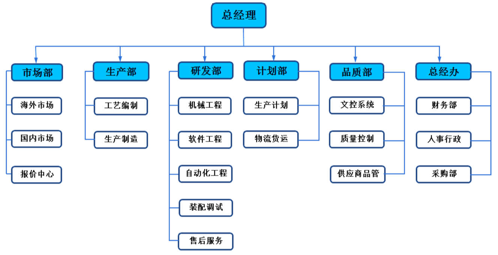

前端的 DOM Tree

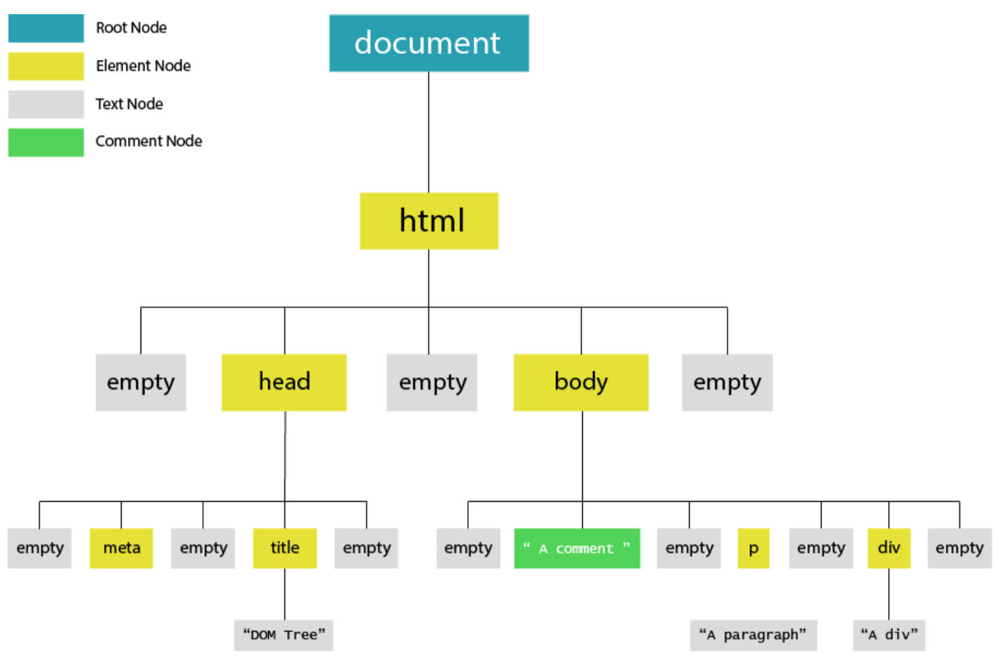

树结构的抽象：

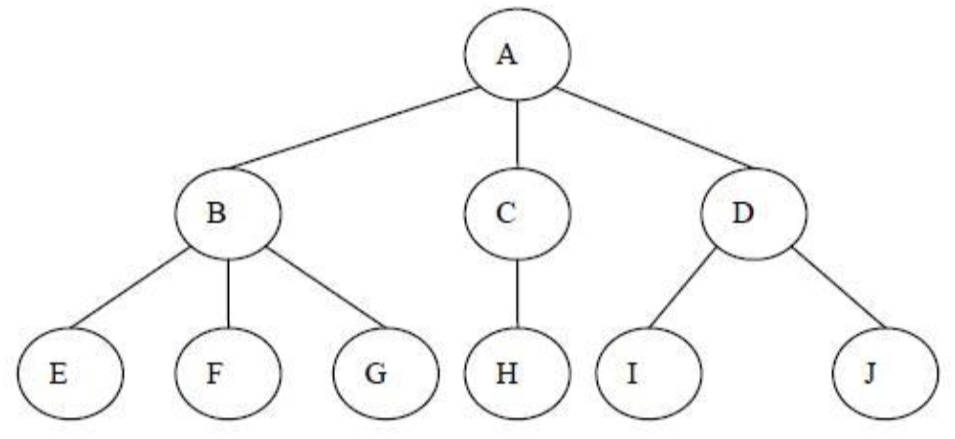

## 三、树结构的优点

树结构与数组、链表、哈希表的对比，有什么优点呢？

### 1.数组

优点：

- 使用下标值访问，效率高。

缺点：

- 查找有序数列时，要先对数组进行排序，才能使用二分查找，提高查找效率。
- 在插入和删除数据时，需要有大量的位移操作，效率很低。

### 2.链表

优点：

- 插入和删除操作，效率高。

缺点：

- 查找效率低，需要从头开始依次访问每个数据项，直到找到。
- 即使插入和删除操作，效率很高，但是仍然需要先找到元素。

### 3.哈希表

优点：

- 插入/查询/删除，效率都非常高。

缺点：

- 空间利用率不高，底层使用的数组，某些单元是没有被利用的。
- 元素是无序的，不能按照固定的顺序，来遍历哈希表中的元素。不能快速的找出哈希表中的最大值或者最小值这些特殊的值。

### 4.树结构

树综合了上面的数据结构的优点（但优点不足以盖过其他数据结构）。并且也弥补了上面数据结构的缺点。

> 不能说树结构比其他数据结构更好，因为每种数据结构，都有特定的应用场景。

某些场景下，使用树结构会更方便：

- 树结构是非线性的，可以表示一对多的关系。
- 比如文件的目录结构。

## 四、树的术语

**树（Tree）**：n（n ≥ 0）个节点，构成的有限集合。当 n = 0 时，称为空树；

对于任一棵非空树（n > 0），它具备以下性质：

- 树中有一个称为“**根（Root）**”的特殊节点， 用 r 表示；
- 其余节点可分为 m (m > 0) 个互不相交的有限集 T1，T2，..。，Tm；
- 其中每个集合本身又是一棵树，称为原来树的“**子树（SubTree）**”

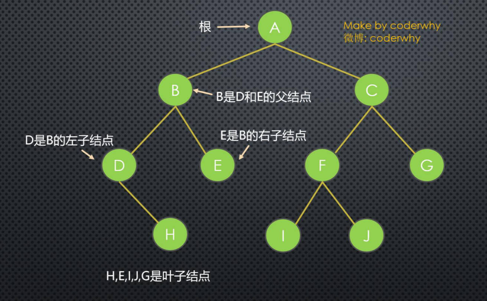

**节点的度（Degree）**：节点的子树个数。

**树的度（Degree）**：树的所有节点中，最大的度数。

**叶节点（Leaf）**：度为 0 的节点。(也称为**叶子节点**)

**父节点（Parent）**：有子树的节点是其子树的根节点的父节点.

**子节点（Child）**：若 A 节点是 B 节点的父节点，则称 B 节点是 A 节点的子节点；子节点也称孩子节点。

**兄弟节点（Sibling）**：具有同一父节点的各节点彼此是兄弟节点。

**路径和路径长度**：从节点 n1 到 nk 的路径，为一个节点序列 n1 ，n2，… ，nk；

- ni 是 n(i+1) 的父节点；
- 路径所包含边的个数，为**路径的长度**。

**节点的层次（Level）**：规定根节点在 1 层，其它任一节点的层数是其父节点的层数加 1。

**树的深度（Depth）**：对于任意节点 n, n 的深度为从根到 n 的唯一路径长，根的深度为 0。

**树的高度（Height）**：对于任意节点 n, n 的高度为从 n 到一片树叶的最长路径长，所有树叶的高度为 0。

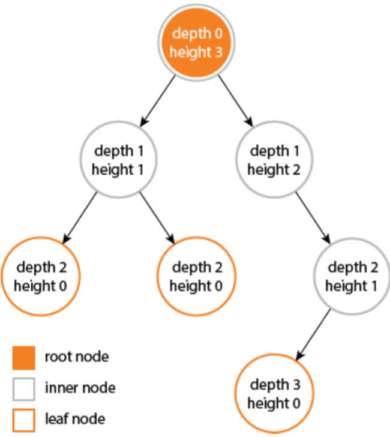

## 五、树结构的表示方式

普通表示方式

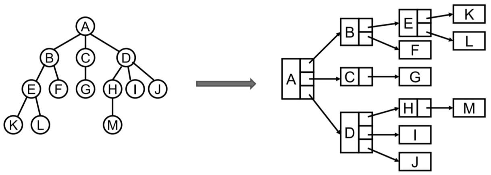

儿子-兄弟表示法

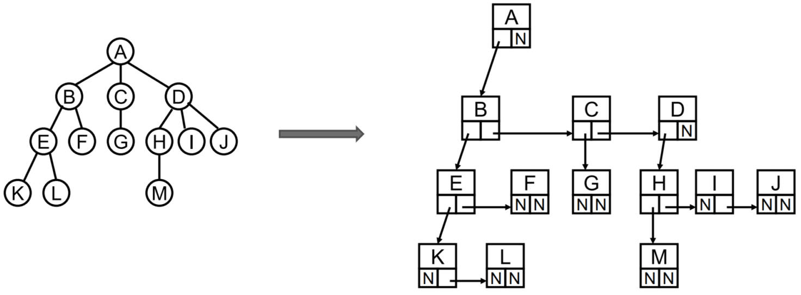

儿子-兄弟表示法旋转 —— 成为了一个反向二叉树。

- 其实所有的树，本质上都可以通过“儿子-兄弟表示法”，用二叉树模拟出来。
- 所以在二叉树非常重要。

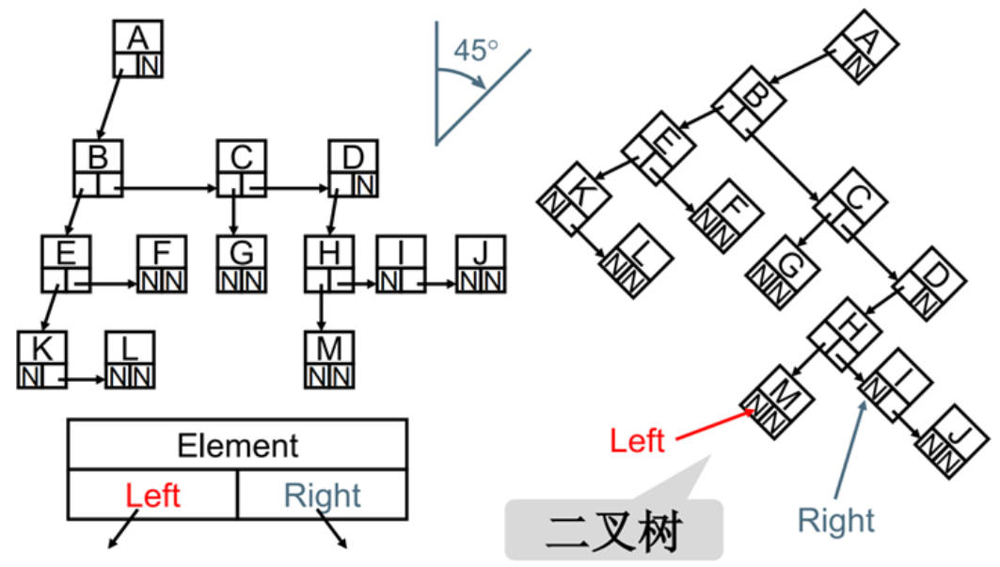

## 六、二叉树的概念

如果树中每个节点，最多只能有两个子节点，这样的树就称为"二叉树"。

几乎所有的树，都可以表示成二叉树的形式。

二叉树的定义：

- 二叉树可以为空，也就是没有节点。
- 若不为空，则它是由根节点和称为其**左子树（TL）**、**右子树（TR）**的两个不相交的二叉树组成。

二叉树有五种形态：

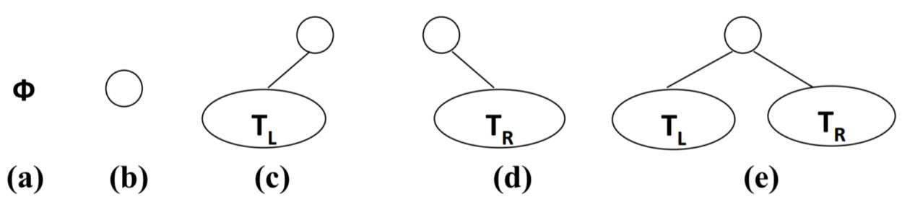

## 七、二叉树的特性

二叉树有几个比较重要的特性，在面试笔试题中比较常见：

- 一颗二叉树第 i 层的最大节点数为：`2^(i-1)`，i >= 1;
- 深度为 k 的二叉树，有最大节点总数为：`2^k - 1`，k >= 1;
- 对任何非空二叉树 T，若 n0 表示叶节点的个数、n2 是度为 2 的非叶节点个数，那么两者满足关系 `n0 = n2 + 1`。

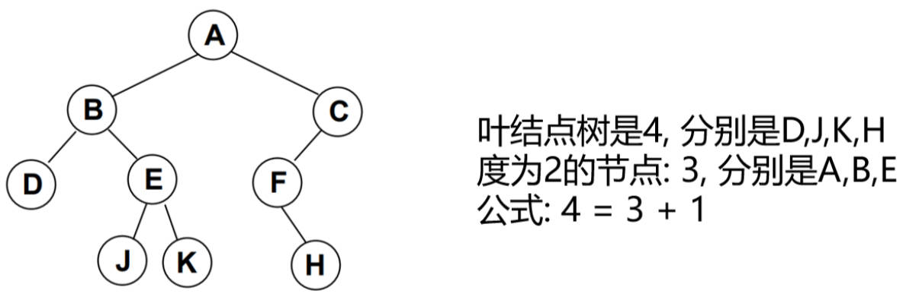

## 八、完美二叉树

**完美二叉树（Perfect Binary Tree）**，也称为**满二叉树（Full Binary Tree）**

在二叉树中，除了最下一层的叶节点外，每层节点都有 2 个子节点，就是满二叉树。

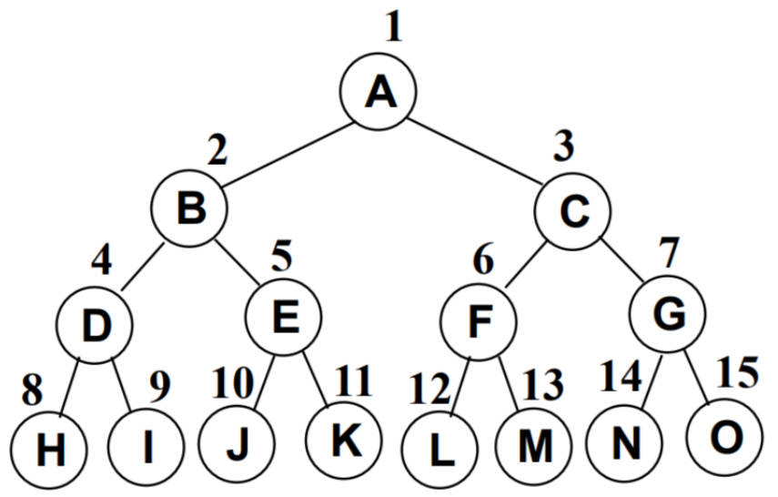

## 九、完全二叉树

**完全二叉树(Complete Binary Tree)**

- 除二叉树最后一层外，其他各层的节点数，都达到最大个数。
- 且最后一层，从左向右的叶节点连续存在，只缺右侧若干节点。

下图不是完全二叉树，因为 D 节点还没有右节点，但是 E 节点就有了左右节点。

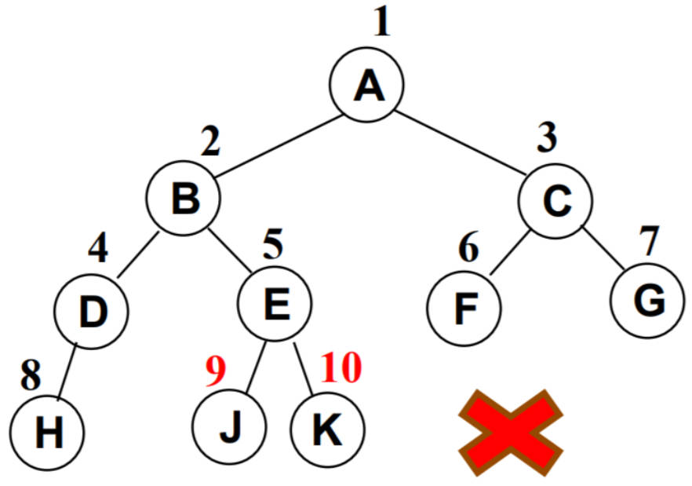

## 十、二叉树的存储

二叉树的存储常见的方式是数组和链表。

完全二叉树，用数组，按从上至下、从左到右的顺序存储

> 重要，后面堆结构会用到。

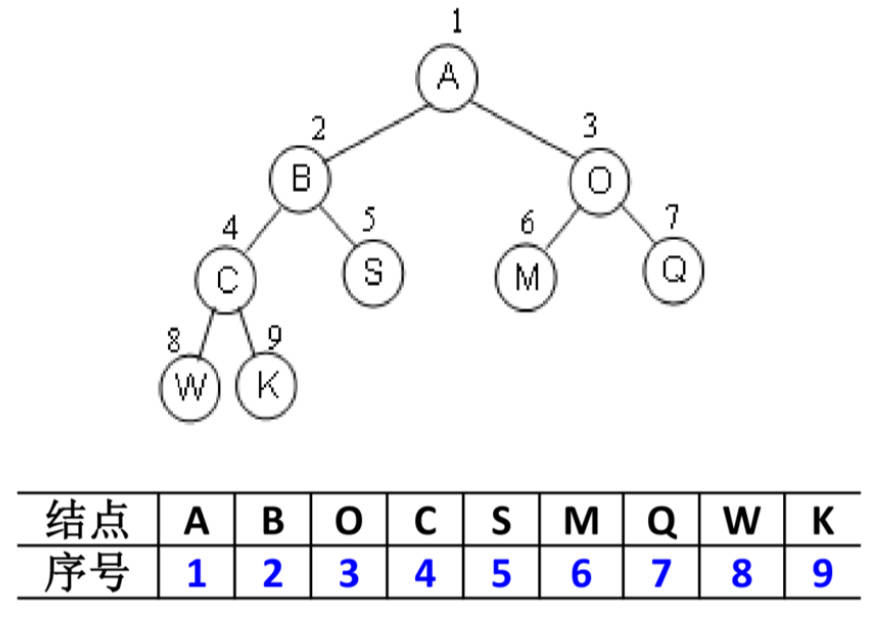

非完全二叉树，用数组，要转成完全二叉树，才可以按照上面的方案存储。会造成很大的空间浪费。

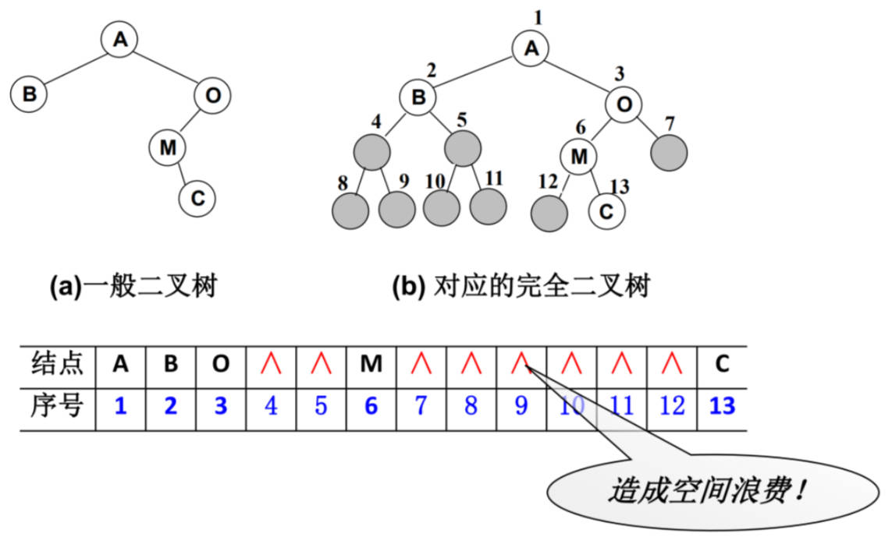

非完全二叉树，用链表，每个节点封装成一个 Node，其中包含存储的数据，左节点的引用，右节点的引用。

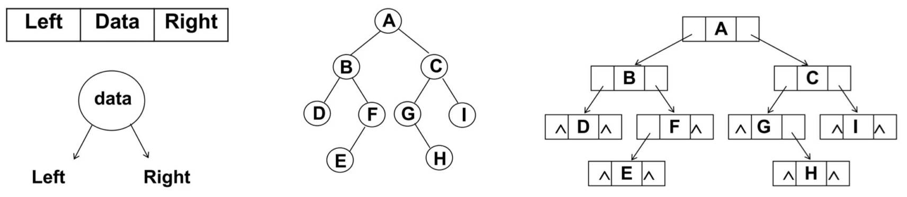

## 十一、二叉搜索树

**二叉搜索树（BST，Binary Search Tree）**，也称**二叉排序树**或**二叉查找树**。

二叉搜索树是一颗二叉树，可以为空；

如果不为空，满足以下性质：

- 非空左子树的所有键值，小于其根节点的键值。
- 非空右子树的所有键值，大于其根节点的键值。
- 左、右子树本身也都是二叉搜索树。

下面哪些是二叉搜索树，哪些不是？

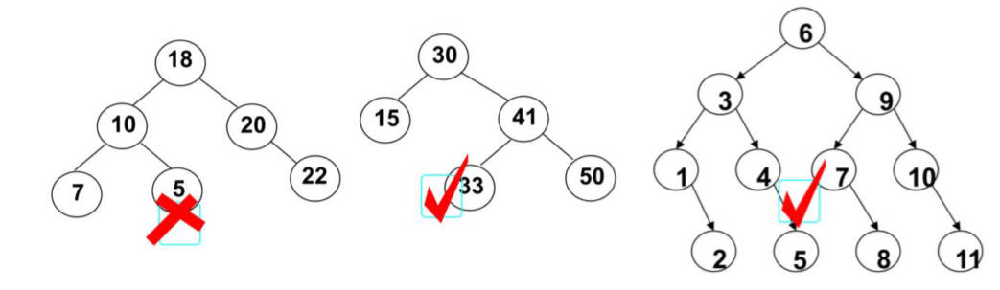

二叉搜索树的特点：

- 相对较小的值，总是保存在左节点上，相对较大的值，总是保存在右节点上。
- 查找效率非常高；

比如查找一下值为 10 的节点，其实就是二分查找的思想：

- 查找所需的最大次数，等于二叉搜索树的深度；
- 插入节点时，也利用类似的方法，一层层比较大小，找到新节点合适的位置。

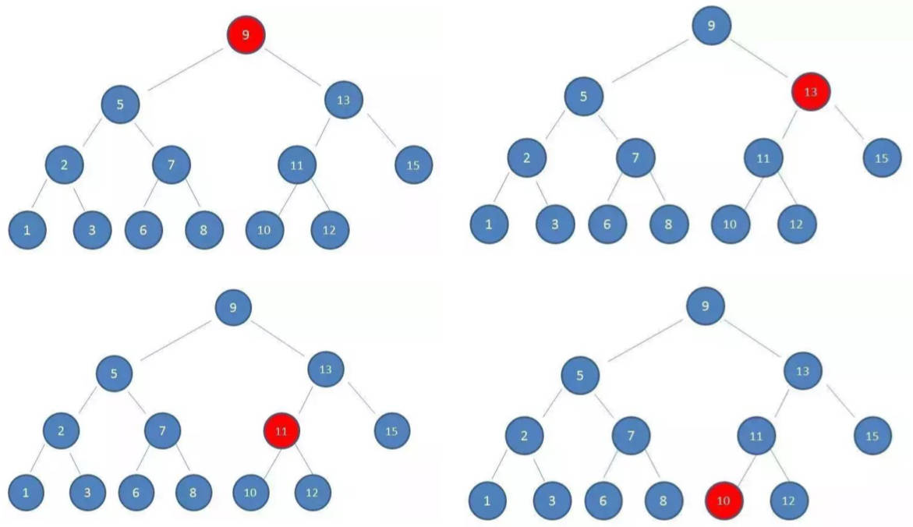

## 十二、二叉搜索树封装

就像封装其他数据结构一样，先来封装一个 `BSTree` 类,表示二叉搜索树。

代码解析：

- 封装 `BSTree` 类之前，还需要封装一个用于保存每一个节点的类 `TreeNode`。
- 该类包含三个属性：节点对应的 `value`，指向的左子树 `left`，指向的右子树 `right`
- 对于 `BSTree` 来说，只需要保存根节点 `root` 即可，因为其他节点，都可以通过根节点找到。

demo-project\06-二叉搜索树\01-二叉搜索树Tree（封装）.ts

```typescript
class Node<T> {
  constructor(public value: T) {}
}

class TreeNode<T> extends Node<T> {
  left: TreeNode<T> | null = null
  right: TreeNode<T> | null = null
}

/**
 * @description: 此类用于：二叉搜索树的封装
 * @Author: ZeT1an
 */
class BSTree<T> {
  private root: TreeNode<T> | null = null
}

export default BSTree
```

## 十三、二叉搜索树常见操作

插入操作：

- `insert(value)`：向树中插入一个新的数据。

查找操作：

- `search(value)`：在树中查找一个数据，如果节点存在，则返回 `true`；如果不存在，则返回 `false`。
- `min`：返回树中最小的值/数据。
- `max`：返回树中最大的值/数据。

遍历操作：

- `inOrderTraverse`：通过中序遍历方式，遍历所有节点。
- `preOrderTraverse`：通过先序遍历方式，遍历所有节点。
- `postOrderTraverse`：通过后序遍历方式，遍历所有节点。
- `levelOrderTraverse`：通过层序遍历方式，遍历所有节点。

删除操作（有一点点复杂）：

- `remove(value)`：从树中移除某个数据。
