# 树结构

## 一、二叉搜索树常见操作

插入操作：

- `insert(value)`：向树中插入一个新的数据。

查找操作：

- `search(value)`：在树中查找一个数据，如果节点存在，则返回 `true`；如果不存在，则返回 `false`。
- `min`：返回树中最小的值/数据。
- `max`：返回树中最大的值/数据。

遍历操作：

- `inOrderTraverse`：通过中序遍历方式，遍历所有节点。
- `preOrderTraverse`：通过先序遍历方式，遍历所有节点。
- `postOrderTraverse`：通过后序遍历方式，遍历所有节点。
- `levelOrderTraverse`：通过层序遍历方式，遍历所有节点。

删除操作（有一点点复杂）：

- `remove(value)`：从树中移除某个数据。比较复杂。

## 二、insert 方法

考虑两种情况：

情况一：空树（没有根节点）。将新节点，赋值给根节点。

情况二：非空树（有根节点）。

- 将新节点的 newvalue 和原来节点的 value 值的比较，判断该值，是插入到左边，还是插入到右边。
  - 如果新节点的 newvalue 小于原节点的 oldvalue，那么就向左边插入。
  - 如果新节点的 newvalue 大于原节点的 oldvalue，那么就向右边插入。

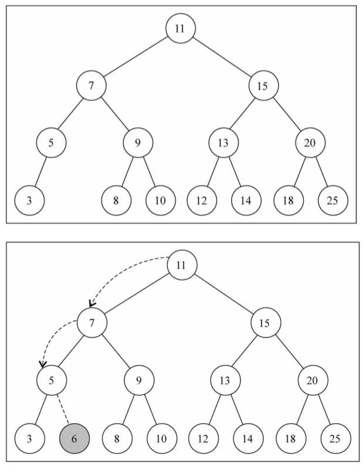

使用递归的操作，判断插入的位置

测试：插入一些数据，将树结构打印到控制台。使用 hy-algokit 工具

demo-project\06-二叉搜索树\02-二叉搜索树 Tree（insert）.ts

```typescript
import { btPrint } from 'hy-algokit'

class Node<T> {
  constructor(public value: T) {}
}

class TreeNode<T> extends Node<T> {
  left: TreeNode<T> | null = null
  right: TreeNode<T> | null = null
}

/**
 * @description: 此类用于：二叉搜索树的封装
 * @Author: ZeT1an
 */
class BSTree<T> {
  private root: TreeNode<T> | null = null

  print() {
    btPrint(this.root)
  }

  /**
   * @description: 此函数用于：二叉搜索树的插入操作。
   * @Author: ZeT1an
   * @param {T} value 插入的值
   * @return {*}
   */
  insert(value: T) {
    // 1.根据传入的 value，创建 Node 节点。
    const newNode = new TreeNode(value)

    // 2.判断当前是否已经有了根节点
    if (!this.root) {
      this.root = newNode
    } else {
      this.insertNode(this.root, newNode)
    }
  }
  private insertNode(node: TreeNode<T>, newNode: TreeNode<T>) {
    if (newNode.value < node.value) {
      if (!node.left) {
        node.left = newNode
      } else {
        this.insertNode(node.left, newNode)
      }
    } else {
      if (!node.right) {
        node.right = newNode
      } else {
        this.insertNode(node.right, newNode)
      }
    }
  }
}

export default BSTree

// 测试
const bst = new BSTree<number>()
bst.insert(11)
bst.insert(7)
bst.insert(15)
bst.insert(5)
bst.insert(3)
bst.insert(9)
bst.insert(8)
bst.insert(10)
bst.insert(13)
bst.insert(12)
bst.insert(14)
bst.insert(20)
bst.insert(18)
bst.insert(25)
bst.insert(6)

bst.print()
```

## 三、遍历

不仅是二叉搜索树，针对所有二叉树，都适用的遍历方法。

树的遍历：

- 遍历一棵树，是指访问树的每个节点（也可以对每个节点进行某些操作，这里就是简单的打印）.
- 树和线性结构不太一样，线性结构通常按照从前到后的顺序遍历，但是树呢？
- 应该从树的顶端还是底端开始呢？ 从左开始还是从右开始呢？

二叉树的遍历常见的有四种方式：

- 先序遍历
- 中序遍历
- 后序遍历
- 层序遍历

### 1.先序遍历

遍历的过程为：

1. 访问根节点；
2. 先序遍历其左子树；
3. 先序遍历其右子树。

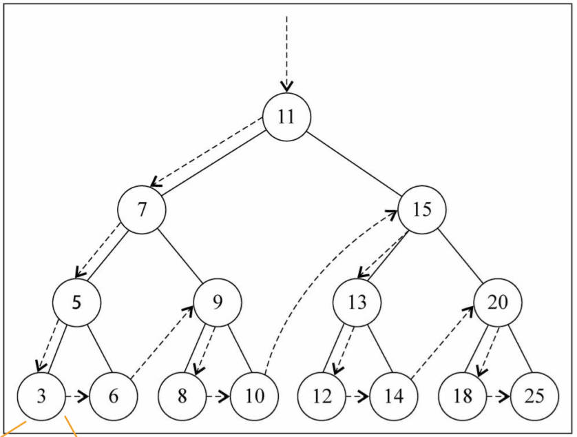

使用递归操作，最方便

demo-project\06-二叉搜索树\02-二叉搜索树 Tree（遍历）.ts

```typescript
import { btPrint } from 'hy-algokit'

class Node<T> {
  constructor(public value: T) {}
}

class TreeNode<T> extends Node<T> {
  left: TreeNode<T> | null = null
  right: TreeNode<T> | null = null
}

/**
 * @description: 此类用于：二叉搜索树的封装
 * @Author: ZeT1an
 */
class BSTree<T> {
  private root: TreeNode<T> | null = null
  
  //...

  /**
   * @description: 此函数用于：二叉搜索树的遍历操作
   * @Author: ZeT1an
   * @return {*}
   */
  preorderTraverse() {
    this.preOrderTraverseNode(this.root)
  }
  private preOrderTraverseNode(node: TreeNode<T> | null) {
    if (node) {
      console.log(node.value)
      this.preOrderTraverseNode(node.left)
      this.preOrderTraverseNode(node.right)
    }
  }
}

export default BSTree
```

非递归写法（了解）。

demo-project\06-二叉搜索树\04-二叉搜索树 Tree（先序遍历-循环）.ts

```typescript
import { btPrint } from 'hy-algokit'

class Node<T> {
  constructor(public value: T) {}
}

class TreeNode<T> extends Node<T> {
  left: TreeNode<T> | null = null
  right: TreeNode<T> | null = null
}

/**
 * @description: 此类用于：二叉搜索树的封装
 * @Author: ZeT1an
 */
class BSTree<T> {
  private root: TreeNode<T> | null = null

  print() {
    btPrint(this.root)
  }

  /**
   * @description: 此函数用于：二叉搜索树的遍历操作
   * @Author: ZeT1an
   * @return {*}
   */
  preorderTraverse() {
    let stack: TreeNode<T>[] = []
    let current: TreeNode<T> | null = this.root

    while (current !== null || stack.length !== 0) {
      while (current !== null) {
        console.log(current.value)
        stack.push(current)
        current = current.left
      }
      current = stack.pop()!
      current = current.right
    }
  }
}
```

### 2.中序遍历

遍历过程为：

1. 中序遍历其左子树（右子树）；
2. 访问根节点；
3. 中序遍历其右子树（左子树）。

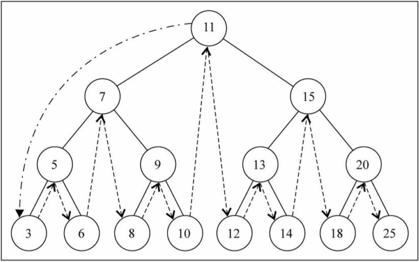

二叉搜索树中，中序遍历如果按照：先遍历左子树的遍历过程，那么遍历的结果，就是从大到小的顺序。

使用递归，最方便。

```typescript
import { btPrint } from 'hy-algokit'

class Node<T> {
  constructor(public value: T) {}
}

class TreeNode<T> extends Node<T> {
  left: TreeNode<T> | null = null
  right: TreeNode<T> | null = null
}

/**
 * @description: 此类用于：二叉搜索树的封装
 * @Author: ZeT1an
 */
class BSTree<T> {
  private root: TreeNode<T> | null = null

  print() {
    btPrint(this.root)
  }

  inOrderTraverse() {
    this.inOrderTraverseNode(this.root)
  }
  private inOrderTraverseNode(node: TreeNode<T> | null) {
    if (node) {
      this.inOrderTraverseNode(node.left)
      console.log(node.value)
      this.inOrderTraverseNode(node.right)
    }
  }
}

export default BSTree
```

非递归写法（了解）。

demo-project\06-二叉搜索树\06-二叉搜索树 Tree（中序遍历-循环）.ts

```typescript
import { btPrint } from 'hy-algokit'

class Node<T> {
  constructor(public value: T) {}
}

class TreeNode<T> extends Node<T> {
  left: TreeNode<T> | null = null
  right: TreeNode<T> | null = null
}

/**
 * @description: 此类用于：二叉搜索树的封装
 * @Author: ZeT1an
 */
class BSTree<T> {
  private root: TreeNode<T> | null = null

  print() {
    btPrint(this.root)
  }

  /**
   * @description: 此函数用于：二叉树的中序遍历
   * @Author: ZeT1an
   * @return {*}
   */
  inOrderTraverse() {
    let stack: TreeNode<T>[] = []
    let current: TreeNode<T> | null = this.root

    while (current !== null || stack.length > 0) {
      while (current !== null) {
        stack.push(current)
        current = current.left
      }

      current = stack.pop()!
      console.log(current.value)
      current = current.right
    }
  }
}

export default BSTree
```

### 3.后序遍历

遍历过程为：

1. 后序遍历其左子树；
2. 后序遍历其右子树；
3. 访问根节点。

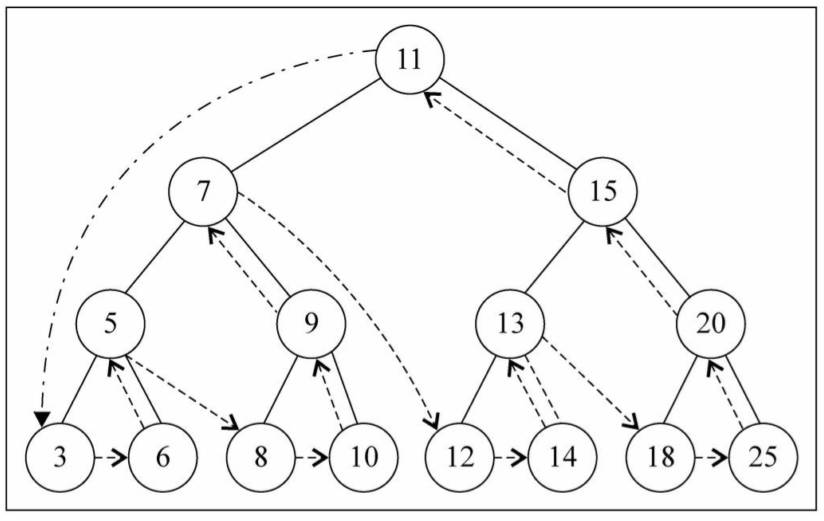

也用递归，最方便。

demo-project\06-二叉搜索树\07-二叉搜索树 Tree（后序遍历-递归）.ts

```typescript
import { btPrint } from 'hy-algokit'

class Node<T> {
  constructor(public value: T) {}
}

class TreeNode<T> extends Node<T> {
  left: TreeNode<T> | null = null
  right: TreeNode<T> | null = null
}

/**
 * @description: 此类用于：二叉搜索树的封装
 * @Author: ZeT1an
 */
class BSTree<T> {
  private root: TreeNode<T> | null = null

  print() {
    btPrint(this.root)
  }

  /**
   * @description: 此函数用于：二叉树的后序遍历操作
   * @Author: ZeT1an
   * @return {*}
   */
  postOrderTraverse() {
    this.postOrderTraverseNode(this.root)
  }
  private postOrderTraverseNode(node: TreeNode<T> | null) {
    if (node) {
      this.postOrderTraverseNode(node.left)
      this.postOrderTraverseNode(node.right)
      console.log(node.value)
    }
  }
}
```

非递归写法（了解）。

demo-project\06-二叉搜索树\08-二叉搜索树 Tree（后序遍历-循环）.ts

```typescript
class Node<T> {
  constructor(public value: T) {}
}

class TreeNode<T> extends Node<T> {
  left: TreeNode<T> | null = null
  right: TreeNode<T> | null = null
}

/**
 * @description: 此类用于：二叉搜索树的封装
 * @Author: ZeT1an
 */
class BSTree<T> {
  private root: TreeNode<T> | null = null

  print() {
    btPrint(this.root)
  }

  /**
   * @description: 此函数用于：二叉树的后序遍历操作
   * @Author: ZeT1an
   * @return {*}
   */
  postOrderTraverse() {
    let stack: TreeNode<T>[] = []
    let current: TreeNode<T> | null = this.root
    let lastVisitedNode: TreeNode<T> | null = null

    while (current || stack.length) {
      while (current) {
        stack.push(current)
        current = current.left
      }

      current = stack[stack.length - 1]
      if (!current.right || current.right === lastVisitedNode) {
        console.log(current.value)
        lastVisitedNode = current
        stack.pop()
        current = null
      } else {
        current = current.right
      }
    }
  }
}

export default BSTree
```

### 4.层序遍历

遍历过程为：

- 从上向下逐层遍历。

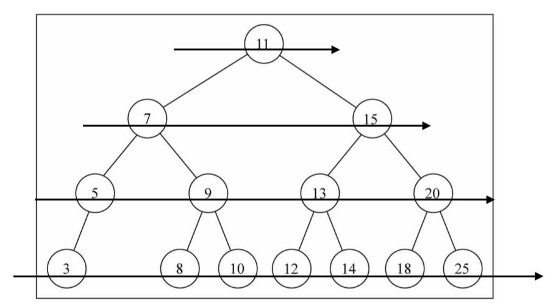

通常借助于队列来完成；也是队列的一个经典应用场景；

> 这个算法很重要，后面图结构遍历的深度优先，广度优先也是用该算法.

demo-project\06-二叉搜索树\09-二叉搜索树 Tree（层序遍历）.ts

```typescript
class Node<T> {
  constructor(public value: T) {}
}

class TreeNode<T> extends Node<T> {
  left: TreeNode<T> | null = null
  right: TreeNode<T> | null = null
}

/**
 * @description: 此类用于：二叉搜索树的封装
 * @Author: ZeT1an
 */
class BSTree<T> {
  private root: TreeNode<T> | null = null
  
  //...

  /**
   * @description: 此函方法于：二叉树的层序遍历操作
   * @Author: ZeT1an
   * @return {*}
   */
  levelOrderTraverse() {
    // 1.如果没有根节点，那么不需要遍历
    if (!this.root) return

    // 2.创建队列结构，第1个节点是根节点
    const queue: TreeNode<T>[] = [this.root]

    // 3.遍历队列中所有的节点（依次出队）
    while (queue.length) {
      const current = queue.shift()!
      console.log(current!.value)

      // 4.将左子节点放入到队列中
      if (current.left) {
        queue.push(current.left)
      }

      if (current.right) {
        queue.push(current.right)
      }
    }
  }
}

export default BSTree
```

## 四、最大值，最小值

在二叉搜索树中，搜索最值是一件非常简单的事情，其实可用肉眼直观的看出来了。

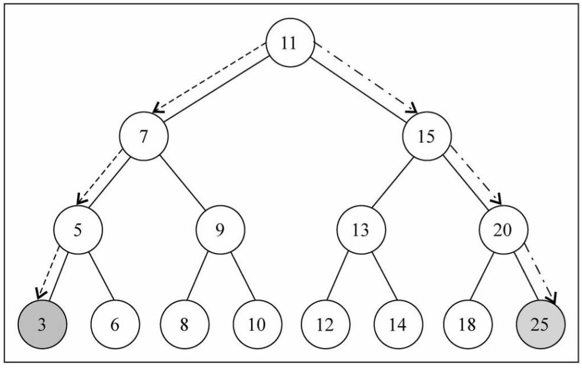

demo-project\06-二叉搜索树\10-二叉搜索树 Tree（最值）.ts

```typescript
import { btPrint } from 'hy-algokit'

class Node<T> {
  constructor(public value: T) {}
}

class TreeNode<T> extends Node<T> {
  left: TreeNode<T> | null = null
  right: TreeNode<T> | null = null
}

/**
 * @description: 此类用于：二叉搜索树的封装
 * @Author: ZeT1an
 */
class BSTree<T> {
  private root: TreeNode<T> | null = null
  
  // ...

  /**
   * @description: 此方法用于：获取二叉搜索树的最大值
   * @Author: ZeT1an
   * @return {*}
   */
  getMaxVAlue(): T | null {
    let current = this.root
    while (current && current?.right) {
      current = current?.right
    }

    return current?.value ?? null
  }

  /**
   * @description: 此方法用于：获取二叉搜索树的最小值
   * @Author: ZeT1an
   * @return {*}
   */
  getNinValue(): T | null {
    let current = this.root
    while (current && current?.left) {
      current = current?.left
    }

    return current?.value ?? null
  }
}

export default BSTree

// 测试
const bst = new BSTree<number>()
bst.insert(11)
bst.insert(7)
bst.insert(15)
bst.insert(5)
bst.insert(3)
bst.insert(9)
bst.insert(8)
bst.insert(10)
bst.insert(13)
bst.insert(12)
bst.insert(14)
bst.insert(20)
bst.insert(18)
bst.insert(25)
bst.insert(6)

bst.print()
bst.levelOrderTraverse()
console.log('最大值:', bst.getMaxVAlue())
console.log('最小值:', bst.getNinValue())
```

## 五、search 方法

二叉搜索树，搜索特定的值，效率也非常高。返回 boolean 类型即可。

使用递归的方式。

递归必须有退出条件，以下两种情况下，可退出。

- `node === null`，也就是后面不再有节点的时候。
- `node.value === value` ，也就是找到对应的 value 的时候。

在其他情况下，根据 node 的 value 和传入的 value 进行比较，来决定向左还是向右查找。

- `node.value > value`，说明传入的值更小，需要向左查找。
- `node.value < value`，说明传入的值更大，需要向右查找。

使用循环：

demo-project\06-二叉搜索树\12-二叉搜索树 Tree（search-循环）.ts

```typescript
class Node<T> {
  constructor(public value: T) {}
}

class TreeNode<T> extends Node<T> {
  left: TreeNode<T> | null = null
  right: TreeNode<T> | null = null
}

/**
 * @description: 此类用于：二叉搜索树的封装
 * @Author: ZeT1an
 */
class BSTree<T> {
  private root: TreeNode<T> | null = null

  /**
   * @description: 此方法用于：二叉搜索树搜索
   * @Author: ZeT1an
   * @param {T} value 要搜索的值
   * @return {boolean} 是否有要搜索的值
   */
  search(value: T): boolean {
    let current = this.root
    while (current) {
      if (current.value === value) {
        return true
      } else if (current.value > value) {
        current = current.left
      } else {
        current = current.right
      }
    }

    return false
  }
}

export default BSTree
```

使用递归（了解）。

demo-project\06-二叉搜索树\11-二叉搜索树 Tree（search-递归）.ts

```typescript
class Node<T> {
  constructor(public value: T) {}
}

class TreeNode<T> extends Node<T> {
  left: TreeNode<T> | null = null
  right: TreeNode<T> | null = null
}

/**
 * @description: 此类用于：二叉搜索树的封装
 * @Author: ZeT1an
 */
class BSTree<T> {
  private root: TreeNode<T> | null = null

  /**
   * @description: 此方法用于：二叉搜索树的搜索
   * @Author: ZeT1an
   * @param {T} value 要搜索的值
   * @return {boolean} 是否有要搜索的值
   */
  search(value: T): boolean {
    return this.searchNode(this.root, value)
  }
  private searchNode(node: TreeNode<T> | null, value: T): boolean {
    if (node === null) return false

    if (node.value > value) {
      return this.searchNode(node.left, value)
    } else if (node.value < value) {
      return this.searchNode(node.right, value)
    } else {
      return true
    }
  }
}

export default BSTree
```


## 六、delete 方法（难点）

删除节点，要从查找该节点开始，找到节点后，需要考虑三种情况：

- 情况一：该节点是叶节点，没有子节点（简单）；
- 情况二：该节点有一个子节点（比较简单）；
- 情况三：该节点有两个子节点（复杂）。

### 1.查找节点

先找到要删除的节点，如果没有找到，就无需删除。

为 `TreeNode` 类，新增 `parent` 属性，用于指向子节点的父节点。

抽取 `search` 方法中的逻辑，到 `searchNode` 方法中。

demo-project\06-二叉搜索树\13-二叉搜索树 Tree（delete）.ts

```typescript
import { btPrint } from 'hy-algokit'

class Node<T> {
  constructor(public value: T) {}
}

class TreeNode<T> extends Node<T> {
  left: TreeNode<T> | null = null
  right: TreeNode<T> | null = null
  // 当前节点的父节点
  parent: TreeNode<T> | null = null
}

/**
 * @description: 此类用于：二叉搜索树的封装
 * @Author: ZeT1an
 */
class BSTree<T> {
  private root: TreeNode<T> | null = null

  //...
  
  private searchNode(value: T): TreeNode<T> | null {
    let current = this.root
    let parent: TreeNode<T> | null = null
    while (current) {
      // 1.找到 current，直接返回
      if (current.value === value) {
        return current
      }

      // 2.继续向下找
      parent = current
      if (current.value > value) {
        current = current.left
      } else {
        current = current.right
      }

      // 如果 current 有值，那么 current 保存自己的父节点
      if (current) current.parent = parent
    }

    return null
  }

  /**
   * @description: 此方法用于：二叉搜索树的收缩
   * @Author: ZeT1an
   * @param {T} value 要搜索的值
   * @return {boolean} 是否有要搜索的值
   */
  search(value: T): boolean {
    return !!this.searchNode(value)
  }

  remove(value: T): boolean {
    // 1.查找 value 所在的节点
    const current = this.searchNode(value)
    if (!current) return false

    // 2.获取到三个东西，当前节点 / 父节点 / 当前节点是左子节点，还是右子节点
    console.log('当前节点：', current.value, '父节点：', current.parent?.value)

    return true
  }
}

export default BSTree

// 测试
const bst = new BSTree<number>()
bst.insert(11)
bst.insert(7)
bst.insert(15)
bst.insert(5)
bst.insert(3)
bst.insert(9)
bst.insert(8)
bst.insert(10)
bst.insert(13)
bst.insert(12)
bst.insert(14)
bst.insert(20)
bst.insert(18)
bst.insert(25)
bst.insert(6)

bst.print()

bst.remove(13)
```

### 2.删除的是叶子节点

检测 current 的 left、right 是否都为 null.

如果都满足，那么该节点，就是一个叶子节点。

再检查 current 是否是根节点。

- 满足，清空整个二叉树。

  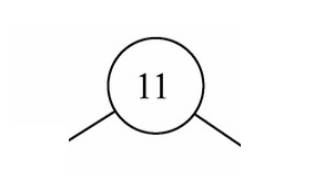

- 不满足，就判断该子节点，是父节点的左子节点，还是右子节点。再把相应的引用，设置为 null 即可。

  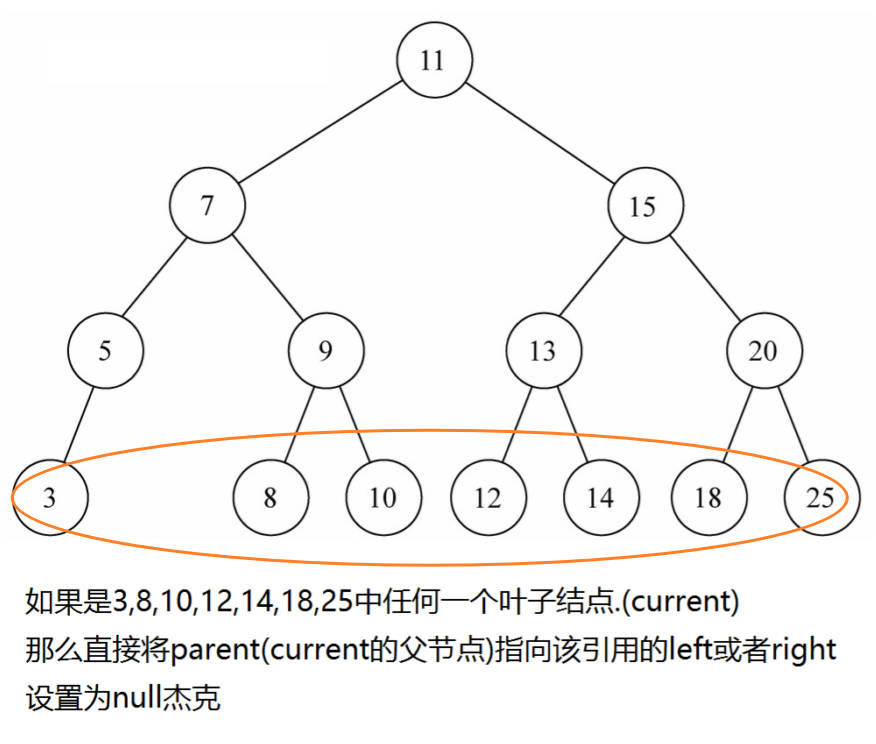

为 `TreeNode` 类，新增 `isLeft`，`isRight` 两个访问器。

demo-project\06-二叉搜索树\13-二叉搜索树 Tree（delete）.ts

```typescript
import { btPrint } from 'hy-algokit'

class Node<T> {
  constructor(public value: T) {}
}

class TreeNode<T> extends Node<T> {
  left: TreeNode<T> | null = null
  right: TreeNode<T> | null = null
  // 当前节点的父节点
  parent: TreeNode<T> | null = null

  get isLeft(): boolean {
    return !!(this.parent && this.parent.left === this)
  }
  get isRight(): boolean {
    return !!(this.parent && this.parent.right === this)
  }
}

/**
 * @description: 此类用于：二叉搜索树的封装
 * @Author: ZeT1an
 */
class BSTree<T> {
  private root: TreeNode<T> | null = null

  print() {
    btPrint(this.root)
  }

  // ...

  /**
   * @description: 此方法用于：二叉搜索树的收缩
   * @Author: ZeT1an
   * @param {T} value 要搜索的值
   * @return {boolean} 是否有要搜索的值
   */
  search(value: T): boolean {
    return !!this.searchNode(value)
  }

  remove(value: T): boolean {
    // 1.查找 value 所在的节点
    const current = this.searchNode(value)
    if (!current) return false

    // 2.获取到三个东西，当前节点 / 父节点 / 当前节点是左子节点，还是右子节点
    // 删除的是叶子节点
    if (current.left === null && current.right === null) {
      if (current === this.root) {
        // 根节点
        this.root = null
      } else if (current.isLeft) {
        // 父节点的左子节点
        current.parent!.left = null
      } else {
        current.parent!.right = null
      }
    }

    return true
  }
}

export default BSTree

// 测试
const bst = new BSTree<number>()
bst.insert(11)
bst.insert(7)
bst.insert(15)
bst.insert(5)
bst.insert(3)
bst.insert(9)
bst.insert(8)
bst.insert(10)
bst.insert(13)
bst.insert(12)
bst.insert(14)
bst.insert(20)
bst.insert(18)
bst.insert(25)
bst.insert(6)

bst.print()
bst.remove(12)
bst.print()
```

### 3.删除的是仅有一个子节点的节点

删除的节点有一个子节点

- current 只有左子节点或者右子节点。

这个过程，考虑是否 current 就是根，

然后要改变父节点的 left 或者 right，指向要删除节点的左子节点或者右子节点.

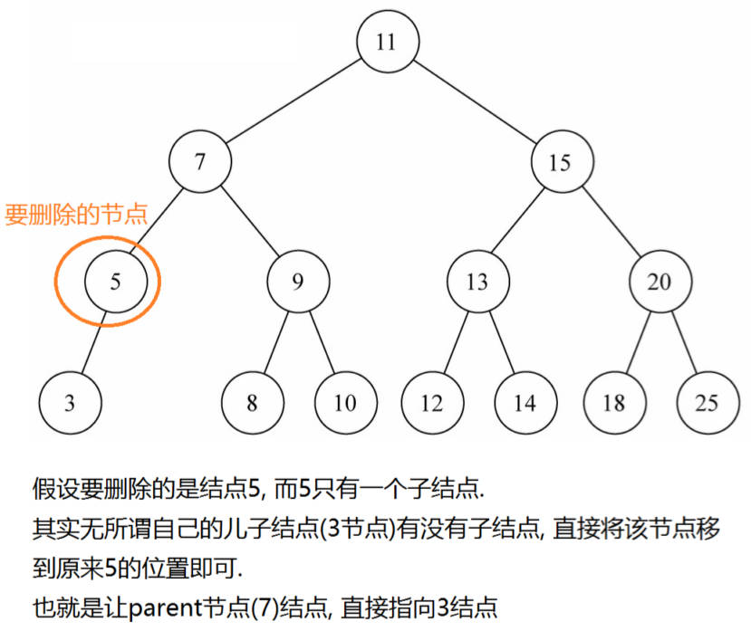

demo-project\06-二叉搜索树\13-二叉搜索树 Tree（delete）.ts

```typescript
import { btPrint } from 'hy-algokit'

class Node<T> {
  constructor(public value: T) {}
}

class TreeNode<T> extends Node<T> {
  left: TreeNode<T> | null = null
  right: TreeNode<T> | null = null
  // 当前节点的父节点
  parent: TreeNode<T> | null = null

  get isLeft(): boolean {
    return !!(this.parent && this.parent.left === this)
  }
  get isRight(): boolean {
    return !!(this.parent && this.parent.right === this)
  }
}

/**
 * @description: 此类用于：二叉搜索树的封装
 * @Author: ZeT1an
 */
class BSTree<T> {
  private root: TreeNode<T> | null = null

  //...

  /**
   * @description: 此方法用于：二叉搜索树中，节点的删除。
   * @Author: ZeT1an
   * @param {T} value
   * @return {*}
   */
  remove(value: T): boolean {
    // 1.查找 value 所在的节点
    const current = this.searchNode(value)
    if (!current) return false

    // 2.获取到三个东西，当前节点 / 父节点 / 当前节点是左子节点，还是右子节点
    // console.log('当前节点：', current.value, '父节点：', current.parent?.value)
    // 删除的是叶子节点
    if (current.left === null && current.right === null) {
      if (current === this.root) {
        // 根节点
        this.root = null
      } else if (current.isLeft) {
        // 父节点的左子节点
        current.parent!.left = null
      } else {
        current.parent!.right = null
      }
    }

    // 3.只有一个子节点
    else if (current.right === null) {
      // 只有左子节点
      if (current === this.root) {
        this.root = current.left
      } else if (current.isLeft) {
        current.parent!.left = current.left
      } else {
        current.parent!.right = current.left
      }
    } else if (current.left === null) {
      // 只有右子节点
      if (current === this.root) {
        this.root = current.right
      } else if (current.isLeft) {
        current.parent!.left = current.right
      } else {
        current.parent!.right = current.right
      }
    }

    return true
  }
}

export default BSTree

// 测试
const bst = new BSTree<number>()
bst.insert(11)
bst.insert(7)
bst.insert(15)
bst.insert(5)
bst.insert(3)
bst.insert(9)
bst.insert(8)
bst.insert(10)
bst.insert(13)
bst.insert(12)
bst.insert(14)
bst.insert(20)
bst.insert(18)
bst.insert(25)
bst.insert(6)

bst.print()
bst.remove(12)
bst.print()
bst.remove(13)
bst.print()
```

### 4.删除的是有两个子节点的节点（难点）

删除的节点有两个子节点（情况比较复杂）。

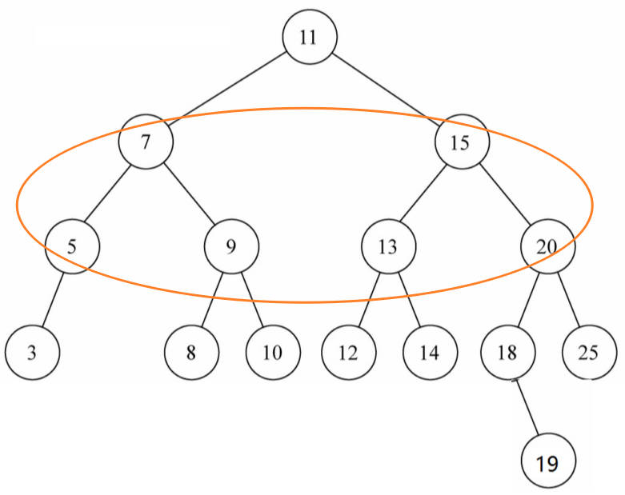

需要找到某一个后代节点，代替 current 的位置。这是有规律可循的。

如果我们要删除的节点，有两个子节点，甚至子节点还有子节点，这种情况下需要从下面的子节点中，找到一个节点，来替换当前的节点.

找到的这个节点有什么特征呢？应该是 current 节点下面所有节点中最接近 current 节点的.

- 要么比 current 节点小一点点，要么比 current 节点大一点点。

这个节点怎么找呢？

- 比 current 小一点点的节点，一定是 current 左子树的最大值。
- 比 current 大一点点的节点，一定是 current 右子树的最小值。

**前驱** & **后继**

- 在二叉搜索树中，有两个特别的节点。
- 比 current 小一点点的节点，称为 current 节点的前驱。
- 比 current 大一点点的节点，称为 current 节点的后继。

也就是为了能够删除有两个子节点的 current，要么找到它的前驱，要么找到它的后继。

所以，接下来，我们先找到这样的节点（前驱或者后继都可以，我这里以找后继为例）。

demo-project\06-二叉搜索树\13-二叉搜索树 Tree（delete）.ts

```typescript
import { btPrint } from 'hy-algokit'

class Node<T> {
  constructor(public value: T) {}
}

class TreeNode<T> extends Node<T> {
  left: TreeNode<T> | null = null
  right: TreeNode<T> | null = null
  // 当前节点的父节点
  parent: TreeNode<T> | null = null

  get isLeft(): boolean {
    return !!(this.parent && this.parent.left === this)
  }
  get isRight(): boolean {
    return !!(this.parent && this.parent.right === this)
  }
}

/**
 * @description: 此类用于：二叉搜索树的封装
 * @Author: ZeT1an
 */
class BSTree<T> {
  private root: TreeNode<T> | null = null

  // ...

  /**
   * @description: 此方法用于：二叉搜索树中，节点的删除。
   * @Author: ZeT1an
   * @param {T} value
   * @return {*}
   */
  remove(value: T): boolean {
    // 1.查找 value 所在的节点
    const current = this.searchNode(value)
    if (!current) return false

    // 2.获取到三个东西，当前节点 / 父节点 / 当前节点是左子节点，还是右子节点
    // console.log('当前节点：', current.value, '父节点：', current.parent?.value)
    // 删除的是叶子节点
    if (current.left === null && current.right === null) {
      if (current === this.root) {
        // 根节点
        this.root = null
      } else if (current.isLeft) {
        // 父节点的左子节点
        current.parent!.left = null
      } else {
        current.parent!.right = null
      }
    }

    // 3.只有一个子节点
    else if (current.right === null) {
      // 只有左子节点
      if (current === this.root) {
        this.root = current.left
      } else if (current.isLeft) {
        current.parent!.left = current.left
      } else {
        current.parent!.right = current.left
      }
    } else if (current.left === null) {
      // 只有右子节点
      if (current === this.root) {
        this.root = current.right
      } else if (current.isLeft) {
        current.parent!.left = current.right
      } else {
        current.parent!.right = current.right
      }
    }

    // 4.有两个子节点
    else {
      const successor = this.getSuccessor(current)
      if (current === this.root) {
        this.root = successor
      } else if (current.isLeft) {
        current.parent!.left = successor
      } else {
        current.parent!.right = successor
      }
    }

    return true
  }

  private getSuccessor(delNode: TreeNode<T>): TreeNode<T> {
    // 获取待删除节点的右子树
    let current = delNode.right
    let successor: TreeNode<T> | null = null
    while (current) {
      successor = current
      current = current.left
      if (current) {
        current.parent = successor
      }
    }

    // 拿到后继节点
    if (successor !== delNode.right) {
      successor!.parent!.left = successor!.right
      successor!.right = delNode.right
    }

    // 将删除节点的 left，赋值给后继节点的 left
    successor!.left = delNode.left

    return successor!
  }
}

export default BSTree

// 测试
const bst = new BSTree<number>()
bst.insert(11)
bst.insert(7)
bst.insert(15)
bst.insert(5)
bst.insert(3)
bst.insert(9)
bst.insert(8)
bst.insert(10)
bst.insert(13)
bst.insert(12)
bst.insert(14)
bst.insert(20)
bst.insert(18)
bst.insert(25)
bst.insert(6)

bst.print()
bst.remove(12)
bst.print()
bst.remove(13)
bst.print()
bst.remove(7)
bst.print()
```

## 七、重构，代码优化

优化重复的代码：

demo-project\06-二叉搜索树\14-二叉搜索树 Tree（delete-重构）.ts

```typescript
class BSTree<T> {
  // ...

  /**
   * @description: 此方法用于：二叉搜索树中，节点的删除。
   * @Author: ZeT1an
   * @param {T} value
   * @return {*}
   */
  remove(value: T): boolean {
    // 1.查找 value 所在的节点
    const current = this.searchNode(value)
    if (!current) return false

    let replaceNode: TreeNode<T> | null = null
    // 2.获取到三个东西，当前节点 / 父节点 / 当前节点是左子节点，还是右子节点
    // console.log('当前节点：', current.value, '父节点：', current.parent?.value)
    // 删除的是叶子节点
    if (current.left === null && current.right === null) {
      replaceNode = null
    }

    // 3.只有一个子节点
    else if (current.right === null) {
      // 只有左子节点
      replaceNode = current.left
    } else if (current.left === null) {
      // 只有右子节点
      replaceNode = current.right
    }

    // 4.有两个子节点
    else {
      const successor = this.getSuccessor(current)
      replaceNode = successor
    }

    if (current === this.root) {
      this.root = replaceNode
    } else if (current.isLeft) {
      current.parent!.left = replaceNode
    } else {
      current.parent!.right = replaceNode
    }

    return true
  }
}
```

## 八、删除操作总结

看到这里，你就会发现，删除节点相当棘手。

实际上，因为它非常复杂，一些程序员会尝试着避开删除操作。

- 他们的做法是，在 Node 类中，添加一个类型为 boolean 的属性，比如名称为 isDeleted。
- 要删除一个节点时，就将此字段设置为 true。
- 其他操作，比如 `find()` 在查找之前，先判断这个节点是不是标记为删除。
- 这样相对比较简单，每次删除节点不会改变原有的树结构。
- 但是在二叉树的存储中，还保留着那些本该已经被删除掉的节点。

上面的做法看起来很聪明，其实是一种逃避。

- 这样会造成很大空间的浪费，特别是针对数据量较大的情况。
- 而且，作为程序员，要学会通过这些复杂的操作，锻炼自己的逻辑。

## 九、二叉搜索树的缺陷

二叉搜索树，作为数据存储的结构有重要的优势：

- 可以快速地找到、插入、删除数据项。

但是，二叉搜索树有一个很麻烦的问题：

- 如果插入的数据是有序的数据，比如下面的情况
- 有一棵初始化为 9 8 12 的二叉树
- 插入下面的数据：7 6 5 4 3

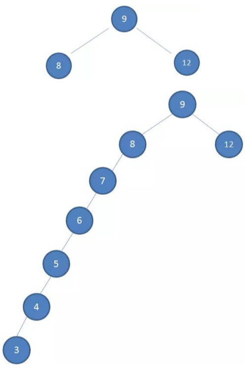

非平衡树：

- 比较好的二叉搜索树，数据项应该是左右分布均匀的。
- 但是插入连续数据后，分布变的不均匀，一般称这种树为非平衡树。
- 对于一棵平衡二叉树来说，插入、查找、删除等操作的效率是 `O(logN)`；
- 对于一棵非平衡二叉树，相当于编写了一个链表，插入，查找、删除效率变成了 `O(N)`。

## 十、树的平衡性

为了能以较快的时间 `O(log N)` 来操作一棵树，我们需要保证树总是平衡的：

- 至少大部分是平衡的，那么时间复杂度也是接近 `O(log N)` 的；
- 也就是说，树中每个节点左边的子孙节点的个数，应该尽可能的等于右边的子孙节点的个数。
- 常见的平衡树有哪些呢？

AVL 树：

- AVL 树，是最早的一种平衡树。它有些办法保持树的平衡（每个节点多存储了一个额外的数据）
- 因为 AVL 树是平衡的，所以时间复杂度也是 `O(log N)`。
- 但是，每次插入、删除操作，相对于红黑树，效率都不高，所以整体效率不如红黑树。

红黑树：

- 红黑树，也是通过一些特性，来保持树的平衡。
- 因为是平衡树，所以时间复杂度也是在 `O(log N)`。
- 另外插入、删除等操作，红黑树的性能要优于 AVL 树，所以，现在平衡树的应用，基本都是红黑树。
