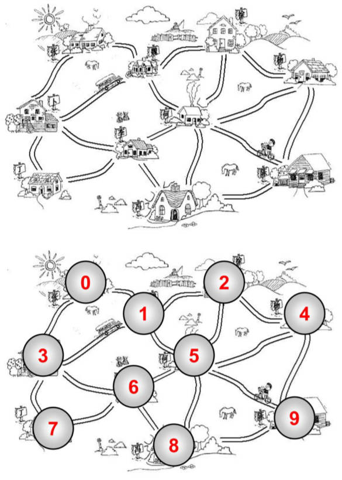
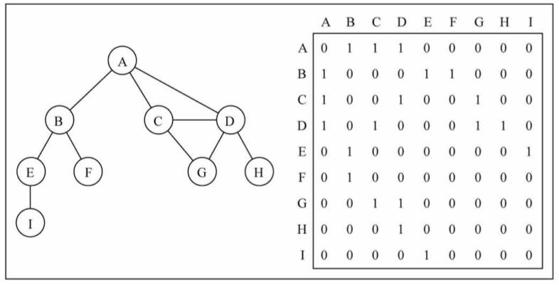
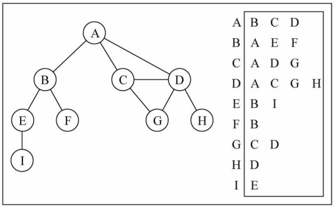
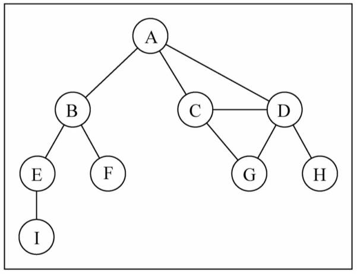
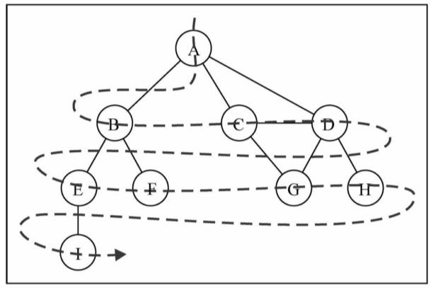
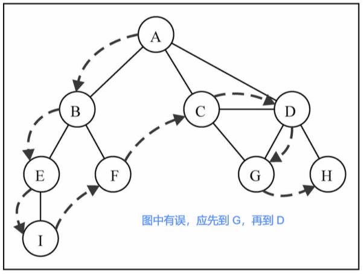

# 图结构

面试的比较少。

## 一、图结构是什么

在计算机程序设计中，图结构，是一种非常常见的数据结构。

> 本章主要介绍的是：图的抽象数据类型，和一些相关算法实现。
>
> 而“图论”，是数学的一个分支，是一个非常大的话题；

什么是图结构?

- 图结构与树结构有些相似。

- 在数学的概念上，树是图的一种。
- 它是以图为研究对象，研究”**顶点**“和“**边**”组成的图形的数学理论和方法。
- 主要研究的目的是：事物之间的关系，”**顶点**“代表事物，“**边**”代表两个事物间的关系。

我们知道树可以用来模拟很多现实的数据结构

- 比如：家谱，公司组织架构 ...

那么，图长什么样子？或者什么样的数据，使用图来模拟更合适呢?

## 二、图的现实案例

### 1.人际关系网

科学家们在观察人与人之间的关系网时，发现了“六度空间理论”。

> 六度空间理论：理论上认为，世界上任何两个互相不认识的人，只需要经过最多六个中间人，就可以建立起联系。


### 2.北京地铁图


### 3.村庄路线图


我们会发现，上面的节点（图中叫**顶点（Vertex）**)之间的关系，不能使用树来表示。

这个时候，就要使用图，来模拟它们。

图通常有什么特点呢?

- 一组顶点：通常用 **V (Vertex)** 表示顶点的集合；
- 一组边：通常用 **E (Edge)** 表示边的集合；
  - 边是顶点和顶点之间的连线。
  - 边可以是有向的，也可以是无向的。
  - 比如：A --- B，通常表示无向。 A --> B，通常表示有向。

## 三、图结构的起源

18 世纪著名古典数学问题之一。

- 在哥尼斯堡的一个公园里，有七座桥，将普雷格尔河中两个岛，及岛与河岸连接起来，如下图。
- 有人提出问题： 一个人怎样才能不重复、不遗漏地一次走完七座桥， 最后回到出发点。


1735 年，有几名大学生，写信给当时正在俄罗斯彼得斯堡科学院任职的，瑞典天才数学家欧拉，请他帮忙解决这一问题。

欧拉在亲自观察了哥尼斯堡的七桥后，认真思考走法，但是始终没有成功，于是他怀疑七桥问题是无解的。

1736 年 29 岁的欧拉，向彼得斯堡科学院，递交了《哥尼斯堡的七座桥》的论文，在解答问题的同时，开创了数学的一个新的分支 —— “图论与几何拓扑”，也由此展开了数学史上的新历程。

### 1.欧拉的解答

欧拉解决了该问题，并且给出了连通图可以一笔画的充要条件：

- 奇点的数目不是 0 个就是 2 个；

  > 与顶点相连的边，如果是奇数条，就称为**奇点**，如果是偶数条就称为**偶点**。
- 要想一笔画成，必须中间点均是**偶点**。如果有奇点，那么奇点只可能在两端；
- 也就是，有来路必有另一条去路；
- 因此任何图能一笔画成，奇点要么没有要么在两端。

coderwhy 思考：

- 欧拉在思考这个问题的时候，并不是针对某一个特性的问题去考虑，而是将“岛”和“桥”，抽象成了点和线。
- 抽象是数学的本质（比如：数字 1 可以是 1 张桌子，一台电脑，1 个水杯 ... 的抽象）；
- 而编程，也是一种抽象的思维。
- 汇编语言是对机器语言的抽象，高级语言是对汇编语言的抽象。
- 操作系统是对硬件的抽象，应用程序在操作系统的基础上构建。


## 四、图的术语

图的术语，非常多，这里，仅介绍几个比较常见的术语。

结合下图理解：



**顶点（vertex）**：

- 顶点表示图中的一个节点。
- 比如：地铁站中某个站，多个村庄中的某个村庄，互联网中的某台主机，人际关系中的人。

**边（edge）**：

- 边表示顶点和顶点之间的连线。
- 比如：地铁站中两个站点之间的直接连线，就是一个边。
- 注意：这里的边，不要是路径，路径是其他的概念，待会儿我们会介绍到。
- 如上图中：0 - 1 有一条边，1 - 2 有一条边，0 - 2 没有边。

**相邻顶点**：

- 由一条边连接在一起的顶点，称为相邻顶点。
- 比如：0 - 1 是相邻的，0 - 3 是相邻的。 0 - 2 是不相邻的。

**度**：

- 一个顶点的度是相邻顶点的数量。
- 比如 0 顶点和其他两个顶点相连，0 顶点的度是 2。
- 比如 1 顶点和其他四个顶点相连，1 顶点的度是 4。

**路径**：

- 路径是顶点 v1，v2...，vn 的一个连续序列，比如上图中 0 1 5 9 就是一条路径。
- **简单路径**：要求不包含重复的顶点。比如 0 1 5 9 是一条简单路径。
- **回路**：第一个顶点和最后一个顶点相同的路径称为回路。 比如 0 1 5 6 3 0 是一条回路。

**无向图**：

- 所有的边，都没有方向。上面的图就是一张无向图。
- 比如 0 - 1 之间有边，那么说明这条边可以保证 0 -> 1，也可以保证 1 -> 0。

**有向图**：

- 有向图表示的图中的边是有方向的。
- 比如 0 -> 1，不能保证一定可以 1 -> 0，要根据方向来定。

**无权图**：

- 边没有携带权重。上图就是一张无权图。
- 上图中的边，是没有任何意义的。
- 不能说 0 - 1 的边，比 4 - 9 的边更远或者用的时间更长。

**带权图**：

- 表示边有一定的权重。
- 这里的权重，可以是任意你希望表示的数据：
  - 比如：距离或者花费的时间或者票价。

## 五、图的表示

怎么在程序中表示图呢?

- 我们知道一个图，包含很多顶点，另外包含顶点和顶点之间的连线（边）。
- 这两个都是非常重要的图信息，因此都需要在程序中体现出来。

### 1.顶点的表示

顶点的表示相对简单：

- 上面的顶点，我们抽象成了 1 2 3 4，也可以抽象成 A B C D。
- 在后面的案例中，我们使用 A B C D。
- 当然，A，B，C，D 也可以表示其他含义的数据（比如村庄的名字）.
- 那么这些 A B C D 我们可以使用一个数组来存储起来(存储所有的顶点)

### 2.边的表示

那么边怎么表示呢?

- 因为边是两个顶点之间的关系，所以表示起来会稍微麻烦一些。
- 下面，我们具体讨论一下边常见的表示方式。

#### 1.邻接矩阵

邻接矩阵，让每个节点，和一个整数项关联，该整数作为数组的下标值。

我们用一个二维数组，来表示顶点之间的连接。

二维数组 \[0\]\[2\] -> A -> C

画图演示：



图片解析：

- 在二维数组中，0 表示没有连线，1 表示有连线。
- 通过二维数组，可以很快地找到一个顶点和哪些顶点有连线。(比如 A 顶点，只需要遍历第一行即可)
- 另外，A - A，B - B（也就是顶点到自己的连线），通常使用 0 表示。

邻接矩阵的问题：

- 如果是一个稀疏图，那么矩阵中将存在大量的 0，这意味着，浪费了计算机存储空间来表示根本不存在的边。

#### 2.邻接表

另外一种常用的表示图的方式：邻接表。

- 邻接表由图中每个顶点，以及和顶点相邻的顶点列表组成。
- 这个列表有很多种方式来存储：比如：数组/链表/字典（哈希表）都可以。

画图演示：



图片解析：

- 比如要表示和 A 顶点有关联的顶点（边），A 和 B 、C、 D 有边，
- 那么我们可以通过 A 找到对应的数组/链表/字典，再取出其中的内容就可以啦。

邻接表的问题：

- 邻接表计算"出度"是比较简单的。

  > 出度：指向别人的数量，入度：指向自己的数量。

- 邻接表如果需要计算有向图的"入度"，那么是一件非常麻烦的事情。

- 它必须构造一个“逆邻接表”，才能有效的计算“入度”。但是开发中“入度”相对用的比较少。

## 六、图的封装

先创建 `Graph` 类：

demo-project\07-图结构\01-图结构Graph（封装）.ts

```typescript
class Graph<T> {
  private vertexes: T[] = []

  private adjListL: Map<T, T[]> = new Map()
}
```

代码解析：

创建 `Graph` 类，在其中定义了两个属性：

- `vertexes`： 用数组来保存所有的顶点。
- `adjList`： "adj"是"adjoin"的缩写，表示邻接的意思。用于存储所有的边，我们这里采用邻接表的形式。

新增三个方法，

- `addVertex` 用于添加顶点：可以向图中添加一些顶点。
- `addEdge` 用于添加边：可以指定顶点和顶点之间的边。
- `printEdge` 用于遍历图：封装使用邻接表，表示图的方法。

demo-project\07-图结构\02-图结构Graph（顶点和边）.ts

```typescript
class Graph<T> {
  // 顶点
  private vertexes: T[] = []
  // 边
  private adjListL: Map<T, T[]> = new Map()

  addVertex(vertex: T) {
    // 将顶点添加到数组中保存
    this.vertexes.push(vertex)
    // 创建一个邻接表中的数组
    this.adjListL.set(vertex, [])
  }

  addEdge(v1: T, v2: T) {
    this.adjListL.get(v1)?.push(v2)
    this.adjListL.get(v2)?.push(v1)
  }

  printEdge() {
    console.log('Graph:')
    this.vertexes.forEach(vertex => {
      const edges = this.adjListL.get(vertex)
      console.log(`${vertex} -> ${edges?.join(' ')}`)
    })
  }
}

// 测试
const graph = new Graph()
graph.addVertex("A")
graph.addVertex("B")
graph.addVertex("C")
graph.addVertex("D")
graph.addVertex("E")
graph.addVertex("F")
graph.addVertex("G")
graph.addVertex("H")
graph.addVertex("I")

graph.addEdge('A', 'B');
graph.addEdge('A', 'C');
graph.addEdge('A', 'D');
graph.addEdge('C', 'D');
graph.addEdge('C', 'G');
graph.addEdge('D', 'G');
graph.addEdge('D', 'H');
graph.addEdge('B', 'E');
graph.addEdge('B', 'F');
graph.addEdge('E', 'I');

graph.printEdge()
```

形成的图结构如下图所示：



添加顶点 `addVertex` 方法解析：

- 将添加的顶点，放入到数组中。
- 另外，给该顶点创建一个数组，该数组用于存储顶点连接的所有的顶点。

添加边 `addEdge` 代码解析：

- 添加边，需要传入两个顶点，因为边是两个顶点之间的边，边不可能单独存在。
- 根据顶点 v1 取出对应的数组，将 v2 加入到它的数组中。
- 根据顶点 v2 取出对应的数组，将 v1 加入到它的数组中。
- 因为我们这里实现的是无向图，所以边是可以双向的。

## 七、图的遍历

图的遍历思想，和树的遍历思想是一样的。

图的遍历，意味着需要将图中每个顶点，访问一遍，并且不能有重复的访问

有两种算法可以对图进行遍历：

- **广度优先搜索（Breadth-First Search，简称 BFS）**
- **深度优先搜索（Depth-First Search，简称 DFS）**

两种遍历算法，都需要明确指定第一个被访问的顶点。

### 1.两种算法的思想

两种算法的思想：

- BFS：基于队列，入队列的顶点，先被探索（类似于树结构的层序遍历）。
- DFS：基于循环方式和栈结构，通过将顶点存入栈中，顶点是沿着路径被探索的，存在新的相邻顶点就去访问；也可使用或递归的方式实现，

> 递归本质上就是函数栈的调用。

为了记录顶点是否被访问过，有两种方案：

方案一：早期的方案，使用三种颜色，来标记它们的状态：

- 白色： 表示该顶点还没有被访问。
- 灰色： 表示该顶点被访问过，但并未被探索过。
- 黑色： 表示该顶点被访问过且被完全探索过。

方案二：使用 Set，来存储被访问过的节点。

### 2.广度优先搜索

demo-project\07-图结构\03-图结构Graph（广度优先）.ts

```typescript
class Graph<T> {
  // 顶点
  private vertexes: T[] = []
  // 边
  private adjListL: Map<T, T[]> = new Map()

  addVertex(vertex: T) {
    // 将顶点添加到数组中保存
    this.vertexes.push(vertex)
    // 创建一个邻接表中的数组
    this.adjListL.set(vertex, [])
  }

  addEdge(v1: T, v2: T) {
    this.adjListL.get(v1)?.push(v2)
    this.adjListL.get(v2)?.push(v1)
  }

  printEdge() {
    console.log('Graph:')
    this.vertexes.forEach(vertex => {
      const edges = this.adjListL.get(vertex)
      console.log(`${vertex} -> ${edges?.join(' ')}`)
    })
  }

  bfs() {
    // 1.判断是否有顶点
    if (this.vertexes.length === 0) return

    // 2.创建队列结构，访问第一个节点
    const queue: T[] = []
    queue.push(this.vertexes[0])

    // 3.创建 Set 结构，记录某一个顶点是否被访问过
    const visited = new Set<T>()
    visited.add(this.vertexes[0])

    // 4.遍历队列中每一个顶点
    while (queue.length) {
      const vertex = queue.shift()
      console.log(vertex)

      const neighbors = this.adjListL.get(vertex!)
      if (!neighbors) continue
      neighbors?.forEach(item => {
        if (!visited.has(item)) {
          visited.add(item)
          queue.push(item)
        }
      })
    }
  }
}

// 测试
const graph = new Graph()
graph.addVertex("A")
graph.addVertex("B")
graph.addVertex("C")
graph.addVertex("D")
graph.addVertex("E")
graph.addVertex("F")
graph.addVertex("G")
graph.addVertex("H")
graph.addVertex("I")

graph.addEdge('A', 'B');
graph.addEdge('A', 'C');
graph.addEdge('A', 'D');
graph.addEdge('C', 'D');
graph.addEdge('C', 'G');
graph.addEdge('D', 'G');
graph.addEdge('D', 'H');
graph.addEdge('B', 'E');
graph.addEdge('B', 'F');
graph.addEdge('E', 'I');

graph.printEdge()
graph.bfs()
```

代码解析：

广度优先搜索算法的思路：

- 从指定的第一个顶点开始，遍历图，先访问其所有的相邻点，就像一次访问图的一层。
- 换句话说，就是先宽后深的访问顶点。

图解 BFS



采用颜色标记方案，广度优先搜索的实现步骤：

1. 创建一个队列 Q。
2. 将 v 标注为被发现的(灰色)，并将 v 入队列 Q 。
3. 如果 Q 非空，执行下面的步骤：
   1. 将 v 从 Q 中取出队列。
   2. 将 v 标注为被发现的灰色。
   3. 将 v 所有的未被访问过的邻接点（白色），加入到队列中。
   4. 将 v 标志为黑色。

### 3.深度优先搜索

demo-project\07-图结构\04-图结构Graph（深度优先）.ts

```typescript
class Graph<T> {
  // 顶点
  private vertexes: T[] = []
  // 边
  private adjListL: Map<T, T[]> = new Map()

  addVertex(vertex: T) {
    // 将顶点添加到数组中保存
    this.vertexes.push(vertex)
    // 创建一个邻接表中的数组
    this.adjListL.set(vertex, [])
  }

  addEdge(v1: T, v2: T) {
    this.adjListL.get(v1)?.push(v2)
    this.adjListL.get(v2)?.push(v1)
  }

  printEdge() {
    console.log('Graph:')
    this.vertexes.forEach(vertex => {
      const edges = this.adjListL.get(vertex)
      console.log(`${vertex} -> ${edges?.join(' ')}`)
    })
  }
  
  // ...

  dfs() {
    // 1.判断有没有顶点，没有直接返回
    if (this.vertexes.length === 0) return

    // 2.创建栈结构
    const stack: T[] = []
    stack.push(this.vertexes[0])

    // 3.创廯 Set
    const visited = new Set<T>()
    visited.add(this.vertexes[0])

    // 4.遍历栈结涟中添加的顶炴�
    while (stack.length) {
      const vertex = stack.pop()
      console.log(vertex)

      const neighbors = this.adjListL.get(vertex!)
      if (!neighbors) continue // 类型缩小
      /* neighbors.forEach(item => {
        if (!visited.has(item)) {
          visited.add(item)
          stack.push(item)
        }
      }) */
      for (let i = neighbors.length - 1; i >= 0; i--) {
        const item = neighbors[i]
        if (!visited.has(item)) {
          visited.add(item)
          stack.push(item)
        }
      }
    }
  }
}

// 测试
const graph = new Graph()
graph.addVertex("A")
graph.addVertex("B")
graph.addVertex("C")
graph.addVertex("D")
graph.addVertex("E")
graph.addVertex("F")
graph.addVertex("G")
graph.addVertex("H")
graph.addVertex("I")

graph.addEdge('A', 'B');
graph.addEdge('A', 'C');
graph.addEdge('A', 'D');
graph.addEdge('C', 'D');
graph.addEdge('C', 'G');
graph.addEdge('D', 'G');
graph.addEdge('D', 'H');
graph.addEdge('B', 'E');
graph.addEdge('B', 'F');
graph.addEdge('E', 'I');

graph.printEdge()
graph.dfs()
```

代码解析：

深度优先搜索的思路：

- 从第一个指定的顶点开始遍历图，直到这条路径所有节点都被访问。
- 接着原路回退，并探索下一条路径。

深度优先搜索算法的实现：

- 使用栈完成，也可以使用递归。

图解 DFS



## 八、图的建模

对交通流量建模

- 顶点可以表示街道的十字路口，边可以表示街道。
- 加权的边，可以表示限速，或者车道的数量，或者街道的距离。
- 建模人员，可以用这个系统来判定最佳路线，以及最可能堵车的街道。

对飞机航线建模

- 航空公司可以用图来为其飞行系统建模。
- 将每个机场看成顶点，将经过两个顶点的每条航线看作一条边。
- 加权的边，可以表示从一个机场到另一个机场的航班成本，或两个机场间的距离。
- 建模人员可以利用这个系统有效的判断从一个城市到另一个城市的最小航行成本。
