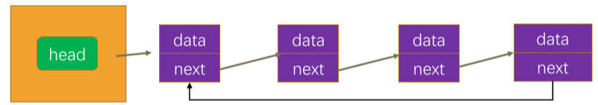

# 二叉树重构 & 单向循环链表 & 双向链表

## 一、二叉树重构

思考：以前封装的二叉搜索树中，能不能放一个对象模型（比如：Product 类的实例），而不是 number 类型的值？

- 答案是可以的。

默认情况下，两个对象之间，不能使用 <, >? 这样的比较运算符，进行比较，否则结果永远为 false。

要在类中实现 `valueOf` 方法，才能让类的两个实例之间，进行比较。

> `valueOf` 只能用于 <, >, 这样的比较运算符，不能用于 ===（全等运算符）的比较。

demo-project\00_测试代码\01-对象之间的比较方式.ts

```typescript
class Person {
  constructor(public name: string, public age: number) {}

  valueOf() {
    return this.age;
  }
}

const p1 = new Person("John", 30);
const p2 = new Person("Jane", 26);
console.log(p1 < p2); // false
console.log(p1 > p2); // true

const p3 = new Person("zzt", 26)
console.log(p3 === p2) // false
console.log(p3 == p2) // false
```

> 两对象实例，如何进行相等比较？
>
> - 实现类的 `equals` 方法：
>
> ```typescript
> class CustomNumber {
>   constructor(private value: number) {}
> 
>   equals(other: CustomNumber): boolean {
>     return this.value === other.value;
>   }
> }
> 
> const num1 = new CustomNumber(5);
> const num2 = new CustomNumber(5);
> 
> console.log(num1.equals(num2));  // 输出: true
> ```

在二叉树 `BSTree` 类的实例中，插入 `Product` 类的实例。

```typescript
/**
 * @description: 此类用于：二叉搜索树的封装
 * @Author: ZeT1an
 */
class BSTree<T> {
  // ...
}

class Product {
  constructor(public name: string, public price: number) {}

  valueOf() {
    return this.price
  }
}

const p1 = new Product('IPhone', 100)
const p2 = new Product('Huawei', 120)
const p3 = new Product('Xiaomi', 80)
const p4 = new Product('oppo', 90)
const p5 = new Product('vivo', 70)

// 测试
const bst = new BSTree<Product>()
bst.insert(p1)
bst.insert(p2)
bst.insert(p3)
bst.insert(p4)
bst.insert(p5)

bst.print()
```

以前封装的 `TreeNode` 类，正好有 `value`，`left`，`right` 属性，可以直接使用 `hy-algokit` 工具库的 `btPrint` 方法，打印二叉树。

那么，如果 `TreeNode` 中的属性是 `data`，`leftNode`, `rightNode` 呢？并且，想要打印的是 Product 对象实例的信息呢（比如：`name` + `data` 这样的字符串）？

这时，就需要为 `TreeNode` 类，实现 `hy-algokit` 工具库中的 `PrintableNode` 接口：

- 它要求实现  `value`，`left`，`right` 这三个属性。

重构二叉树 `TreeNode` 类，实现 `PrintableNode` 接口，。

demo-project\06-二叉搜索树\15-二叉搜索树Tree（存放Product对象）.ts

```typescript
import { PrintableNode, btPrint } from 'hy-algokit'

class Node<T> {
  // 保存节点值的属性是 data，不再是 value
  constructor(public data: T) {}
}

class TreeNode<T> extends Node<T> implements PrintableNode {
  left: TreeNode<T> | null = null
  right: TreeNode<T> | null = null
  // 当前节点的父节点
  parent: TreeNode<T> | null = null

  get isLeft(): boolean {
    return !!(this.parent && this.parent.left === this)
  }
  get isRight(): boolean {
    return !!(this.parent && this.parent.right === this)
  }

  // 用于 hy-algokit 的 btprint 方法打印二叉树
  get value() {
    const data = (this.data) as Product
    return `${data.name} - ${data.price}`
  }
}

/**
 * @description: 此类用于：二叉搜索树的封装
 * @Author: ZeT1an
 */
class BSTree<T> {
  // ...
}

class Product {
  constructor(public name: string, public price: number) {}

  valueOf() {
    return this.price
  }
}

const p1 = new Product('IPhone', 100)
const p2 = new Product('Huawei', 120)
const p3 = new Product('Xiaomi', 80)
const p4 = new Product('oppo', 90)
const p5 = new Product('vivo', 70)

// 测试
const bst = new BSTree<Product>()
bst.insert(p1)
bst.insert(p2)
bst.insert(p3)
bst.insert(p4)
bst.insert(p5)

bst.print()
/*
                          IPhone - 100
                ┌───────────────┴───────────────┐
           Xiaomi - 80                    Huawei - 120
        ┌───────┴───────┐
    vivo - 70       oppo - 90
*/
```

另一种设计思路：在 `BSTree` 类的 `constructor` 中，传入一个 `comparator` 函数，用于比较两个节点的大小。

demo-project\06-二叉搜索树\15-二叉搜索树Tree（存放Product对象）.ts

```typescript
/**
 * @description: 此类用于：二叉搜索树的封装
 * @Author: ZeT1an
 */
class BSTree<T> {
  private root: TreeNode<T> | null = null
  private comparator: (a: T, b: T) => number

  constructor(comparator: (a: T, b: T) => number) {
    this.comparator = comparator
  }

  //...

  private searchNode(value: T): TreeNode<T> | null {

    //...

      // 2.继续向下找
      parent = current
      if (this.comparator(current.data, value)) {
        current = current.left
      } else {
        current = current.right
      }

      // 如果 current 有值，那么 current 保存自己的父节点
      if (current) current.parent = parent

    // ...
  }

  //...
}

// 测试
const bst = new BSTree<Product>((c1, c2) => {
  return c1.price - c2.price
})
//...
```

该方式常用于 Java 中。

再 JS 中，不建议这么用，因为已经有非常好用的 `valueOf` 方法，用于类的实例进行比较。

## 二、循环链表是什么？

前面我们已经从零去封装了一个链表结构（`LinkedList` 类）。

在此基础上，还可以封装更加灵活的链表结构：比如“循环链表”和“双向链表”。

**循环链表（Circular LinkedList）**是一种特殊的链表数据结构：

- 在普通链表的基础上，最后一个节点的下一个节点，不再是 null，而是指向链表的第一个节点。
- 这样形成了一个环，使得链表能够被无限遍历。
- 遍历一个单向循环链表，可从任意一个节点出发，不断地遍历下一个节点，直到回到起点。



单向循环链表，有两种实现方式：

- 方式一：从零去实现一个链表，包括其中所有的属性和方法；
- 方式二：继承自之前封装的 `LinkedList` 类，只实现差异化的部分（下方采用）；

## 三、重构单向链表 linkedList 类

### 1.新增属性，修改属性修饰符

将 `LinkedList` 类中的 `head`，`length` 用 `protected` 修饰。以便子类能够使用这些属性。

并新增 `tail` 属性，表示尾部节点。

demo-project\08-高阶链表结构\01-单向链表重构.ts

```typescript
class LinkedList<T> implements ILinkedList<T> {
  protected head: Node<T> | null = null
  // 新增属性，总是指向链表的尾部。
  protected tail: Node<T> | null = null
  protected length: number = 0

  // ...
}
```

### 2.重构 `append` 方法

demo-project\08-高阶链表结构\01-单向链表重构.ts

```typescript
class LinkedList<T> implements ILinkedList<T> {
  //...

  append(value: T) {
    const newNode = new Node(value)

    if (!this.head) {
      // 情况一：链表本身为空
      this.head = newNode
    } else {
      // 情况二：链表不为空。不用遍历到尾部，而是直接改变 tail.next 的指向。
      /* let current = this.head
      while (current.next) {
        current = current.next
      }
      current.next = newNode */      
      this.tail!.next = newNode
    }

    this.tail = newNode

    this.length++
  }

  // ...
}
```

### 3.重构 `insert` 方法

考虑在尾部，插入节点的情况。

demo-project\08-高阶链表结构\01-单向链表重构.ts

```typescript
class LinkedList<T> implements ILinkedList<T> {
  // ...

  insert(position: number, value: T): boolean {
    // 越界处理
    if (position < 0 || position > this.length) return false

    const newNode = new Node(value)

    if (position === 0) { // 情况一：添加到链表头部（第一个）位置，
      newNode.next = this.head
      this.head = newNode
    } else {
      const previous = this.getNode(position - 1)
      // 插入操作，下面两行代码的顺序，一定是不变的。
      newNode.next = previous!.next
      previous!.next = newNode

      // 在尾部插入时，tail 指向新节点
      if (position === this.length) this.tail = newNode
    }

    this.length++

    return true
  }

  // ...
}
```

### 4.重构 `removeAt` 方法

考虑以下两种情况：

- 链表中，仅有一个节点的情况；
- 删除的是最后一个节点的情况。

demo-project\08-高阶链表结构\01-单向链表重构.ts

```typescript
class LinkedList<T> implements ILinkedList<T> {
  // ...

 removeAt(position: number): T | null {
    // 越界处理
    if (position < 0 || position >= this.length) return null

    let removeNode: Node<T> | null = null

    if (position === 0) {
      // 情况一：删除链表头部元素。
      removeNode = this.head ?? null
      this.head = this.head?.next ?? null

      // 情况 1.1：链表中仅有一个节点
      if (this.length === 1) this.tail = null
    } else {
      // 情况二：删除链表中间，尾部的元素。
      const previous = this.getNode(position - 1)
      removeNode = previous?.next ?? null
      previous!.next = previous?.next?.next ?? null

      // 情况 2.1：删除的是尾节点
      if (position === this.length - 1) this.tail = previous
    }

    this.length--
    return removeNode?.value ?? null
  }

  // ...
}
```

### 5.新增一个 `isTail` 方法

判断传入的 node 节点，是否为最后一个节点。

demo-project\08-高阶链表结构\01-单向链表重构.ts

```typescript
class LinkedList<T> implements ILinkedList<T> {
  // ...

  private isTail(node: Node<T>) {
    return this.tail === node
  }

  // ...
}
```

### 6.重构 `traverse` 方法

避免死循环，打印时形成环。

- 可以用“模板模式”（设计模式）将逻辑进行抽取，交给子类完成，但没必要，反而麻烦。

这里，直接在 `LinkedList` 类的 `traverse` 方法中，将逻辑补充上。

demo-project\08-高阶链表结构\01-单向链表重构.ts

```typescript
class LinkedList<T> implements ILinkedList<T> {
  // ...

  traverse() {
    const values: T[] = []

    let current = this.head
    while (current) {
      values.push(current.value)

      // 判断是否遍历到最后一个节点
      if (this.isTail(current)) {
        current = null // 防止死循环
      } else {
        current = current.next
      }
    }

    // 打印循环链表时，新城闭环
    if (this.head && this.tail?.next === this.head) {
      values.push(this.head.value)
    }

    console.log(values.join('->'))
  }

  // ...
}
```

### 7.重构 `indexOf` 方法

避免死循环。

demo-project\08-高阶链表结构\01-单向链表重构.ts

```typescript
class LinkedList<T> implements ILinkedList<T> {
  // ...

  indexOf(value: T): number {
    let index = 0
    let current = this.head

    while (current) {
      if (current.value === value) return index

      // 判断是否遍历到最后一个节点
      if (this.isTail(current)) {
        current = null // 防止死循环
      } else {
        current = current.next
      }

      index++
    }
    return -1
  }

  // ...
}
```

## 四、封装单向循环链表 CircularLinkedList 类

重新实现 `append` 方法。

- 将 `tail.next` 指向 `head`。

重新实现 `insert` 方法。

- 考虑在头部，尾部插入节点的情况，将 `tail.next` 指向 `head`。

重新实现 `remoreAt` 方法。

- 考虑在头部，尾部删除节点的情况，将 `tail.next` 指向 `head`。

demo-project\08-高阶链表结构\02-单向循环链表CircularLinkedLisrt.ts

```typescript
import LinkedList from './01-单向链表重构'

class CircularLinkedList<T> extends LinkedList<T> {
  append(value: T): void {
    super.append(value)

    // 将 tail.next 指向 head
    this.tail!.next = this.head
  }

  insert(position: number, value: T): boolean {
    const isSuccess = super.insert(position, value)

    // 在头部，尾部插入节点时，要改变 tail.next 的指向
    if (isSuccess && (position === this.length - 1 || position === 0)) {
      // 更新 tail
      this.tail!.next = this.head
    }

    return isSuccess
  }

  removeAt(position: number): T | null {
    const removed = super.removeAt(position)

    // 在头部，尾部删除节点时，要改变 tail.next 的指向
    if (removed && this.tail && (position === 0 || position === this.length)) {
      // 更新 tail
      this.tail.next = this.head
    }

    return removed
  }

}
```

## 五、双向链表是什么？

双向链表的特点：

- 既可以从头遍历到尾, 又可以从尾遍历到头。
- 一个节点，既有向前连接的引用 `prev`, 又有向后连接的引用 `next`.


双向链表有什么缺点呢?

- 每次在插入或删除某个节点时，需要处理四个引用, 而不是两个. 也就是实现起来要困难一些。
- 相比于单向链表, 占用内存空间（多一个 `prev` 引用，存放内存地址）更大一些（通常在计算机内存中可忽略不计）；

这些缺点，在使用方便面前, 是微不足道的.。

## 六、封装双向链表节点 DoublyNode 类

`DoublyNode` 类，继承自 `Node` 类，重写 `next` 属性，改变它的类型。

demo-project\08-高阶链表结构\LinkedNode.ts

```typescript
/**
 * @description: 此类用于表示：单向链表的节点
 * @Author: ZeT1an
 */
export class Node<T> {
  next: Node<T> | null = null
  constructor(public value: T) {}
}

/**
 * @description: 此类用于表示：双向链表的节点
 * @Author: ZeT1an
 */
export class DoublyNode<T> extends Node<T> {
  prev: DoublyNode<T> | null = null
  // 重写 next 属性，其类型必须是 Node 类型，或 Node 类型的子类型。
  next: DoublyNode<T> | null = null
}

```
