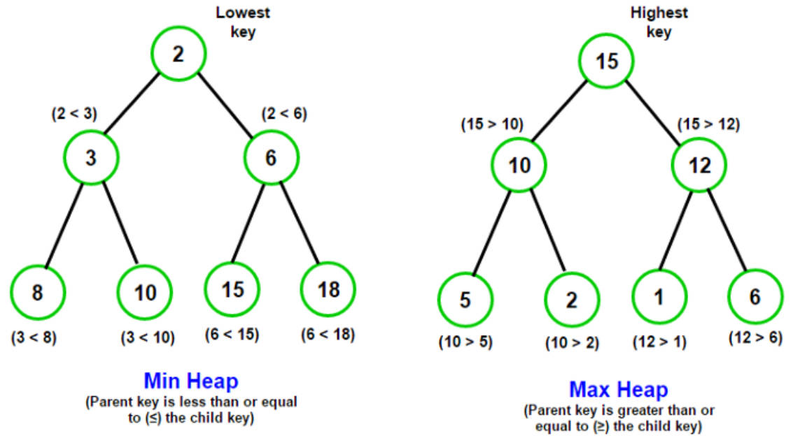
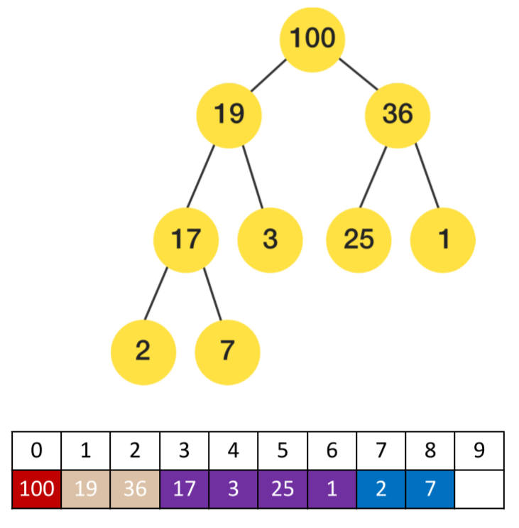

# 双向链表-堆结构

## 一、双向链表的实现

双向链表中添加（`append`，`insert`）、删除（`removeAt`）方法的实现，和单向链表有较大的区别，

所以，在 `DoublyLinkedList` 类中，应对继承的单向链表类 `LinkedList` 中的方法，进行重写：

要重写的方法：

- `append` 方法：在尾部追加元素；
- `insert` 方法：根据索引插入元素；
- `removeAt` 方法：根据索引删除元素；

新方法：

- `prepend` 方法：在头部添加元素；
- `postTraverse` 方法：从尾部遍历所有节点；

准备工作：

在 `DoublyLinkedList` 类中，重写父类（`LinkedList`）中的，`head`，`tail` 属性，类型改为 `DoublyNode` 类型。

demo-project\08-高阶链表结构\03-双向链表 doublyLinkedList.ts

```typescript
import LinkedList from './01-单向链表重构'
import { DoublyNode } from './LinkedNode'

export class DoublyLinkedList<T> extends LinkedList<T> {
  protected head: DoublyNode<T> | null = null
  protected tail: DoublyNode<T> | null = null
}
```

> 多态的体现：
>
> 不能将一个父类的对象, 赋值给一个子类的类型；
>
> 可以将一个子类的对象, 赋值给一个父类的类型。

### 1.append 方法

重写 `LinkedList` 类的 `append` 方法；

demo-project\08-高阶链表结构\03-双向链表 doublyLinkedList.ts

```typescript
import LinkedList from './01-单向链表重构'
import { DoublyNode } from './LinkedNode'

export class DoublyLinkedList<T> extends LinkedList<T> {
  protected head: DoublyNode<T> | null = null
  protected tail: DoublyNode<T> | null = null

  append(value: T): void {
    const newNode = new DoublyNode(value)

    if (!this.head) {
      // 如果链表中没有存放元素
      this.head = newNode
      this.tail = newNode
    } else {
      // 链表中至少有一个元素。
      this.tail!.next = newNode
      newNode.prev = this.tail
      this.tail = newNode
    }

    this.length++
  }
}

// 测试
const dlinkedList = new DoublyLinkedList<string>()
dlinkedList.append('aaa')
dlinkedList.append('bbb')
dlinkedList.append('ccc')
dlinkedList.append('ddd')

dlinkedList.append('abc')
dlinkedList.append('cba')

dlinkedList.traverse()
```

### 2.prepend 方法

在 `DoublyLinkedList` 类中，新增 `prepend` 方法，用于在链表头部插入元素。

demo-project\08-高阶链表结构\03-双向链表 doublyLinkedList.ts

```typescript
import LinkedList from './01-单向链表重构'
import { DoublyNode } from './LinkedNode'

export class DoublyLinkedList<T> extends LinkedList<T> {
  protected head: DoublyNode<T> | null = null
  protected tail: DoublyNode<T> | null = null

  // ...

  prepend(value: T): void {
    const newNode = new DoublyNode(value)

    if (!this.head) {
      // 如果链表中没有存放元素
      this.head = newNode
      this.tail = newNode
    } else {
      // 链表中至少有一个元素。
      newNode.next = this.head
      this.head.prev = newNode
      this.head = newNode
    }

    this.length++
  }
}

const dlinkedList = new DoublyLinkedList<string>()
dlinkedList.append('aaa')
dlinkedList.append('bbb')
dlinkedList.append('ccc')
dlinkedList.append('ddd')

dlinkedList.prepend('abc')
dlinkedList.prepend('cba')

dlinkedList.traverse()
```

### 3.postTraverse 方法

在 `DoublyLinkedList` 类中，新增 `postTraverse` 方法，用于反向遍历。

demo-project\08-高阶链表结构\03-双向链表 doublyLinkedList.ts

```typescript
import LinkedList from './01-单向链表重构'
import { DoublyNode } from './LinkedNode'

export class DoublyLinkedList<T> extends LinkedList<T> {
  protected head: DoublyNode<T> | null = null
  protected tail: DoublyNode<T> | null = null

  // ...

  postTraverse() {
    const values: T[] = []
    let current = this.tail
    while (current) {
      values.push(current.value)
      current = current.prev
    }

    console.log(values.join('->'))
  }
}

const dlinkedList = new DoublyLinkedList<string>()
dlinkedList.append('aaa')
dlinkedList.append('bbb')
dlinkedList.append('ccc')
dlinkedList.append('ddd')

dlinkedList.prepend('abc')
dlinkedList.prepend('cba')

dlinkedList.traverse()
dlinkedList.postTraverse()
```

### 4.insert 方法

重新实现，根据索引插入元素。

将父类（`LinkedList`）中的 `getNode` 方法，改为使用 `protected` 修饰，以便在子类中使用该方法。

demo-project\08-高阶链表结构\01-单向链表重构.ts

```typescript
class LinkedList<T> implements ILinkedList<T> {
  //...

  protected getNode(position: number): Node<T> | null {
    let index = 0
    let current = this.head
    while (index++ < position && current) {
      current = current.next
    }

    return current
  }

  //...
}
```

在 `DoublyLinkedList` 类中，实现 `insert` 方法。

demo-project\08-高阶链表结构\03-双向链表 doublyLinkedList.ts

```typescript
import LinkedList from './01-单向链表重构'
import { DoublyNode } from './LinkedNode'

export class DoublyLinkedList<T> extends LinkedList<T> {
  protected head: DoublyNode<T> | null = null
  protected tail: DoublyNode<T> | null = null

  // ...

  insert(position: number, value: T): boolean {
    if (position < 0 || position > this.length) return false // 边界情况

    if (position === 0) {
      // 在头部插入元素
      this.prepend(value)
    } else if (position === this.length) {
      // 在尾部插入元素
      this.append(value)
    } else {
      // 在中间插入元素
      const newNode = new DoublyNode(value)
      const current = this.getNode(position) as DoublyNode<T>

      current.prev!.next = newNode
      newNode.next = current
      newNode.prev = current.prev
      current.prev = newNode // 该操作，要放在最后。

      this.length++
    }

    return true
  }
}

const dlinkedList = new DoublyLinkedList<string>()
dlinkedList.append('aaa')
dlinkedList.append('bbb')
dlinkedList.append('ccc')
dlinkedList.append('ddd')

dlinkedList.prepend('abc')
dlinkedList.prepend('cba')

dlinkedList.traverse()
dlinkedList.postTraverse()

dlinkedList.insert(0, 'why')
dlinkedList.insert(7, 'kobe')
dlinkedList.insert(3, 'james')

dlinkedList.traverse()
dlinkedList.postTraverse()
```

### 5.removeAt 方法

考虑删除的是头节点，尾节点。

- 考虑链表中，仅有一个元素的情况。

demo-project\08-高阶链表结构\03-双向链表 doublyLinkedList.ts

```typescript
import LinkedList from './01-单向链表重构'
import { DoublyNode } from './LinkedNode'

export class DoublyLinkedList<T> extends LinkedList<T> {
  protected head: DoublyNode<T> | null = null
  protected tail: DoublyNode<T> | null = null

  // ...

  removeAt(position: number): T | null {
    if (position < 0 || position >= this.length) return null

    let current = this.head
    if (position === 0) {
      // 删除的是头节点。
      if (this.length == 1) {
        // 链表仅有一个节点
        this.head = null
        this.tail = null
      } else {
        // 链表有大于1个节点
        this.head = this.head!.next
        this.head!.prev = null
      }
    } else if (position === this.length - 1) {
      // 删除的是尾节点
      this.tail = this.tail.prev
      this.tail!.next = null
    } else {
      // 删除的是中间的节点
      current = this.getNode(position) as DoublyNode<T>
      current.prev!.next = current.next
      current.next!.prev = current.prev
    }

    this.length--
    return current?.value ?? null
  }
}

const dlinkedList = new DoublyLinkedList<string>()
console.log('----------- append / prepend ----------')
dlinkedList.append('aaa')
dlinkedList.append('bbb')
dlinkedList.append('ccc')
dlinkedList.append('ddd')

dlinkedList.prepend('abc')
dlinkedList.prepend('cba')

dlinkedList.traverse()
dlinkedList.postTraverse()

console.log('----------- insert ----------')
dlinkedList.insert(0, 'zzt')
dlinkedList.insert(7, 'kobe')
dlinkedList.insert(3, 'james')

dlinkedList.traverse()
dlinkedList.postTraverse()

console.log('----------- removeAt ----------')
dlinkedList.removeAt(0)
dlinkedList.removeAt(7)
dlinkedList.removeAt(2)
dlinkedList.traverse()
dlinkedList.postTraverse()
```

### 6.其它方法

其它方法（`get`, `update`, `indexof`, `rmove`），直接从父类（`LinkedList`）继承过来。

进行测试。

demo-project\08-高阶链表结构\03-双向链表 doublyLinkedList.ts

```typescript
console.log('----------- 其它方法测试 ----------')
console.log('----------- get ---------')
console.log(dlinkedList.get(0))
console.log(dlinkedList.get(1))
console.log(dlinkedList.get(2))

console.log('----------- update ---------')
dlinkedList.update(1, 'zzt')
dlinkedList.update(2, 'kobe')
dlinkedList.traverse()

console.log('----------- indexof ---------')
console.log(dlinkedList.indexOf('cba'))
console.log(dlinkedList.indexOf('zzt'))
console.log(dlinkedList.indexOf('kobe'))
console.log(dlinkedList.indexOf('james'))

console.log('----------- rmove ---------')
dlinkedList.remove('zzt')
dlinkedList.remove('kobe')
dlinkedList.remove('cba')
dlinkedList.traverse()
console.log(dlinkedList.isEmpty())
console.log(dlinkedList.size())
```

## 二、堆结构是什么

堆是一种常见的数据结构。

堆的本质，是一种特殊的树结构，使用**完全二叉树**来实现：

- 堆可以进行很多分类，平时使用的基本都是**二叉堆**；
- 二叉堆又可以划分为**最大堆**和**最小堆**；

> 非完全二叉树，也可实现堆结构，但完全二叉树结构的堆，可以更方便地使用换算公式。

最大堆和最小堆：

- 最小堆：堆中每一个节点，都小于等于（<=）它的子节点；
- 最大堆：堆中每一个节点，都大于等于（>=）它的子节点；



> 如果要删除堆中非子节点的节点，要进行“下滤”操作。

## 三、为什么需要堆结构？

对于每一种数据结构，都要清除它有什么用？为什么需要它？这是我们能够记住并且把握它的关键。

那么堆结构，到底解决了什么问题？

如果有一个集合，我们希望获取其中的最大值或者最小值，有哪些方案呢？

- 数组 / 链表：获取最大或最小值，时间复杂度是 `O(n)` 级别的；

  - 需要进行排序，排序本身就会消耗性能；

- 树结构：获取最大或最小值，时间复杂度是 `O(log n)` 级别的；
  - 二叉搜索树，操作较为复杂，并且还要维护树的平衡时，才是 `O(log n)` 级别；
  - AVL 树，红黑树，也要消耗性能，维护树的平衡。

这个时候需要一种数据结构来解决这个问题，就是**堆结构**。

## 四、认识堆结构

堆结构，通常是用来解决 Top K 问题的：

- Top K 问题是指：在一组数据中，找出最前面的 K 个最大 / 最小的元素；
- 常用的解决方案有：使用排序算法、快速选择算法、堆结构等；

因为二叉堆，可用完全二叉树表示；所以通常底层会使用数组来实现；

在数组中，索引为 i 的节点，有如下的规律：

- 如果 i = 0 ，它是根节点；
- 其**父节点**索引的计算公式：`floor((i – 1) / 2)`
- 其**左子节点**索引的计算公式：`2i + 1`
- 其**右子节点**索引的计算公式：`2i + 2`



> 费曼讲解什么是火：
>
> 1. 认识大自然的巧妙，
> 2. 思考在讲解时的逻辑组织方式。

## 五、堆结构的设计

封装一个堆结构，需要有哪些属性和方法?

常见的属性：

- `data`：存储堆中的元素，通常使用数组来实现。
- `length`：堆中当前元素的数量。

常见的方法：

- `insert(value)`：在堆中插入一个新元素（重要）。
- `extract/delete()`：从堆中删除最大 / 最小元素（重要）。
- `peek()`：返回堆中的最大 / 最小元素。
- `isEmpty()`：判断堆是否为空。
- `build_heap(list)`：通过一个列表来构造堆。

## 六、堆结构的封装

封装一个 `Heap` 类；其中包含两个属性 `data` 和 `size`；

封装一个私有工具方法 `swap`，用于两个节点的位置交换。

demo-project\09-堆结构 Heap\01-堆结构 Heap（封装）.ts

```typescript
class Heap<T> {
  // 属性
  private data: T[] = []
  private length: number = 0

  // 用于两个节点的位置交换
  private swap(i: number, j: number) {
    /* const temp = this.data[i]
    this.data[i] = this.data[j]
    this.data[j] = temp */

    // 使用元组，解构赋值，来实现元素的交换
    ;[this.data[i], this.data[j]] = [this.data[j], this.data[i]]
  }

  insert(value: T) {}

  extract(): T | undefined {
    return undefined
  }

  peek(): T | undefined {
    return this.data[0]
  }
  size() {
    return this.length
  }

  isEmpty() {
    return this.length === 0
  }

  buildHeap(arr: []) {}
}
```
