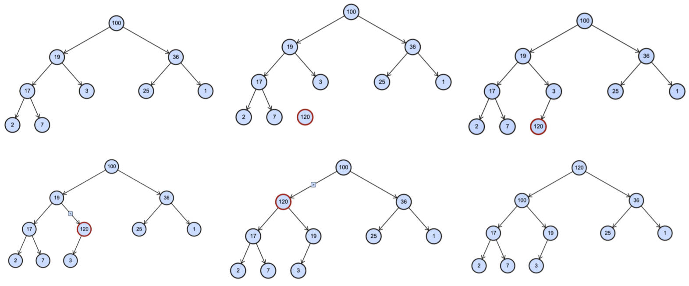
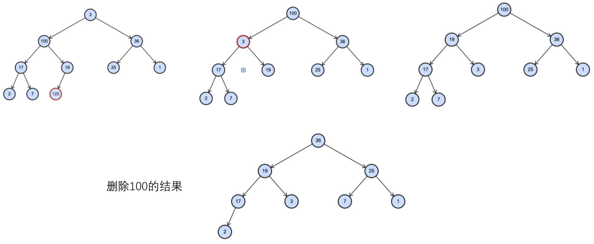

# 堆结构

基于堆结构，可实现优先级队列（后续介绍）。

## 一、insert 方法：插入元素

要实现一个**最大堆**，先从实现 `insert` 方法开始。

步骤如下：

1. 先将元素 push 进数组；
2. 再做**上滤（percolate up）**操作，因为每次插入元素后，需要对堆进行重构，以维护最大堆的性质。

该做法，时间复杂度是 `O(log n)`，效率是非常高的。

抽取一个私有 `heapfy_up` 方法，用于做上滤操作。

demo-project\09-堆结构Heap\02-堆结构Heap（插入）.ts

```typescript
class Heap<T> {
  data: T[] = []
  private length: number = 0

  private swap(i: number, j: number) {
    [this.data[i], this.data[j]] = [this.data[j], this.data[i]]
  }

  insert(value: T) {
    // 1.将元素放到数组的尾部
    this.data.push(value)
    this.length++

    // 2.上滤操作，维护最大堆的特性
    this.heapfy_up()
  }
  private heapfy_up() {
    let index = this.length - 1

    while (index > 0) {
      let parentIndex = Math.floor((index - 1) / 2)

      if (this.data[index] <= this.data[parentIndex]) break

      this.swap(index, parentIndex)
      index = parentIndex
    }
  }
  
  //...
}

export default Heap

// 测试
const arr = [19, 100, 36, 17, 3, 25, 1, 2, 7]
const heap = new Heap<number>()
for (const item of arr) {
  heap.insert(item)
}
console.log(heap.data)

heap.insert(133)
console.log(heap.data)
heap.insert(65)
console.log(heap.data)
```

插入元素后，上滤操作可视化如下图：



> 数据结构可视化网站，在线数据结构演练：
>
> - [加利福尼亚州的旧金山大学](https://www.cs.usfca.edu/~galles/visualization/Algorithms.html)
> - [数据结构可视化1](https://visualgo.net/en/heap?slide=1)
> - [数据结构可视化2（推荐）](http://btv.melezinek.cz/binary-heap.html)

## 二、extract / delete 方法：提取元素

主要步骤如下：

1. 将数组第一个元素，设置为 `null`。
2. 再将数组末尾的元素。提取到第一个元素（此时这个元素，是不符合最大堆特性的）。
3. 为维护最大堆的性质，从第一个元素向下替换元素，即**下滤（percolate down）**，

封装一个私有 `heapfy_down` 方法，用于做下滤操作。

demo-project\09-堆结构Heap\03-堆结构Heap（删除）.ts

```typescript
class Heap<T> {
  data: T[] = []
  private length: number = 0

  private swap(i: number, j: number) {
    [this.data[i], this.data[j]] = [this.data[j], this.data[i]]
  }
  
  //...

  extract(): T | undefined {
    // 1.判断元素的个数为 0 或者 1 的情况
    if (this.length === 0) return
    if (this.length === 1) {
      this.length--
      return this.data.pop()
    }

    // 2.提取返回的最大值
    const topvalue = this.data[0]
    this.data[0] = this.data.pop()!
    this.length--
 
    // 3.维护最大堆的特性，下滤操作
    this.heapfy_down()

    return topvalue
  }
  private heapfy_down() {
    let index = 0

    while (2 * index + 1 < this.length) {
      // 1.定义索引位置
      let leftChildIndex = 2 * index + 1
      let rightChildIndex = leftChildIndex + 1

      // 2.找到左右子节点较大的值
      let largeIndex = leftChildIndex
      if (rightChildIndex < this.length && this.data[rightChildIndex] > this.data[leftChildIndex]) {
        largeIndex = rightChildIndex
      }

      // 3.较大的之和 index 位置进行比较
      if (this.data[index] >= this.data[largeIndex]) break

      // 4.变换位置
      this.swap(index, largeIndex)
      index = largeIndex
    }
  }

  //...
}

export default Heap

// 测试
const arr = [19, 100, 36, 17, 3, 25, 1, 2, 7]
const heap = new Heap<number>()
for (const item of arr) {
  heap.insert(item)
}
console.log(heap.data)

while (!heap.isEmpty()) {
  console.log(heap.extract())
}
```

提取元素后，下滤操作可视化：



## 三、buildHeap 方法：原地建堆

**原地建堆（In-place heap construction）**是指：直接在数组的基础上，创建一个堆。

思路：将数组，看作是一个完全二叉树结构，从第一个非叶子节点开始，进行**下滤**操作。

- 这种方式，称之为**自下而上的下滤**。
- 也可以使用**自上而下的上滤**，但是效率低，不推荐。

demo-project\09-堆结构Heap\04-堆结构Heap（原地建堆）.ts

```typescript
class Heap<T> {
  data: T[] = []
  private length: number = 0

  private swap(i: number, j: number) {
    [this.data[i], this.data[j]] = [this.data[j], this.data[i]]
  }

  constructor(arr: T[] = []) {
    this.buildHeap(arr)
  }

  //...
  
  private heapfy_down(start: number) {
    let index = start

    while (2 * index + 1 < this.length) {
      // 1.定义索引位置
      let leftChildIndex = 2 * index + 1
      let rightChildIndex = leftChildIndex + 1

      // 2.找到左右子节点较大的值
      let largeIndex = leftChildIndex
      if (rightChildIndex < this.length && this.data[rightChildIndex] > this.data[leftChildIndex]) {
        largeIndex = rightChildIndex
      }

      // 3.较大的之和 index 位置进行比较
      if (this.data[index] >= this.data[largeIndex]) break

      // 4.变换位置
      this.swap(index, largeIndex)
      index = largeIndex
    }
  }
  
  //...

  private buildHeap(arr: T[]) {
    this.data = arr
    this.length = arr.length

    for (let i = Math.floor((this.length - 1 -1) / 2); i >= 0; i--) {
      this.heapfy_down(i)
    }
  }
}

export default Heap

// 测试
const arr = [9, 11, 20, 56, 23, 45]
const heap = new Heap<number>(arr)

console.log(heap.data)
console.log(heap.extract())
```

## 四、最小堆实现

改变 `heapfy_up` 方法中，跳出循环的比较条件；

改变 `heapfy_down` 方法中，最小索引的比较条件，和挑出循环的比较条件。

demo-project\09-堆结构Heap\06-堆结构Heap（二叉堆）.ts

```typescript
class Heap<T> {
  data: T[] = []
  private length: number = 0

  private swap(i: number, j: number) {
    [this.data[i], this.data[j]] = [this.data[j], this.data[i]]
  }
  
  //...
  
  private heapfy_up() {
    let index = this.length - 1

    while (index > 0) {
      let parentIndex = Math.floor((index - 1) / 2)

      if (this.data[parentIndex] <= this.data[index]) break

      this.swap(index, parentIndex)
      index = parentIndex
    }
  }
  
  //...

  private heapfy_down(start: number) {
    let index = start

    while (2 * index + 1 < this.length) {
      // 1.定义索引位置
      let leftChildIndex = 2 * index + 1
      let rightChildIndex = leftChildIndex + 1

      // 2.找到左右子节点较小的值
      let lesserIndex = leftChildIndex
      if (rightChildIndex < this.length && this.data[rightChildIndex] < this.data[leftChildIndex]) {
        lesserIndex = rightChildIndex
      }

      // 3.较小的值，和 index 位置的值进行比较
      if (this.data[index] <= this.data[lesserIndex]) break

      // 4.变换位置
      this.swap(index, lesserIndex)
      index = lesserIndex
    }
  }
}

export default Heap

// 测试
const arr = [9, 11, 20, 56, 23, 45]
const heap = new Heap<number>(arr)

console.log(heap.data)
console.log(heap.extract())
```

## 五、二叉堆（最大、最小堆）

将最大堆和最小堆，用一个类实现。

新增私有属性 `isMax`，用于表示这个堆实例，是否是一个最大堆，反之是最小堆。

新增私有方法 `compare`，用于最大堆 / 最小堆的逻辑比较。

demo-project\09-堆结构Heap\06-堆结构Heap（二叉堆）.ts

```typescript
class Heap<T> {
  data: T[] = []
  private length: number = 0
  private isMax: boolean

  constructor(arr: T[] = [], isMax: boolean = true) {
    this.isMax = isMax
    if (!arr.length) return
    this.buildHeap(arr)
  }
  
  private buildHeap(arr: T[]) {
    this.data = arr
    this.length = arr.length

    for (let i = Math.floor((this.length - 2) / 2); i >= 0; i--) {
      this.heapfy_down(i)
    }
  }
  
  //...

  private compare(i: number, j: number): boolean {
    if (this.isMax) {
      return this.data[i] >= this.data[j]
    } else {
      return this.data[i] <= this.data[j]
    }
  }

  //...
  
  private heapfy_up() {
    let index = this.length - 1

    while (index > 0) {
      let parentIndex = Math.floor((index - 1) / 2)

      if (this.compare(parentIndex, index)) break
      // if (this.data[parentIndex] <= this.data[index]) break

      this.swap(index, parentIndex)
      index = parentIndex
    }
  }
  
  //...
  
  private heapfy_down(start: number) {
    let index = start

    while (2 * index + 1 < this.length) {
      // 1.定义索引位置
      let leftChildIndex = 2 * index + 1
      let rightChildIndex = leftChildIndex + 1

      // 2.找到左右子节点较小的值
      let nextIndex = leftChildIndex
      if (rightChildIndex < this.length && this.compare(rightChildIndex, leftChildIndex)) {
      // if (rightChildIndex < this.length && this.data[rightChildIndex] < this.data[leftChildIndex]) {
        nextIndex = rightChildIndex
      }

      // 3.较小的之和 index 位置进行比较
      if (this.compare(index, nextIndex)) break
      // if (this.data[index] <= this.data[nextIndex]) break

      // 4.变换位置
      this.swap(index, nextIndex)
      index = nextIndex
    }
  }
  
  //...
}

export default Heap

// 测试
const arr = [9, 11, 20, 56, 23, 45]
const heap = new Heap<number>(arr, false)

console.log(heap.data)
console.log(heap.extract())
```
