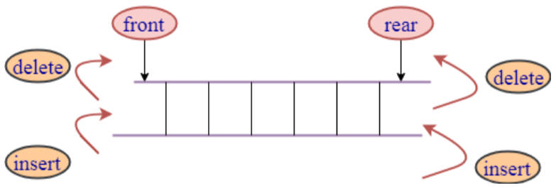
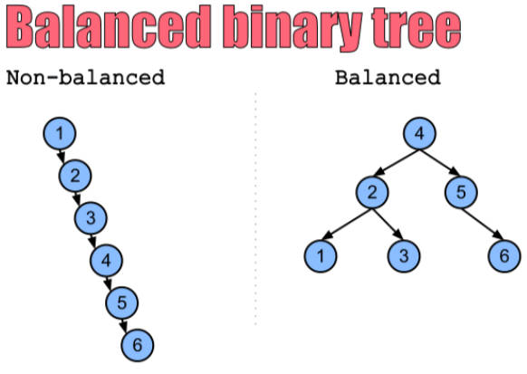
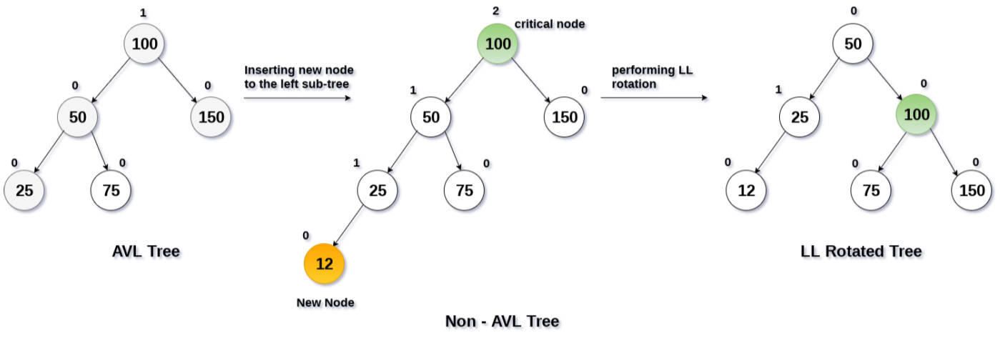
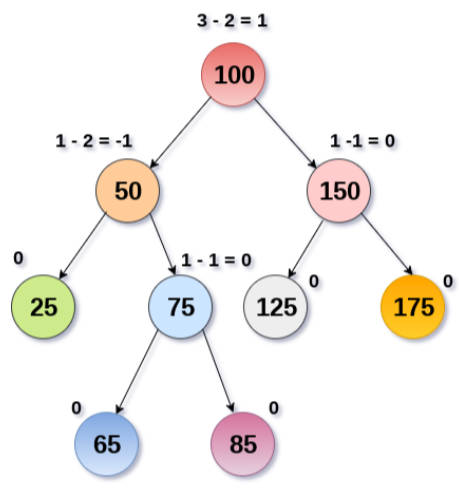

# 高阶队列 & 平衡树

补充：堆结构的打印。

借助 *hy-algokit* 工具库的 `cbtPrint` 方法。

demo-project\09-堆结构Heap\06-堆结构Heap（二叉堆）.ts

```typescript
import { cbtPrint } from 'hy-algokit';

class Heap<T> {
  //...

  print() {
    cbtPrint(this.data)
  }
}

// 测试
const arr = [9, 11, 20, 56, 23, 45]
const heap = new Heap<number>(arr, false)
heap.print()
```

## 一、双端队列是什么？

我们知道，队列（Queue）结构是一种受限的线性结构。

**双端队列（Deque）**在队列（Queue）的基础上，解除了一部分限制：即允许在队列的两端添加（入队）和删除（出队）元素。

- 因为解除了一部分限制，所以在解决一些特定问题时，会更加的方便；
- 比如：[leetcode 滑动窗口问题](https://leetcode.cn/problems/sliding-window-maximum/description/)



## 二、双端队列的实现

demo-project\10-高阶队列\01-双向队列（Deque）实现.ts

```typescript
import ArrayQueue from '../02-队列/01-ArrayQueue';

class ArrayDeque<T> extends ArrayQueue<T> {
  addFront(value: T) {
    this.data.unshift(value)
  }

  removeBack(): T | undefined {
    return this.data.pop()
  }
}

// 测试
const deque = new ArrayDeque<string>()
deque.enqueue('aaa')
deque.enqueue('bbb')
deque.enqueue('ccc')
deque.addFront('abc')
deque.addFront('cba')
while (!deque.isEmpty()) {
  console.log(deque.removeBack())
}
```

> 自己实现时，使用链表，双向链表更好。
>
> 使用 TS 在 LeetCode 中解题，没有原生的链表结构，最好基于数组实现，这样就不用再封装一个链表。

## 三、优先级队列是什么？

**优先级队列（Priority Queue）**相比普通队列，更加高效。

- 它每次出队的元素，都是具有最高优先级的元素，
- 实现它，最常用的是堆结构（数组、链表等数据结构也可实现）。

优先级队列，在现实中的案例：

案例一：机场登机的顺序：

- 头等舱和商务舱乘客的优先级，要高于经济舱乘客。
- 在有些国家，老年人、孕妇，或带小孩的妇女，登机时也享有高于其他乘客的优先级。

案例二：医院的（急诊科）候诊室。

- 医生会优先处理病情比较严重的患者。

计算机中，可以通过优先级队列，来重新排序队列中任务的顺序：

- 比如：每个线程处理的任务重要性不同,，可以通过优先级的大小, 来决定该线程在队列中被处理的次序.

## 四、优先级队列的实现

一般使用最大堆，有两种具体的实现思路：

思路一：封装一个 `PriorityNode` 节点类，其中 `value` 属性，作为比较优先级的依据。

demo-project\10-高阶队列\02-优先级队列实现一.ts

```typescript
import Heap from '../09-堆结构Heap/06-堆结构Heap（二叉堆）'

class PriorityNode<T> {
  constructor(public value: T, public priority: number) {}

  valueOf() {
    return this.priority
  }
}

class PriorityQueue<T> {
  private heap: Heap<PriorityNode<T>> = new Heap()

  enqueue(value: T, priority: number) {
    const newNode = new PriorityNode(value, priority)
    this.heap.insert(newNode)
  }

  dequeue(): T | undefined {
    return this.heap.extract()?.value
  }

  peek(): T | undefined {
    return this.heap.peek()?.value
  }

  isEmpty(): boolean {
    return this.heap.isEmpty()
  }

  size() {
    return this.heap.size()
  }
}

// 测试
const pqueue = new PriorityQueue<string>()
pqueue.enqueue('zzt', 98)
pqueue.enqueue('kobe', 90)
pqueue.enqueue('james', 105)
while (!pqueue.isEmpty()) {
  console.log(pqueue.dequeue())
}

export default PriorityQueue
```

思路二：直接在存放的对象之间，进行优先级的比较。

demo-project\10-高阶队列\03-优先级队列实现二.ts

```typescript
import Heap from '../09-堆结构Heap/06-堆结构Heap（二叉堆）'

class PriorityQueue<T> {
  private heap: Heap<T> = new Heap()

  enqueue(value: T) {
    this.heap.insert(value)
  }

  dequeue(): T | undefined {
    return this.heap.extract()
  }

  peek(): T | undefined {
    return this.heap.peek()
  }

  isEmpty(): boolean {
    return this.heap.isEmpty()
  }

  size() {
    return this.heap.size()
  }
}

export default PriorityQueue

// 测试
class Student {
  constructor(public name: string, public score: number) {}

  valueOf() {
    return this.score
  }
}

const pqueue = new PriorityQueue<Student>()
pqueue.enqueue(new Student('zzt', 90))
pqueue.enqueue(new Student('kobe', 89))
pqueue.enqueue(new Student('james', 95))
pqueue.enqueue(new Student('curry', 88))

while (!pqueue.isEmpty()) {
  console.log(pqueue.dequeue())
}
```

## 五、平衡树

### 1.平衡树是什么？

**平衡树（Balanced Tree）**，是一种特殊的二叉搜索树：

- 其目的是：通过一些特殊的技巧，来维护树的高度平衡；
- 从而保证：搜索、插入、删除等操作的时间复杂度都较低；

### 2.为什么需要平衡树？

如果一棵二叉搜索树，退化成链状结构，那么搜索、插入、删除等操作的时间复杂度，会达到最坏情况，即 O(n)。

平衡树通过不断调整树的结构，使得树的高度尽量平衡，从而保证搜索、插入、删除等操作的时间复杂度都较低，通常为 `O(logn)`。

因此，高效地处理大量的数据，平衡树是非常重要了。

比如：连续的插入 1、2、3、4、5、6 的数字，二叉搜索树和平衡树形成的结构如下：



事实上，不只是添加元素会导致树的不平衡，删除也会。

平衡树的应用非常广泛，如索引、内存管理、图形学等领域均有广泛使用。

### 3.如何让一棵树平衡？

方式一：限制插入、删除的节点。这是不现实的；

- 比如：在树特性的状态下，不允许插入或者删除某些节点。

方式二：在随机插入或者删除元素后，通过某种方式，观察树是否平衡；如果不平衡，通过特定的方式（比如旋转），让树保持平衡。



## 六、常见的平衡二叉树

常见的**平衡二叉搜索树**，有哪些呢？

- AVL 树：最早的平衡二叉搜索树，在 1962 年由 G.M. Adelson-Velsky 和 E.M. Landis 发明。
- 红黑树：比较流行的平衡二叉搜索树，由 R. Bayer 在 1972 年发明。
- Splay 树：动态平衡二叉搜索树，通过旋转操作对树进行平衡。
- Treap：随机化的平衡二叉搜索树，是二叉搜索树和堆的结合。
- B-树：适用于磁盘，或其他外存存储设备的多路平衡查找树。

这些平衡二叉搜索树，都致力于保证树的平衡，从而在插入、删除、查找操作时，保证较低的时间复杂度。

红黑树、AVL 树，是应用最广泛的平衡二叉搜索树：

- 红黑树：是被广泛应用于操作系统内核、数据库、编译器...软件中的数据结构，其原因在于：它在**插入、删除、 查找操作**时，都具有较低的时间复杂度。
- AVL 树：是被用于实现**高效查询**的数据结构，如计算机图形学、数学计算和计算机科学研究中的一些特定算法。

## 七、AVL 树是什么？

AVL 树是二叉搜索树的一个变体，是一种自（Self）平衡二叉搜索树。

在保证二叉搜索树性质的同时，通过**旋转操作**，保证树的平衡。

其中，每个节点都有一个权值，该权值代表了以该节点为根节点的子树的高度差。

- 任意节点的权值，只有 1 或 -1 或 0，因为对于每个节点，它的左子树和右子树的高度差不超过 1。
- 因此 AVL 树也被称为**高度平衡树**。这使得 AVL 树，具有比普通二叉搜索树，更高的查询效率。
- 当插入、删除节点时，AVL 树可以通过旋转操作，来平衡树，从而保证其平衡性。

AVL 树的插入、删除操作，与普通的二叉搜索树类似，但是在插入、删除之后，需要继续保持树的平衡。

这时，就需要通过“**旋转**”操作，来维护平衡。旋转操作有四种情况：

- 左左情况；
- 右右情况；
- 左右情况；
- 右左情况。

具体使用哪一种旋转，要根据不同的条件进行区分和判断。


由于 AVL 树具有自平衡性，因此其查找时，最坏情况下的时间复杂度仍是 O(log n)，是非常高效的。



## 八、AVL 树的封装过程

手写实现 AVL 树，本身的过程是相当的复杂的；

应如何学习呢？分如下步骤：

1. AVL 树节点的封装；
2. AVL 树接待你的旋转，代码实现；
3. 不同情况下，进行的不同旋转操作的代码实现（再平衡）；
4. 插入操作后，树的再平衡操作，代码实现；
5. 删除操作后，树的再平衡操作，代码实现；

### 1.AVLTreeNode 节点封装

导入以前封装好的 `TreeNode` 类。并重写其中的 `left`、`right`、`parent` 属性，改变它们的类型。

demo-project\11-平衡二叉树\01-封装AVLTreeNOde.ts

```typescript
import { TreeNode } from '../06-二叉搜索树/14-二叉搜索树Tree（delete-重构）';

class AVLTreeNode<T> extends TreeNode<T> {
  left: AVLTreeNode<T> | null = null
  right: AVLTreeNode<T> | null = null
  parent: AVLTreeNode<T> | null = null
}
```

为了获取每个节点的高度，封装一个私有方法 `getHeight`，用于获取该节点高度。

为了获取每个节点的平衡因子，封装一个私有方法 `getBalanceFactor`，用于获取该节点的平衡因子。

> 平衡因子 = 左子树高度 - 右子树高度。

为了获取该节点是否平衡，封装一个访问器 `isBalance`，判断当前节点是否是平衡的。

demo-project\11-平衡二叉树\01-封装AVLTreeNOde.ts

```typescript
import { TreeNode } from '../06-二叉搜索树/14-二叉搜索树Tree（delete-重构）';

class AVLTreeNode<T> extends TreeNode<T> {
  left: AVLTreeNode<T> | null = null
  right: AVLTreeNode<T> | null = null
  parent: AVLTreeNode<T> | null = null

  get isBalance() {
    const balanceFactor = this.getBalanceFactor()
    return balanceFactor >= -1 && balanceFactor <= 1
  }

  getHeight(): number {
    const leftHeight = this.left?.getHeight() ?? -1
    const rightHeight = this.right?.getHeight() ?? -1
    return Math.max(leftHeight, rightHeight) + 1
  }

  getBalanceFactor(): number {
    const leftHeight = this.left?.getHeight() ?? -1
    const rightHeight = this.right?.getHeight() ?? -1
    return leftHeight - rightHeight
  }
}

const avlNode1 = new AVLTreeNode(6)
console.log(avlNode1.getHeight()) // 0
avlNode1.right = new AVLTreeNode(7)
avlNode1.right.right = new AVLTreeNode(8)
console.log(avlNode1.getHeight()) // 2
```

旋转不平衡的节点，要先找到不平衡节点的轴心；

轴心是该不平衡节点，左、右子节点中，高度最高的子节点。

如果左、右子节点，高度相等怎么办呢？

- 事实上，基本不会出现这种情况，
- 因为一个节点的左、右子节点高度要是相等，那么该节点就应该是平衡的。
- 所以，使用 `return this.isLeft ? this.left : this.right` 处理，即该节点要是父节点的左子节点，则返回该节点的左子节点，反之返回该节点的右子节点。

封装一个访问器 `highterChild`，用于获取一个节点下更高的子节点。

demo-project\11-平衡二叉树\01-封装AVLTreeNOde.ts

```typescript
import { TreeNode } from '../06-二叉搜索树/14-二叉搜索树Tree（delete-重构）';

class AVLTreeNode<T> extends TreeNode<T> {
  left: AVLTreeNode<T> | null = null
  right: AVLTreeNode<T> | null = null
  parent: AVLTreeNode<T> | null = null

  get isBalance() {
    const balanceFactor = this.getBalanceFactor()
    return balanceFactor >= -1 && balanceFactor <= 1
  }

  get highterChild(): AVLTreeNode<T> | null {
    const leftNode = this.left
    const rightNode = this.right

    const leftHeight = leftNode?.getHeight() ?? -1
    const rightHeight = rightNode?.getHeight() ?? -1
    return leftHeight > rightHeight ? leftNode
      : leftHeight < rightHeight ? rightNode
      : this.isLeft ? leftNode
      : rightNode
  }

  private getHeight(): number {
    const leftHeight = this.left?.getHeight() ?? -1
    const rightHeight = this.right?.getHeight() ?? -1
    return Math.max(leftHeight, rightHeight) + 1
  }

  private getBalanceFactor(): number {
    const leftHeight = this.left?.getHeight() ?? -1
    const rightHeight = this.right?.getHeight() ?? -1
    return leftHeight - rightHeight
  }
}

const avlNode1 = new AVLTreeNode(6)
avlNode1.right = new AVLTreeNode(7)
avlNode1.right.right = new AVLTreeNode(8)
console.log(avlNode1.highterChild)
```
