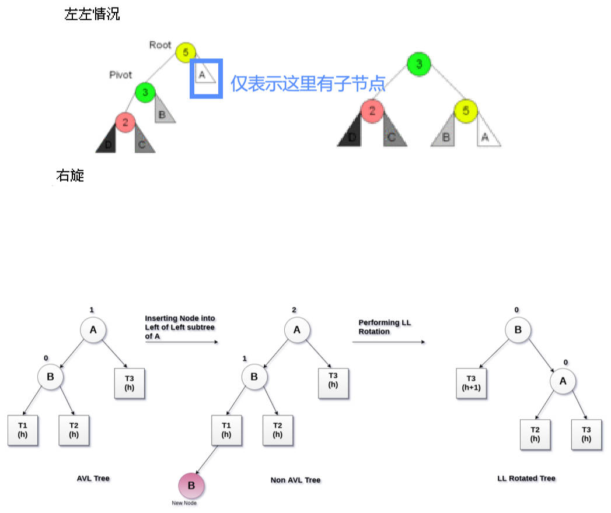
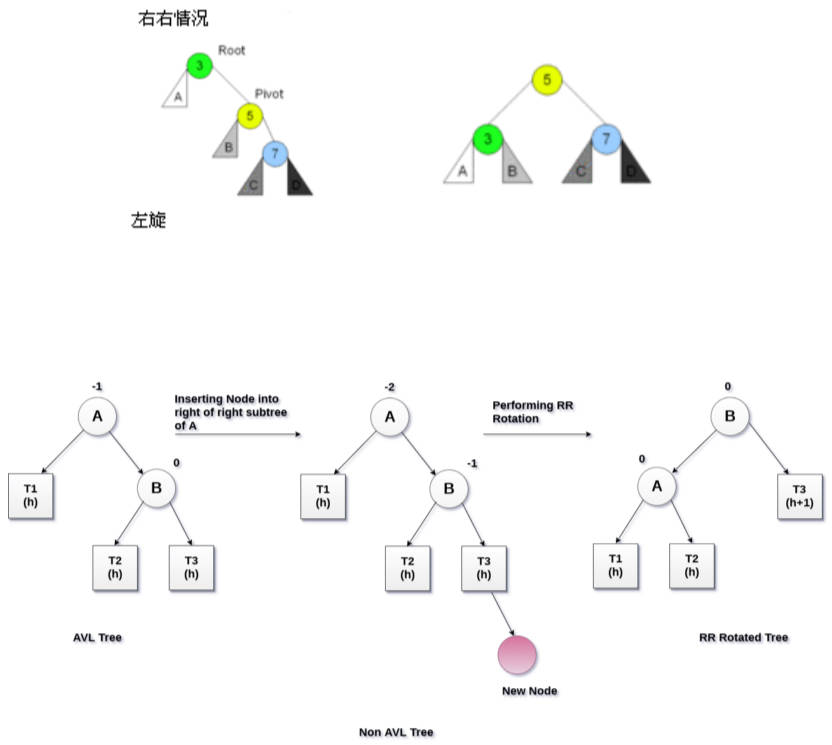

# 平衡树

## 一、AVLTreeNode 节点的封装

变量名命的习惯：

- 不平衡的节点称为 `root` / `grand（Parent）`；
  - 在封装的 `AVLTreeNode` 中，通常用 `this` 表示。
- 要旋转的节点称为：`parent` / `pivot`；
- 要旋转节点的子节点称为：`current`。

> 平衡因子 = 左子树高度 - 右子树高度；
>
> 平衡因子 > 1，表示左节点更高，root 要右旋转；
>
> 平衡因子 < -1，表示右节点更高，root 要左旋转；
>

旋转不平衡节点的步骤：

1. 先找到**不平衡的节点（root）**，判断该节点哪边不平衡。
2. 再找到 `pivot`，判断它的哪边造成了不平衡。

> 旋转不平衡节点时，关注的一定是：==不平衡节点==，即 root

### 1.左左（LL）

如果 `pivot` 是 `root` 的左子节点，且 `pivot` 的左子节点，造成了树的不平衡；

那么这个情况就是**左左（LL）**。



如上图所示，左左情况，parent 要向**右旋转**，这是固定的做法。

具体步骤如下（下方的 `this` 代表 `root/grand`）：

Ⅰ、处理 `pivot` 节点。

1. 使用 `root.left`。找到 `pivot` 节点；
2. 将 `pivot` 节点父节点，指向 `root.parent`。

Ⅱ、处理 `pivot.right` 节点。

1. 将 `root.left = pivot.right`；
2. 如果 `pivot.right` 有值，那么 `pivot.right.parent = root`

Ⅲ、处理 `root` 节点的 `parent` 引用。

1. 将 `pivot.right = root`；
2. 将 `root.parent = pivot`；
3. 将 `pivot` 挂载到原来 `root` 的父节点上（可能挂载到左子节点、右子节点，或根节点）：
   - 判断原来的 `root`，是否有父节点；
   - 有，则将父节点的 `left` / `right` 指向 `pivot`；
   - 没有，则将树的 `root = pivot`（这是 `ALVTree` 类中，`rebalance` 方法的操作）。

代码实现：

demo-project\11-平衡二叉树\02-封装AVLTreeNode（左、右旋转操作）.ts

```typescript
import { TreeNode } from '../06-二叉搜索树/14-二叉搜索树Tree（delete-重构）';

class AVLTreeNode<T> extends TreeNode<T> {
  
  // ...

  rightRotation() {
    const isLeft = this.isLeft
    const isRight = this.isRight

    // 1.处理 pivot 节点
    const pivot = this.left!
    pivot.parent = this.parent

    // 2.处理 pivot 节点的 right
    this.left = pivot.right
    if (pivot.right) pivot.right.parent = this

    // 3.处理 this
    pivot.right = this
    this.parent = pivot

    // 4.挂载 pivot 的 parent 节点
    if (!pivot.parent) {
      return pivot
    } else if (isLeft) { // pivot 作为父节点的左子节点
      pivot.parent.left = pivot
    } else if (isRight) { // pivot 作为父节点的右子节点
      pivot.parent.right = pivot
    }

    return pivot
  }
}
```

> 测试时，每个节点要设置 `parent`，比较麻烦。

### 2.右右（RR）

右右情况，要左旋；

与左左（LL）情况正好相反，如下图所示：



具体步骤如下：

Ⅰ、处理 `pivot` 节点。

1. 使用 `root.right`，找到 `pivot` 节点。
2. 将 `pivot` 节点父节点，指向 `root.parent`。

Ⅱ、处理 `pivot.left` 节点。

1. 将 `root.right = pivot.left`
2. 如果 `pivot.left` 有值，那么 `pivot.left.parent = root`

Ⅲ、处理 `root` 节点的 `parent` 引用。

1. 将 `pivot.left = root`；
2. 将 `root.parent = pivot`；
3. 将 `pivot` 挂载到原来 `root` 的父节点上（可能是挂载到左子节点、右子节点，根节点）
   - 判断原来的 `root` 是否有父节点；
   - 有，则将父节点的 `left` / `right` 指向 `pivot`；
   - 没有，则将树结构的 `root = pivot`（这是 `ALVTree` 类中，`rebalance` 方法的操作）。

代码实现：

demo-project\11-平衡二叉树\02-封装AVLTreeNode（左、右旋转操作）.ts

```typescript
import { TreeNode } from '../06-二叉搜索树/14-二叉搜索树Tree（delete-重构）';

class AVLTreeNode<T> extends TreeNode<T> {
  
  // ...
  
  leftRotation() {
    const isLeft = this.isLeft
    const isRight = this.isRight

    // 1.处理 pivot 节点
    const pivot = this.right!
    pivot.parent = this.parent

    // 2.处理 pivot 节点的 right
    this.right = pivot.left
    if (pivot.left) pivot.left.parent = this

    // 3.处理 this
    pivot.left = this
    this.parent = pivot

    // 4.挂载 pivot 的 parent 节点
    if (!pivot.parent) {
      return pivot
    } else if (isLeft) { // pivot 作为父节点的左子节点
      pivot.parent.left = pivot
    } else if (isRight) { // pivot 作为父节点的右子节点
      pivot.parent.right = pivot
    }

    return pivot
  }
}
```

### 3.左右（LR），右左（RL）


根据上图，分析左右（LR），右左（RL）情况：

- 左右（LR）情况，要先对 `root`（上方绿色节点）进行左旋转（此时变为了左左），再对 `root` （上方黄色节点）进行右旋转；
- 右左（RL）情况，要先对 `root`（上方黄色节点） 进行右旋转（此时变为了右右），再对 `root`（上方绿色节点） 进行左旋转；

## 二、AVLTree 的基本封装

定义一个 `AVLTree` 类，继承自 `BSTree` 类。

当插入、删除节点时，要找到不平衡的节点，进行再平衡。

先封装一个方法 `rebalance` 方法，用于让不平衡的节点，变得平衡。

demo-project\11-平衡二叉树\03-封装AVLTree（基本封装-再平衡操作）.ts

```typescript
import BSTree from '../06-二叉搜索树/14-二叉搜索树Tree（delete-重构）';
import AVLTreeNode from './02-封装AVLTreeNode（左、右旋转操作）';

class AVLTree<T> extends BSTree<T> {
  // 找到不平衡的节点

  // 让不平衡的节点，变得平衡
  rebalance(root: AVLTreeNode<T>) {
    const pivot = root.highterChild
    const current = pivot?.highterChild

    let resultNode: AVLTreeNode<T> | null = null
    if (pivot?.isLeft) {
      if (current?.isLeft) { // LL
        resultNode = root.rightRotation()
      } else { //LR
        pivot.leftRotation()
        resultNode = root.rightRotation()
      }
    } else {
      if (current?.isLeft) { // RL
        pivot?.rightRotation()
        resultNode = root.leftRotation()
      } else { // RR
        resultNode = root.leftRotation()
      }
    }

    if (!resultNode.parent) this.root = resultNode
  }
}

// 测试
const avlTree = new AVLTree<number>()
avlTree.insert(10)
avlTree.insert(15)
avlTree.insert(20)
avlTree.print()
```

在 `insert` 方法中，找到不平衡的节点。

重构 `BSTree` 类的 `insert` 方法，并新增一个受保护方法 `createNode`，用于创建节点。

重构 `BSTree` 类中的 `insertNode` 方法，每插入一个节点，就设置它的 `parent` 属性。

demo-project\06-二叉搜索树\14-二叉搜索树Tree（delete-重构）.ts

```typescript
/**
 * @description: 此类用于：二叉搜索树的封装
 * @Author: ZeT1an
 */
class BSTree<T> {
  protected root: TreeNode<T> | null = null

  protected createNode(value: T): TreeNode<T> {
    return new TreeNode(value)
  }
    
  //...

  /**
   * @description: 此函方法于：二叉搜索树的插入操作。
   * @Author: ZeT1an
   * @param {T} value 插入的值
   * @return {*}
   */
  insert(value: T) {
    // 1.根据传入的 value，创建 Node 节点。
    const newNode = this.createNode(value)

    // 2.判断当前是否已经有了根节点
    if (!this.root) {
      this.root = newNode
    } else {
      this.insertNode(this.root, newNode)
    }
  }
  private insertNode(node: TreeNode<T>, newNode: TreeNode<T>) {
    if (newNode.value < node.value) {
      if (!node.left) {
        node.left = newNode
        newNode.parent = node // 新增插入的节点的 parent 引用
      } else {
        this.insertNode(node.left, newNode)
      }
    } else {
      if (!node.right) {
        node.right = newNode
        newNode.parent = node // 新增插入的节点的 parent 引用
      } else {
        this.insertNode(node.right, newNode)
      }
    }
  }
    
  //...
}
```

在 `AVLTree` 类中，重写 `createNode` 方法，以便实现使用不同的节点类，创建节点。

- 使用父类引用，指向子类对象。

> 这是一种设计模式，称为“模板模式”。

demo-project\11-平衡二叉树\04-封装AVLTree（插入的调整）.ts

```typescript
import BSTree, { TreeNode } from '../06-二叉搜索树/14-二叉搜索树Tree（delete-重构）'
import AVLTreeNode from './02-封装AVLTreeNode（左、右旋转操作）'

class AVLTree<T> extends BSTree<T> {
  
  protected createNode(value: T): TreeNode<T> {
    return new AVLTreeNode(value)
  }
  
  //...
}

// 测试
const avlTree = new AVLTree<number>()
avlTree.insert(10)
avlTree.insert(15)
avlTree.insert(20)
avlTree.print()
```
