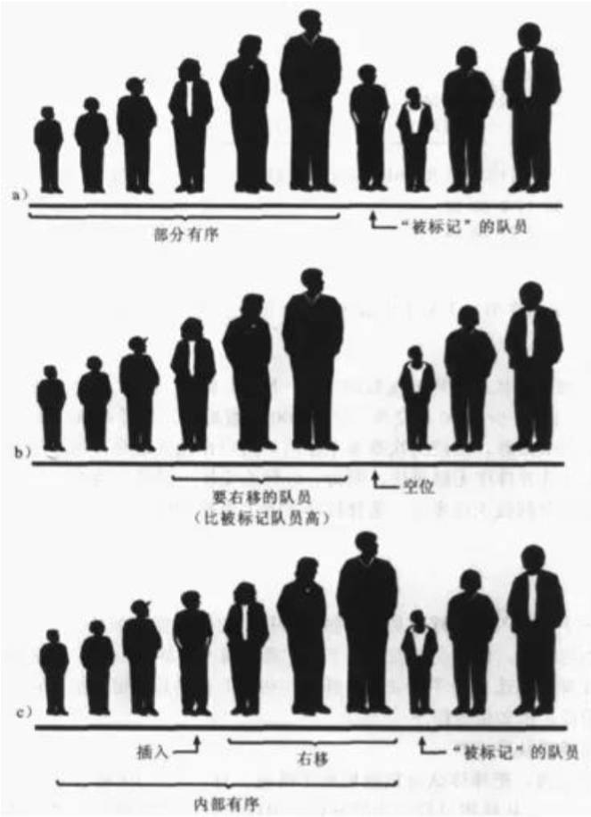

# 排序算法

## 一、排序的概念

**排序（Sorting）**是一个非常，非常，非常常见的功能，在平时生活中也是随处可见的。

对一组身高不等的 10 个人进行排序，如何排序呢？

### 1.人排序

人来排序:

- 人只要扫一眼就能看出来谁最高，谁最低，非常简单。

人排序的优点:

- 可以统筹全局，快速获取到最高或者最低的结果。
- 不需要考虑空间的问题。

人排序的缺点：

- 容易出错。
- 数据量非常庞大时，很难进行排序。

### 2.计算机排序

计算机来排序：

- 计算机只能执行指令，所以没办法像人一样“扫一眼”。
- 只要有了正确的指令，可以做无数次排序，无需担心数据量的大小，和出现错误；
- 计算机没有黑魔法。

计算机排序的特点：

- 根据计算机的比较操作原理，在同一个时间对两个人进行比较。
- 因此，它只能一步步解决遵循一些简单的规则，解决具体问题。

## 二、排序算法的概念？

排序算法，就是研究如何对一个集合，进行高效排序的算法，也是在面试时非常常见的面试题型之一。

维基百科对排序算法的解释：

- 在计算机科学与数学中，一个**排序算法（Sorting algorithm）**是一种能将一串资料（集合）依照特定排序方式排列的算法。
- 虽然，排序算法从名称来看，非常容易理解，但是从计算机科学发展以来，在此问题上已经有大量的研究。

由于排序非常重要，而且可能非常耗时，所以它已经成为一个计算机科学中广泛研究的课题。

- 人们已经研究出一套成熟的方案来实现排序。
- 你并不需要发明某种排序算法，而是站在巨人的肩膀上即可。

计算机科学所使用的排序算法，通常有以下标准分类：

- 计算的时间复杂度：使用大 O 表示法，也可以实际测试消耗的时间；
- 内存使用量（甚至是其他电脑资源）：比如外部排序，使用磁盘来存储排序的数据；
- 稳定性：稳定排序算法会让原本有相等键值的纪录维持相对次序；
- 排序的方法：插入、交换、选择、合并等等；

### 1.常见的排序算法

冒泡排序；

选择排序；

插入排序；

归并排序（V8 底层，在数据量比较少时，使用）；

快速排序（V8 底层，在数据量比较大时，使用）；

堆排序；

希尔排序（历史上比较重要，实际应用比较少）；

计数排序；

桶排序；

基数排序；

内省排序；

平滑排序

### 2.排序算法的时间复杂度

详见[维基百科](https://zh.wikipedia.org/zh-hk/%E6%8E%92%E5%BA%8F%E7%AE%97%E6%B3%95#%E7%AE%80%E8%A6%81%E6%AF%94%E8%BE%83)

### 3.排序算法的分析思路

学习排序算法的步骤如下：

Ⅰ、介绍排序算法：历史背景或者故事。

Ⅱ 、分析排序算法的思路步骤。

Ⅲ 、排序算法的图解。

Ⅳ、排序算法的代码实现过程（一步步手写实现）。

Ⅴ、排序算法的复杂度分析。

Ⅵ、排序算法的小结。

## 三、冒泡排序

### 1.冒泡排序介绍

**冒泡排序（Bubble Sort）**是一种简单的排序方法。

- 基本思路是：通过相邻的元素，两两比较，并交换它们的位置，从而使整个序列，按照顺序排列。
- 该算法经过一轮排序后，最大值总是会移到数组最后面，下一轮就不用再考虑这个最大值。
- 一直重复多轮这样的操作，最终就可以得到排序完成的数组。

这个算法的名字由来，是因为越大的元素会经由交换，慢慢“浮”到数组的尾端，就像水里的气泡一样，故名“冒泡排序”。


### 2.冒泡排序实现思路

冒泡排序的流程如下：

1. 从第一个元素开始，逐一比较相邻元素的大小。
2. 如果前一个元素，比后一个元素大，则交换位置。
3. 在第一轮比较结束后，最大的元素被移动到了最后一个位置。
4. 在下一轮比较中，不再考虑最后一个位置的元素，重复上述操作。
5. 每轮比较结束后，需要排序的元素数量减一，直到没有需要排序的元素。
6. 排序结束。
7. 这个流程会一直循环，直到所有元素都有序排列为止。


### 3.冒泡排序图解

冒泡排序图解：


### 4.冒泡排序代码实现

使用原地排序（在原数组上排序）。

demo-project\12-排序算法\01-冒泡排序.ts

```typescript
import { measureSort, swap } from 'hy-algokit';

export default function bubbleSort(arr: number[]): number[] {
  const n = arr.length
  
  for (let i = 0; i < n - 1; i++) {
    for (let j = 0; j < n - i - 1; j++) {
      if (arr[j] > arr[j + 1]) {
        // swap
        [arr[j], arr[j + 1]] = [arr[j + 1], arr[j]]
      }
    }
  }

  return arr
}

// 测试
measureSort(bubbleSort)
```

> 为什么用变量 `n`，而不是 `length`？
>
> - 编写算法时，使用 n 表示 length，用于更方便的分析大 O 表示法的时间复杂度。

编写一个工具 `testSort`，或者使用 hy-algokit 工具库的 `measureSort`。用于测试排序算法。

demo-project\12-排序算法\utils.ts

```typescript
export const swap = (arr: number[], i: number, j: number) => {
  [arr[i], arr[j]] = [arr[j], arr[i]]
}

export const isSorted = (arr: number[]): boolean => {
  for (let i = 0; i < arr.length; i++) {
    if (arr[i] > arr[i + 1]) return false
  }
  return true
}、

type SorlAlgoFn = (arr: number[]) => number[]

export const testSort = (sortFn: SorlAlgoFn) => {
  const arr = Array.from({ length: 10 }, () => Math.floor(Math.random() * 100))
  
  console.log('排序前的素组：', arr)
  const newArr = sortFn(arr)
  console.log('排序后的素组：', newArr)
  console.log('排序后的素组是否有序：', isSorted(newArr))
}
```

冒泡排序，针对有序的集合做优化。

优化后，冒泡排序，针对**有序集合**的排序效率，是非常高的。

demo-project\12-排序算法\01-冒泡排序.ts

```typescript
// import { measureSort } from 'hy-algokit';
import { testSort } from './utils';

export default function bubbleSort(arr: number[]): number[] {
  const n = arr.length

  for (let i = 0; i < n - 1; i++) {
    let swapped = false

    for (let j = 0; j < n - i - 1; j++) {
      if (arr[j] > arr[j + 1]) {
        // swap
        [arr[j], arr[j + 1]] = [arr[j + 1], arr[j]]
        swapped = true
      }
    }

    if (!swapped) break
  }

  return arr
}

testSort(bubbleSort)
```

### 5.冒泡排序时间复杂度

冒泡排序时间复杂度：

最好情况：`O(n)`

- 即待排序的序列，已经是有序的。
- 此时仅需遍历一遍序列，不需要进行交换操作。

最坏情况：`O(n^2)`

- 即待排序的序列是逆序的。
- 需要进行 `n - 1` 轮排序，每一轮中需要进行 `n - i - 1` 次比较和交换操作。

平均情况：`O(n^2)`

- 即待排序的序列是随机排列的。
- 每一对元素的比较和交换，都有 `1 / 2` 的概率发生；
- 仍需要进行 `n - 1` 轮排序，每一轮中需要进行 `n - i - 1` 次比较和交换操作。

由此可见，冒泡排序的时间复杂度，主要取决于数据的初始顺序；

### 6.冒泡排序总结

冒泡排序适用于数据规模较小的情况，因为它的时间复杂度为 `O(n^2)`，对于大数据量的排序，会变得很慢。

冒泡排序的实现简单，代码实现也容易理解，适用于学习排序算法的初学者。

然而，在实际的应用中，冒泡排序并不常用，因为在大多数情况下，它的效率都是最低的。

在实际应用中，冒泡排序通常被更高效的排序算法代替，如快速排序、归并排序等。

## 四、选择排序

### 1.选择排序介绍

**选择排序（Selection Sort）**是一种简单的排序算法。

它的基本思想是：

- 首先，在要排序的数列中，找到最小（大）元素；
- 然后，将其存放到数列的起始位置；
- 接着，再从剩余未排序的元素中，继续寻找最小（大）元素；
- 然后，放到已排序序列的末尾。
- 以此类推，直到所有元素排序完毕。

选择排序的主要优点与数据移动有关。

- 如果某个元素，位于正确的最终位置，则它不会被移动。
- 每次交换一对元素，它们当中至少有一个将被移到其最终位置上；
- 因此对 n 个元素的表进行排序，总共进行至多 n-1 次交换。
- 在所有的完全依靠交换去移动元素的排序方法中，选择排序属于非常好的一种。

选择排序的实现方式很简单，并且容易理解，因此它是学习排序算法的很好的选择。

### 2.选择排序实现思路

选择排序的实现思路，可以分为以下几个步骤：

Ⅰ、遍历数组，找到未排序部分的最小值

1. 首先，将未排序部分的第一个元素，标记为最小值；
2. 然后，从未排序部分的第二个元素开始遍历，依次和已知的最小值进行比较，如果找到了比最小值更小的元素，就更新最小值的位置索引。

Ⅱ、将未排序部分的最小值，放置到已排序部分的后面：

1. 首先，用解构赋值的方式，交换最小值和已排序部分的末尾元素的位置；
2. 然后，已排序部分的长度加一，未排序部分的长度减一；
3. 重复执行步骤 1 和 2，直到所有元素都有序。


### 3.选择排序图解


### 4.选择排序代码实现

demo-project\12-排序算法\02-选择排序selectionSort.ts

```typescript
import { testSort } from './utils';

export const selectionSort = (arr: number[]): number[] => {
  const n = arr.length

  for (let i = 0; i < n - 1; i++) {
    let minIndex = i;

    for (let j = i + 1; j < n; j++) {
      if (arr[j] < arr[minIndex]) minIndex = j
    }

    [arr[i], arr[minIndex]] = [arr[minIndex], arr[i]]
  }

  return arr
}

testSort(selectionSort)
```

做一个小优化：当第一个元素，不是最小的元素时，才需要交换

demo-project\12-排序算法\02-选择排序selectionSort.ts

```typescript
import { measureSort, swap } from 'hy-algokit';
import { testSort } from './utils';

export const selectionSort = (arr: number[]): number[] => {
  const n = arr.length

  for (let i = 0; i < n - 1; i++) {
    let minIndex = i;

    for (let j = i + 1; j < n; j++) {
      if (arr[j] < arr[minIndex]) minIndex = j
    }

    if (i !== minIndex) swap(arr, i, minIndex)
  }

  return arr
}

// 测试
measureSort(selectionSort)
```

### 5.选择排序时间复杂度

最好情况时间复杂度：O(n^2)

- 最好情况是指：待排序的数组本身就是有序的。
- 在这种情况下，内层循环每次都需要比较 n - 1 次，因此比较次数为 n (n - 1) / 2，交换次数为 0。
- 所以，时间复杂度为 O(n^2)。

最坏情况时间复杂度：O(n^2)

- 最坏情况是指，待排序的数组是倒序排列的。
- 在这种情况下，每次内层循环都需要比较 n - i - 1 次，因此比较次数为 n (n - 1) / 2，交换次数也为 n (n - 1) / 2。
- 所以，时间复杂度为 O(n^2)。

平均情况时间复杂度：O(n^2)

- 平均情况是指待排序的数组是随机排列的。
- 在这种情况下，每个元素在内层循环中的位置是等概率的，因此比较次数和交换次数的期望值都是 n (n - 1) / 4。
- 所以，时间复杂度为 O(n^2)。

### 6.选择排序的总结

选择排序的实现非常简单，但它的时间复杂度较高，对于大规模的数据排序效率较低。

如果需要对大规模的数据进行排序，通常会选择其他更为高效的排序算法，例如快速排序、归并排序等。

总的来说，选择排序适用于小规模数据的排序和排序算法的入门学习，

## 五、插入排序

### 1.插入排序介绍

插入排序就像我们打扑克牌时，摸到一张新牌，需要插入到手牌中的合适位置一样。

- 我们会将新牌，和手牌中已有的牌，进行比较，找到一个合适的位置插入新牌。
- 如果新牌比某张牌小，那么我们就把这张牌向右移动一位，为新牌腾出位置。
- 一直比较直到找到一个合适的位置将新牌插入，这样就完成了一 次插入操作。

与打牌类似，**插入排序（Insertion sort）**的实现方法是：

- 首先假设第一个数据，是已经排好序的，接着取出下一个数据，在已经排好序的数据中，**从后往前扫描**，找到比它小的数的位置，将该位置之后插入，数整体后移一个单位。
- 不断重复上述操作，直到排序完成。


### 2.插入排序实现思路

Ⅰ、首先，假设数组的第一个元素，已经排好序了，因为它只有一个元素，所以可以认为是有序的。

Ⅱ、然后，从第二个元素开始，不断与前面的有序数组元素进行比较。

Ⅲ、如果当前元素大于前面的有序数组元素，则把当前元素插入到前面的合适位置。

Ⅳ、否则，继续与前面的有序数组元素进行比较。

Ⅴ、以此类推，直到整个数组都有序。



### 3.插入排序图解


