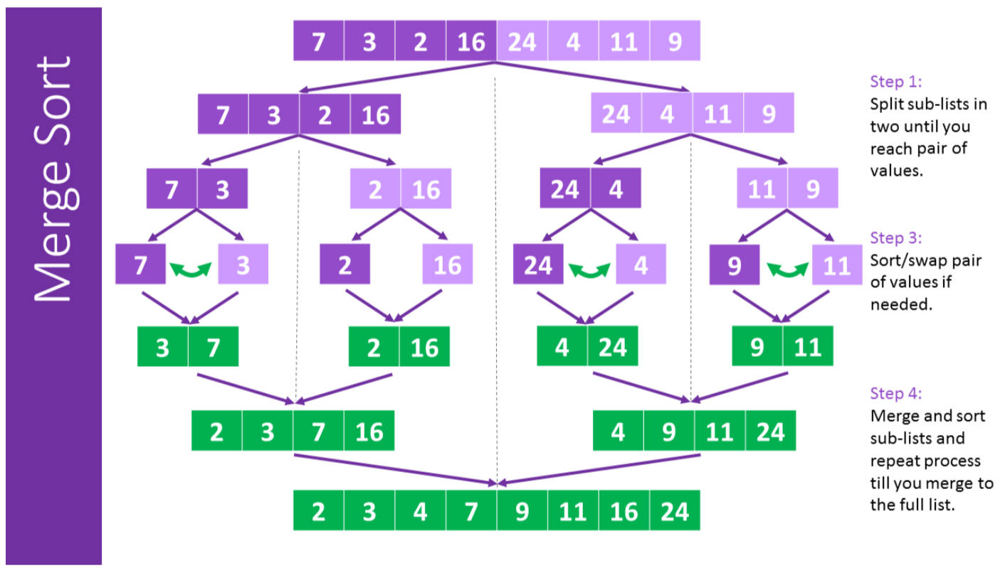
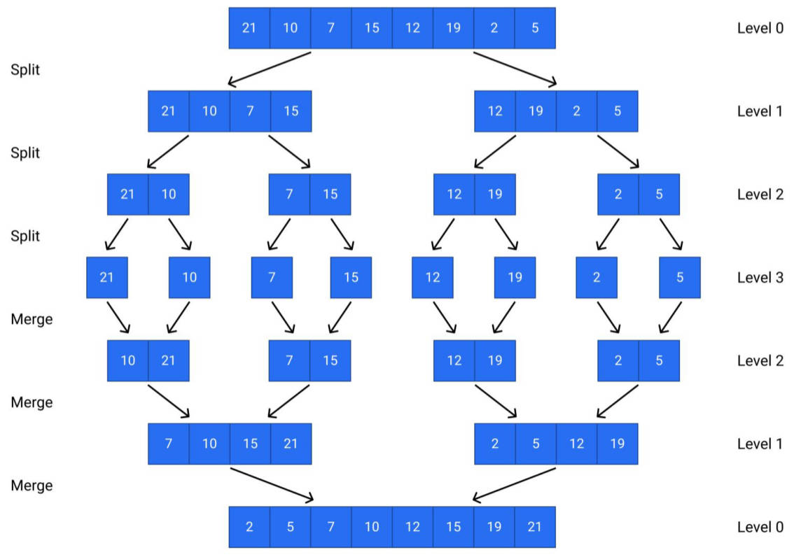
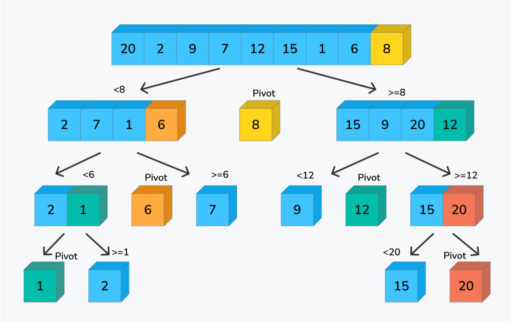

# 排序算法

## 一、插入排序

### 1.插入排序代码实现

demo-project\12-排序算法\03-插入排序（insertionSort）.ts

```typescript
import { testSort, measureSort } from 'hy-algokit';

export default function insertionSort(arr: number[]): number[] {
  const n = arr.length
  
  for (let i = 1; i < n; i++) {
    const current = arr[i];

    let j = i - 1
    while (j >= 0 && arr[j] > current) {
      arr[j + 1] = arr[j]
      j--
    }

    arr[j + 1] = current
  }

  return arr
}

// 测试
testSort(insertionSort)
measureSort(insertionSort)
```

### 2.插入排序时间复杂度分析

最好情况：`O(n)`

- 待排序数组已经排好序，
- 比较的次数为 n - 1，移动的次数为 0。

最坏情况：`O(n^2)`

- 待排序数组是倒序排列的。
- 比较的次数为 `n (n - 1) / 2`，移动的次数也为 `n (n - 1) / 2`。
- 所以最坏情况下，插入排序的时间复杂度，为平方级别，即 `O(n^2)`。

平均情况：`O(n^2)`

总而言之，如果数组部分有序，插入排序可以比冒泡排序和选择排序更快。

但是如果数组完全逆序，则插入排序的时间复杂度比较高，不如快速排序或归并排序。

### 3.插入排序总结

插入排序是一种简单直观的排序算法。

它的基本思想就是，将待排序数组，分为已排序部分，和未排序部分；

然后，将未排序部分的每个元素，插入到已排序部分的合适位置。

虽然这个复杂度比较高，但是插入排序的实现，非常简单，而且在某些情况下，性能表现也很好。

- 比如，待排序数组的部分元素，已经排好序，那么插入排序的性能就会比较优秀。

## 二、归并排序

### 1.归并排序的介绍

**归并排序（merge sort）**是一种常见的排序算法：

- 它的基本思想是：将待排序数组，分成若干个子数组。
- 然后将相邻的子数组，归并（merge）成一个有序数组。
- 最后再将这些有序数组，归并（merge）成一个整体有序的数组。

该算法最早在 1945 年，由约翰·冯·诺伊曼（John von Neumann）（现代计算机之父，成接：冯·诺依曼结构、普林斯顿结构）首次提出。

- 当时他在为美国政府工作，研究原子弹的问题。
- 他在研究中提出了一种高效计算的方法，这个方法就是归并排序。


归并排序的基本思路是：先将待排序数组，递归地拆分成两个子数组；然后对每个子数组进行排序， 最后将两个有序子数组，合并成一个有序数组。

在实现中，可以使用“**分治法**”，即将大问题分解成小问题解决。

归并排序的算法复杂度为 `O(n log n)`，是一种比较高效的排序算法，因此在实际应用中被广泛使用。

### 2.归并排序的实现思路

归并排序，是一种基于分治思想的排序算法，其基本思路可以分为三个步骤：

步骤一：分解（Divide）：归并排序使用递归算法，来实现分解过程，可以分为以下几个步骤：

1. 如果待排序数组长度为 1，认为这个数组已经有序，直接返回；
2. 将待排序数组，分成两个长度相等的子数组，分别对这两个子数组进行递归排序；
3. 将两个排好序的子数组合并成一个有序数组，返回这个有序数组。

步骤二：合并（Merge）：合并过程中，需要比较每个子数组的元素，并将它们有序地合并成一个新的数组：

1. 使用两个指针 `i` 和 `j`，分别指向两个子数组的开头，比较它们的元素大小，将小的元素，插入到新的有序数组中。
2. 如果其中一个子数组，已经遍历完，就将另一个子数组的剩余部分，直接插入到新的有序数组中。
3. 最后返回这个有序数组。

步骤三：归并排序的递归终止条件：

- 归并排序使用递归算法，来实现分解过程；
- 当子数组的长度为 1 时，认为这个子数组已经有序，递归结束。

总体来看，归并排序的基本思路，是**分治法**；即将问题分成子问题分别解决，然后将子问题的解，合并成整体的解。

### 3.归并排序的图解





动画


### 4.归并排序代码实现

demo-project\12-排序算法\04-归并排序（mergeSort）.ts

```typescript
import { testSort, measureSort } from 'hy-algokit';

export default function mergeSort(arr: number[]): number[] {
  const n = arr.length
  if (n <= 1) return arr

  const mid = Math.floor(n / 2) // 获取到愿数组中间位置的索引
  const leftArr = arr.slice(0, mid) // 切割得到左边数组
  const rightArr = arr.slice(mid) // 切割得到右边数组

  // 递归切割
  const leftSorted = mergeSort(leftArr)
  const rightSorted = mergeSort(rightArr)

  // 合并切割的数组（使用双指针）
  const newArr: number[] = []
  let i = 0
  let j = 0
  while (i < leftSorted.length && j < rightSorted.length) {
    if (leftSorted[i] <= rightSorted[j]) {
      newArr.push(leftSorted[i])
      i++
    } else {
      newArr.push(rightSorted[j])
      j++
    }
  }

  // 判断是否第一个数字中还有剩余的元素，有则将它们加入到新数组中。
  /* if (i < leftSorted.length) {
    newArr.push(...leftSorted.slice(i))
  }
  if (j < rightSorted.length) {
    newArr.push(...rightSorted.slice(j))
  } */

  return newArr.concat(leftSorted.slice(i), rightSorted.slice(j))
}

// 测试
testSort(mergeSort)
measureSort(mergeSort)
```

归并排序，空间复杂度低的写法（了解）：

demo-project\12-排序算法\04-1-归并排序-原地排序.ts

```typescript
import { measureSort, testSort } from 'hy-algokit';

/**
 * @description: 此函数用于：归并排序
 * @Author: ZeT1an
 * @param {number} arr 要排序的数组
 * @return {*number[]} 排序后的数组
 */
export default function mergeSort(arr: number[]): number[] {
  const n = arr.length
  mergeSortInternal(arr, 0, n - 1)
  return arr
}

/**
 * @description: 此函数用于：归并排序内部实现的函数，堆数组 arr 的 [left, right] 区间，进行排序
 * @Author: ZeT1an
 * @param {number} arr 元素组
 * @param {number} left 开始的索引
 * @param {number} right 末尾的索引
 * @return {*}
 */
function mergeSortInternal(arr: number[], left: number, right: number) {
  // 如果区间只有一个元素，或者为空，直接返回
  if (left >= right) return;


  // 区间分为左右两个子区间，分别递归调用 mergeSortInternal 函数
  const mid = Math.floor(left + (right - left) / 2)
  mergeSortInternal(arr, left, mid)
  mergeSortInternal(arr, mid + 1, right)

  // 左右子区间排序完成后，开始合并
  merge(arr, left, mid, right)
}

/**
 * @description: 此函数用于：将已经排好序的左右两个子区间，合并成一个有序的区间
 * @Author: ZeT1an
 * @param {number} arr 排序的数组
 * @param {number} left 开始的索引
 * @param {number} mid 中间的索引
 * @param {number} right 末尾的索引
 * @return {*}
 */
function merge(arr: number[], left: number, mid: number, right: number) {
  const temp = new Array(right - left + 1);
  let i = left;
  let j = mid + 1;
  let k = 0;

  while (i <= mid && j <= right) {
    if (arr[i] <= arr[j]) {
      temp[k++] = arr[i++];
    } else {
      temp[k++] = arr[j++];
    }
  }

  // 如果左子区间还有元素，将它们全部复制到 temp 中。
  while (i <= mid) {
    temp[k++] = arr[i++];
  }

  // 如果右子区间还有元素，将它们全部复制到 temp 中。
  while (j <= right) {
    temp[k++] = arr[j++];
  }

  // 将 temp 中的内容复制到原数组中。
  for (let x = 0; x < temp.length; x++) {
    arr[left + x] = temp[x];
  }
}

// 测试
// testSort(mergeSort)
measureSort(mergeSort)

```

### 5.归并排序复杂度分析

复杂度的分析过程：

- 假设数组长度为 `n`，需要进行 `log n` 次归并操作，时间复杂度为 `O(log n)`；
- 每次归并操作后，排序的时间复杂度是 `O(n)` ；
- 因此，归并排序的时间复杂度为 `O (n log n)`。

最好情况：`O(n log n)`

- 这种情况，发生在“每次划分都能将数组均匀地分成两半，合并操作的开销也很小”的情况下；

最坏情况：`O (n log n)`

- 无论输入数据的分布如何，归并排序总是将数组均匀地分成两半，然后合并这些子数组，因此其性能在最坏情况下也很稳定。

平均情况：`O (n log n)`

- 在平均情况下，待排序数组中任意两个元素都是等概率出现的。

### 5.归并排序总结

一种非常高效的排序算法，核心思想是：分治。

即将待排序数组，分成若干个子数组，分别对这些子数组进行排序，最后将排好序的子数组，合并成一个有序数组。

归并排序在最好、最坏和平均情况下，时间复杂度都为 `O(n log n)`，

> 如果面试要求只写一种排序算法，优先选择：
>
> 快速排序，归并排序（空间复杂度高）、堆排序（不稳定）；
>
> 因为它们的效率最高。

## 三、快速排序

### 1.快速排序的介绍

**快速排序（ Quicksort ）**是一种经典的排序算法，有时也被称为“划分交换排序”（partition-exchange sort）。

它的发明人是一位名叫 Tony Hoare（东尼·霍尔）的计算机科学家。

- Tony Hoare 在 1960 年代初期，发明了快速排序，在一份 ALGOL60 （一种编程语言）手稿中。
- 为了让稿件更具可读性，他采用了这种新的排序算法。
- 当时，快速排序还没有正式命名，后来被 Tony Hoare 命名为 “quicksort”。
- 由于快速排序的思想，非常巧妙，因此在计算机科学中得到了广泛的应用。

)

虽然它的名字叫做“快速排序”，但并不意味着，它总是最快的排序算法；

它的实际速度，取决于很多因素：

- 比如：排序集合中，元素数据的分布情况、待排序数组的长度、等等。

**快速排序（Quick Sort）**也是一种基于“**分治**”思想的排序算法：也要用到**双指针**实现。

- 基本思路是：将一个大数组分成两个小数组，然后，递归地对两个小数组，进行排序。
- 具体实现方式是：通过选择一个基准元素（pivot），将数组分成左右两部分：
  - 左部分的元素，都小于或等于基准元素；
  - 右部分的元素，都大于基准元素。
- 然后，对左右两部分，分别递归调用快速排序，最终将整个数组排序。

快速排序是一种**原地排序**算法，不需要额外的数组空间。同时，快速排序的时间复杂度是 `O (n log n)`，在最坏情况下是 `O (n^2)`（这种情况出现的概率非常小）。

快速排序通常被认为是一种非常高效的排序算法。

### 2.快速排序的实现思路

可以分解成以下几个步骤：

1. 首先，选择一个基准元素（pivot），通常选择集合的第一个，或最后一个元素，作为基准元素。
2. 然后，定义两个指针 `i` 和 `j`，分别指向数组的左右两端。
3. 接下来，从右侧开始，向左移动 `j` 指针，直到找到一个小于基准元素的值；再从左侧开始，向右移动 `i` 指针，直到找到一个大于基准元素的值。
4. 如果 i 指针小于或等于 j 指针，交换 i 和 j 指针所指向的元素。
5. 重复步骤 3-4，直到 `i` 指针大于 `j` 指针。
6. 这时，将基准元素与 i 指针所指向的元素交换位置。
   - 交换后，基准元素左边都是小于等于它的值，右边都是大于等于它的值；
7. 接着，以基准元素为分割点，将数组分为左右两部分，
8. 然后，对左右两部分，进行递归调用快速排序，直到左右两部分只剩下一个元素。
9. 最终，整个数组就变得有序了。

### 3.快速排序图解



### 4.快速排序代码实现

demo-project\12-排序算法\05-快速排序（quickSort）.ts

```typescript
import { swap, testSort, measureSort } from 'hy-algokit';

function quickSort(arr: number[]): number[] {

  partition(0, arr.length - 1)

  function partition(start: number, end: number) {
    if (start >= end) return arr

    const pivot = arr[end] // 将原数组最后一个元素，作为基准元素 pivot

    let i = start, j = end - 1 // 双指针

    // 交换后的结果，左边都是比 pivot 小的数字，右边都是比 pivot 大的数字
    while (i <= j) {
      while (arr[i] < pivot) i++
      while (arr[j] > pivot) j--

      if (i <= j) {
        swap(arr, i, j)
        i++
        j--
      }
    }

    // 将 pibot 放在正确位置，以它为基准，再切割成两个数组，进行快速排序
    swap(arr, i, end)
    partition(start, j)
    partition(i + 1, end)
  }

  return arr
}

// 测试
// testSort(quickSort)
measureSort(quickSort)
```

### 5.时间复杂度分析

快速排序的时间复杂度，主要取决于：基准元素（pivot）的选择、数组的划分、递归深度等因素。

最好情况：`O(n log n)`

- 每次划分后，两部分的大小都相等，即基准元素的大小，恰好位于数组的中位数位置；
- 此时，递归的深度为 `O(log n)`。每一层，需要进行 n 次比较，时间复杂度为 `O(n)`，
- 因此，最好情况下的时间复杂度为 `O(n log n)`。

最坏情况：`O (n^2)`

- 每次划分后，左、右其中一部分为空，即基准元素的大小，是数组中的最大或最小值。
- 此时递归的深度为 `O (n)`。每一层需要进行 n 次比较，时间复杂度为 `O(n)；`
- 因此最坏情况下的时间复杂度为 `O (n^2)`。

> 采用三数取中法，或随机选择基准元素，可以有效避免最坏情况的发生。

平均情况：`O (n log n)`

- 每次划分后，两部分的大小，大致相等；
- 此时递归的深度为 `O(log n)`；每一层需要进行大约 n 次比较，时间复杂度为 `O(n)；`。
- 因此，平均情况下的时间复杂度为 `O(n log n)`。

需要注意的是，快速排序是一个原地排序算法，不需要额外的数组空间。

### 6.快速排序总结

快速排序的性能，优于许多其他排序算法，因为它具有良好的局部性，和使用原地排序的优点。

- 它在大多数情况下的时间复杂度为 `O(n log n)`，但在最坏情况下会退化到 `O(n^2)`。
- 为了避免最坏情况的发生，可以使用一些优化策略，比如随机选择基准元素和三数取中法。

总之，快速排序是一种高效的排序算法，它在实践中被广泛使用。
