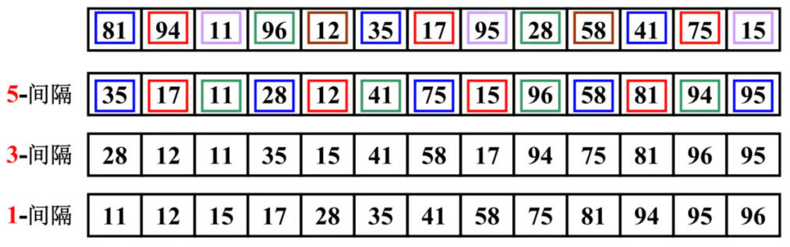

# 排序算法

## 一、快速排序

### 1.代码优化

三数取中

demo-project\12-排序算法\06-快速排序（quickSort）-三数取中.ts

```typescript
import { swap, testSort, measureSort } from 'hy-algokit';

function quickSort(arr: number[]): number[] {
  partition(0, arr.length - 1)

  function partition(start: number, end: number) {
    if (start >= end) return arr

    // 三数取中
    const mid = Math.floor((start + end) / 2)
    if (mid > start && mid < end) {
      if (arr[start] > arr[end]) swap(arr, start, end)
      if (arr[mid] > arr[end]) swap(arr, mid, end)
      if (arr[start] > arr[mid]) swap(arr, start, mid)
      swap(arr ,mid, end)
    }

    const pivot = arr[end] // 将原数组最后一个元素，作为基准元素 pivot

    // // 双指针
    let i = start
    let j = end - 1

    // 交换后的结果，左边都是比 pivot 小的数字，右边都是比 pivot 大的数字
    while (i <= j) {
      while (arr[i] < pivot) i++
      while (arr[j] > pivot) j--

      if (i <= j) {
        swap(arr, i, j)
        i++
        j--
      }
    }

    // 将 pibot 放在正确位置，以它为基准，再切割成两个数组，进行快速排序
    swap(arr, i, end)
    partition(start, j)
    partition(i + 1, end)
  }

  return arr
}

// 测试
testSort(quickSort)
measureSort(quickSort)
```

## 二、堆排序

### 1.堆排序的介绍

**堆排序（Heap Sort）**的核心思想是：使用二叉堆来维护一个有序序列。

- 二叉堆是一种**完全二叉树**，其中每个节点，都满足父节点比子节点大（或小）的条件（最大堆，最小堆）。
- 在堆排序中，我们使用最大堆来进行排序，也就是保证每个节点，都比它的子节点大。

在堆排序中，我们首先构建一个最大堆：

- 然后，将堆的根节点（即最大值）与堆的最后一个元素交换，这样，最大值就被放在了正确的位置上。
- 接着，将堆的大小减 1，并将剩余的元素重新构建成一个最大堆。
- 不断重复这个过程，直到堆的大小为 1。 这样，我们就得到了一个有序的序列。

堆排序和选择排序，有一定的关系，因为它们都利用了“选择”这个基本操作。

- 选择排序的基本思想，是在待排序的序列中，选出最小（或最大）的元素，然后将其放置到序列的起始位置。
- 堆排序也是一种选择排序算法，它使用最大堆来维护一个有序序列，然后不断选择出最大的值。

选择的时间复杂度为 `O(n)`，构建堆的时间复杂度是 `O(log n)`，堆排序的时间复杂度为 `O(n log n)`。

### 2.堆排序的思路分析

堆排序可以分成两大步骤：“构建最大堆”和“排序”：

可以使用原地建堆，或者在新数组中构建。前者空间复杂度更低。

构建最大堆：

1. 自下而上的下滤。

排序：

1. 将堆的根节点（也就是最大值）与堆的最后一个元素交换，这样最大值就被放在了正确的位置上。
2. 将堆的大小减一，并将剩余的元素，重新构建成一个最大堆。
3. 重复进行步骤 1 和步骤 2，直到堆的大小为 1，这样我们就得到了一个有序的序列。

### 3.堆排序的图解


### 4.堆排序代码实现

使用原地建堆，在数组末尾交换最大值。

demo-project\12-排序算法\07-堆排序（heapSort）.ts

```typescript
import { swap, testSort, measureSort } from 'hy-algokit';

export default function heapSort(arr: number[]): number[] {
  const n = arr.length

  // 对 arr 原地建堆，自下而上的下滤
  const lastNonLeafNode = Math.floor((n - 1) / 2 - 1)
  for (let i = lastNonLeafNode; i >= 0; i--) {
    heapfy_down(arr, n, i)
  }

  // 对最大堆，进行排序操作
  for (let i = n - 1; i > 0; i--) {
    swap(arr, 0, i)
    heapfy_down(arr, i, 0)
  }

  return arr
}

function heapfy_down(arr: number[], n: number, index: number) {
  while (2 * index + 1 < n) {
    // 1.定义索引位置
    const leftChildIndex = 2 * index + 1
    const rightChildIndex = leftChildIndex + 1

    // 2.找到左右子节点较小的值
    let largeIndex = leftChildIndex
    if (rightChildIndex < n && arr[rightChildIndex] > arr[leftChildIndex]) {
      largeIndex = rightChildIndex
    }

    // 3.较小的之和 index 位置进行比较
    if (arr[index] >= arr[largeIndex]) break

    // 4.变换位置
    swap(arr, index, largeIndex)
    index = largeIndex
  }
}

// 测试
testSort(heapSort)
measureSort(heapSort)
```

### 5.堆排序复杂度分析

堆排序的时间复杂度分析，既涉及到堆的建立过程，也涉及到排序过程。

步骤一：堆的建立过程：

- `n / 2` 次堆的向下调整操作，因此它的时间复杂度为 `O(n)`。

步骤二：堆的排序过程：

- 要执行 n 次堆的删除最大值操作，每次操作都需要将堆的最后一个元素，与堆顶元素交换，然后进行下滤。时间复杂度为 `O(log n)`；

综合起来，堆排序的时间复杂度为 `O(n log n)`。

需要注意的是，堆排序的空间复杂度为 `O(1)`，因为它只使用了常数个辅助变量，来存储堆的信息。

### 6.堆排序的总结

堆排序，是一种高效的排序算法，它利用堆这种数据结构，来实现排序。

堆排序，具有时间复杂度为 `O(n log n)` 的优秀性能，空间复杂度为 `O(1)`。

然而，堆排序的过程是**不稳定的**，即相同元素的相对位置，可能会发生变化；

因此，在某些情况下，可能会导致排序结果不符合要求。

总的来说，堆排序是一种高效的、通用的排序算法，它适用于各种类型的数据，并且可以应用于大规模数据的排序。

## 三、父节点索引的推导

堆结构，满足完全二叉树在结构上的特性，可以使用数组保存。

如果一个节点，在数组中的索引是 i，那么它的父节点在数组中的索引是 `floor(i / 2 - 1)`。

## 四、希尔排序

### 1.希尔排序的介绍

1959 年，**希尔排序（ Shell Sort ）**算法诞生了，它是一种创新的排序算法，

它的名字来源于它的发明者：**Donald Shell （唐纳德·希尔）**；


在简单排序算法诞生后的很长一段时间内，人们不断尝试发明各种各样的排序算法；

然而，当时的排序算法的时间复杂度都是`O(N²)`，看起来很难超越。

当时计算机学术界，充满了 “排序算法不可能突破 `O(N²)` “的声音，这与人类 100 米短跑，不可能突破 10 秒大关的想法一样。

- 这是因为很多著名的排序算法，如冒泡排序、选择排序、插入排序...，它们的时间复杂度，都是 `O(N²)` 级别的。
- 因此，人们普遍认为，除非发生突破性的创新，否则排序算法的时间复杂度，是不可能达到 `O(N log N)` 级别的。

在这种情况下，希尔排序的提出，成为了一种重要的突破。

- 希尔排序，利用了“分组”和“插入”排序的思想；
- 通过不断缩小间隔的方式，让数据不断地接近有序状态，从而达到了较高的排序效率。
- 希尔排序的时间复杂度，不仅低于 `O(N²)`，而且可以通过调整步长序列，来进一步优化。
- 这一突破性的创新，引起了广泛的关注和研究，也为后来的排序算法研究提供了重要的借鉴。

### 2.插入排序的回顾

由于希尔排序，基于插入排序，回顾插入排序的过程：

- 设想一下，在插入排序执行到一半时，标记符左边数据项，都是排好序的，而标识符右边，是没有排序的。
- 这时，取出指向的那个数据项，把它存储在一个临时变量中；
- 接着，从刚刚移除的位置左边第一个单元开始，每次把有序的数据项，向右移动一个单元，直到存储在临时变量中的数据项，可以成功插入。

插入排序的问题：

- 假设一个很小的数据项，在很靠近右端的位置上，这里本来应该是较大的数据项的位置。
- 把这个小数据项，移动到左边的正确位置，所有的中间数据项，都必须向右移动一位。
- 如果每个步骤对数据项都进行 N 次移动，平均下来是移动 N / 2，N 个元素就是 N*N/2 = N²/2。
- 所以我们通常认为：插入排序的效率是 O(N²)。

如果有某种方式，不需要一个个移动所有中间的数据项，就能把较小的数据项，移动到左边正确位置。

那么，这个算法的执行效率，就会有很大的改进。

### 3.希尔排序实现思路

希尔排序的做法：

- 比如下面的数字，81，94，11，96，12，35，17，95，28，58，41，75，15
- 先以间隔为 5，进行排序。 (35，81)，(94，17)，(11，95)，(96，28)，(12，58)，(35，41)，(17，75)，(95，15)
  - 排序后的新序列，一定可以让数字离自己的正确位置更近一步。
- 再以间隔为 3，进行排序。 (35，28，75，58，95)，(17，12，15，81)，(11，41，96，94)
  - 排序后的新序列，一定可以让数字离自己的正确位置又近了一步。
- 最后，让间隔为 1，也就是正确的插入排序。这个时候数字都离自己的位置更近，那么需要复制的次数一定会减少很多。



希尔排序的增量怎么取？

希尔排序的基本思想，是利用分组插入排序的思想，通过不断缩小间隔，来让数据逐步趋于有序。它的步骤思路如下：

1. 定义一个增量序列 d1, d2, ..., dk，一般选择增量序列最后一个元素为 1，即 dk = 1；
2. 以 dk 为间隔，将待排序的序列，分成 dk 个子序列，对每个子序列进行插入排序；
3. 缩小增量，对缩小后的每个子序列，进行插入排序，直到增量为 1。

其中，第一步的增量序列的选择，比较重要；

增量序列的不同选择，会影响到排序效率的好坏；

目前比较常用的增量序列，有希尔增量、 Hibbard 增量、Knuth 增量等。

以希尔增量为例，希尔增量的计算方法为：`dk = floor(n / 2^k)`；

- 其中，k 为增量序列的元素下标，n 为待排序序列的长度。当 k = 0 时，dk = 1。

这些增量，大部分都是未被证明的。

### 4.希尔排序代码实现

demo-project\12-排序算法\08-希尔排序（shellSort）.ts

```typescript
import { measureSort, testSort } from 'hy-algokit';

export default function shellSort(arr: number[]): number[] {
  const n = arr.length

  let gap = Math.floor(n / 2) // 选择不同的增量

  // 第一层循环，不断改变步长的过程
  while (gap > 0) {

    // 第二层循环，找到不同的数列集合，进行插入排序
    for (let i = gap; i < n; i++) {
      let j = i
      const temp = arr[j]

      // 第三层循环：对数列进行插入排序的过程，使用 temp 向前去找到一个比 temp 小的值
      while (j > gap - 1 && temp < arr[j - gap]) {
        arr[j] = arr[j - gap]
        j -= gap
      }

      arr[j] = temp
    }

    gap = Math.floor(gap / 2)
  }

  return arr
}

// testSort(shellSort)
measureSort(shellSort)
```

### 5.时间复杂度分析

希尔排序的效率：和增量是有关系的。

它的效率证明非常困难，甚至某些增量的效率，到目前依然没有被证明出来。

经过统计，希尔排序，使用原始增量，最坏的情况下，时间复杂度为 `O(N²)`，通常情况下都要好于 `O(N²)`

常用的增量如下：

Hibbard 增量序列 ：

- 增量的算法为 2^k - 1。也就是为1 3 5 7。。。等等。
- 这种增量的最坏复杂度为 O(N^3/2^)，猜想的平均复杂度为 O(N^5/4)^)，目前尚未被证明。

Sedgewick 增量序列 ：

- {1，5，19，41，109，… }，该序列中的项，或者是 9 \* 4^i^ - 9 \* 2^i^ + 1，或者是 4^i^ - 32^i^ + 1
- 这种增量的最坏复杂度为 O(N^4/3^)，平均复杂度为 O(N^7/6^)，但是均未被证明。

总之，我们使用希尔排序大多数情况下效率都高于简单排序。

### 6.希尔排序总结

希尔排序，是一种改进版的插入排序；

从历史的角度来看，它是一种非常，非常，重要的排序算法，因为它解除了人们对原有排序的固有认知。

希尔排序的时间复杂度，取决于**步长序列**的选择；

目前最优的步长序列，还没有被证明；

因此希尔排序的时间复杂度，依然是一个开放的问题。

现在已经有很多更加优秀的排序算法：

- 比如：归并排序、快速排序...，
- 所以从实际的应用角度来说，希尔排序已经使用的非常非常少了。

因为，我们只需要了解其核心思想即可。

## 五、测试多种排序算法

使用 `hy-algokit` 中的 `compareSort` 方法，测试多种排序算法的效率。

demo-project\12-排序算法\09-测试多种排序算法.ts

```typescript
import { compareSort } from 'hy-algokit'
import bubbleSort from './01-冒泡排序bubbleSort'
import selectionSort from './02-选择排序selectionSort'
import insertionSort from './03-插入排序（insertionSort）'
import mergeSort from './04-归并排序（mergeSort）'
import quickSort from './06-快速排序（quickSort）-三数取中'
import heapSort from './07-堆排序（heapSort）'
import shellSort from './08-希尔排序（shellSort）'

compareSort([bubbleSort, selectionSort, insertionSort, mergeSort, quickSort, heapSort, shellSort], 100000)
```

大多数情况下：快速排序 > 堆排序 > 归并排序 > 希尔排序 > ...简单排序

## 六、其它排序算法

基数排序，桶排序，计数排序，内省排序，平滑排序等排序算法，空间复杂度比较高。
