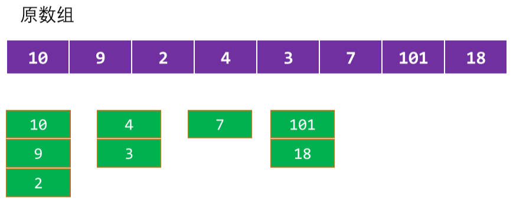

# 面试题

## 一、栈结构

### 1.用两个栈实现队列结构

[Leetcode 原题](https://leetcode.cn/problems/yong-liang-ge-zhan-shi-xian-dui-lie-lcof/description/)

题面：用两个栈实现一个队列。队列的声明如下，请实现它的两个函数 `appendTail` 和 `deleteHead`，分别完成在队列尾部插入整数和在队列头部删除整数的功能。(若队列中没有元素，`deleteHead` 操作返回 -`1` )

demo-project\14-大厂面试题Leetcode\06-用两个栈实现队列结构.ts

```typescript
class CQueue {
  private stack1: number[] = []
  private stack2: number[] = []
  constructor() {}

  appendTail(value: number): void {
    this.stack1.push(value)
  }

  deleteHead(value: number): number {
    // 1.判断 stack2 中是否有数据
    if (this.stack2.length > 0) {
      return this.stack2.pop()!
    }

    // 2.判断 stack1 中是否有数据
    else if (this.stack1.length > 0) {
      // 从 stack1 中，取出所有的数据，放到 stack2 中。
      while (this.stack1.length > 0) {
        const item = this.stack1.pop()!
        this.stack2.push(item)
      }

      return this.stack2.pop()!
    }

    else {
      return -1
    }
  }
}
```

## 二、队列

### 1.滑动窗口最大值

经典的双端队列应用场景，也可以用动态规划解决。

题面：给你一个整数数组 `nums`，有一个大小为 `k` 的滑动窗口，从数组的最左侧，移动到数组的最右侧。你只可以看到在滑动窗口内的 `k` 个数字。滑动窗口每次只向右移动一位。

返回 *滑动窗口中的最大值* 。

**示例 1：**

```txt
输入：nums = [1,3,-1,-3,5,3,6,7], k = 3
输出：[3,3,5,5,6,7]
解释：
滑动窗口的位置                最大值
---------------               -----
[1  3  -1] -3  5  3  6  7       3
 1 [3  -1  -3] 5  3  6  7       3
 1  3 [-1  -3  5] 3  6  7       5
 1  3  -1 [-3  5  3] 6  7       5
 1  3  -1  -3 [5  3  6] 7       6
 1  3  -1  -3  5 [3  6  7]      7
```

**示例 2：**

```txt
输入：nums = [1], k = 1
输出：[1]
```

demo-project\14-大厂面试题Leetcode\07-滑动窗口最大值.ts

```typescript
function maxSlidingWindow(nums: number[], k: number): number[] {
  const n = nums.length

  // 创建双端队列，琼中存放索引
  const dequeue: number[] = []
  const res: number[] = []

  // 遍历每一个元素
  for (let i = 0; i < n; i++) {
    // 移除窗口左侧超出范围的元素索引
    if (dequeue.length > 0 && dequeue[0] < i - k + 1) {
      dequeue.shift()
    }

    // 如果，双端队列不为空，并且队列尾部的索引对应的值，小于遍历的值
    // 则将元素，放入到双端队列的尾部
    while (dequeue.length && nums[i] > nums[dequeue[dequeue.length - 1]]) {
      dequeue.pop()
    }
    dequeue.push(i)


    // 获取到头部的值，作为最大值
    if (i >= k - 1) {
      res.push(nums[dequeue[0]])
    }
  }

  return res
}

// 测试
console.log(maxSlidingWindow([1, 3, -1, -3, 5, 3, 6, 7], 3))
```

## 三、链表

### 1.删除链表的倒数第 N 个节点

[Leetcode 原题](https://leetcode.cn/problems/remove-nth-node-from-end-of-list/description/)

题目：给你一个链表，删除链表的倒数第 n 个结点，并且返回链表的头结点。

思路：可以使用双指针，来解决这个问题。

- 首先让快指针先移动 n 步，然后让慢指针和快指针一起移动， 直到快指针到达链表末尾。
- 此时慢指针所指的节点，就是要删除的节点的前一个节点，可以将其指向下下个节点，从而删除倒数第 n 个节点。
- 其中 dummy 节点，是为了方便处理边界情况而添加的。

demo-project\14-大厂面试题Leetcode\08-删除链表倒数第n个节点.ts

```typescript
//  Definition for singly-linked list.
class ListNode {
  val: number
  next: ListNode | null
  constructor(val?: number, next?: ListNode | null) {
    this.val = val === undefined ? 0 : val
    this.next = next === undefined ? null : next
  }
}

function removeNthFromEnd(head: ListNode | null, n: number): ListNode | null {
  if (!head) return null

  // 1.创建虚拟节点
  const dummy = new ListNode(0)
  dummy.next = head

  // 2.创建双指针（快慢指针）
  let slow = dummy
  let fast = dummy

  // 3.先让快指针，移动到 n + 1 个节点
  for (let i = 0; i<= n; i++) {
    fast = fast.next!
  }

  // 2.同时移动 fast 和 slow，直到 fast 到达链表末尾
  while (fast) {
    fast = fast.next!
    slow = slow.next!
  }

  slow.next = slow.next ? slow.next.next : null

  return dummy.next
}

```

### 2.两两交换链表中的节点

[Leetcode 原题](https://leetcode.cn/problems/swap-nodes-in-pairs/description/)

题目：给你一个链表，两两交换其中相邻的节点，并返回交换后链表的头节点。你必须在不修改节点内部的值的情况下完成本题（即，只能进行节点交换）。

实现思路：

- 首先添加一个 dummy 节点；
- 创建一个 p 节点，默认指向虚拟节点（这里因为有虚拟节点，所以可以直接调用 next）；
- 使用一个指针 p 依次指向每组相邻的节点，然后交换这两个节点的位置，直到遍历完整个链表。

demo-project\14-大厂面试题Leetcode\09-两两交换链表中的节点.ts

```typescript
// Definition for singly-linked list.
export class ListNode {
  val: number
  next: ListNode | null
  constructor(val?: number, next?: ListNode | null) {
    this.val = val === undefined ? 0 : val
    this.next = next === undefined ? null : next
  }
}

function swapPairs(head: ListNode | null): ListNode | null {
  // 1.创建虚拟节点
  const dummy = new ListNode(0, head)

  // 2.创建 current 节点，指向虚拟节点
  let curr = dummy
  while (curr.next && curr.next.next) {
    // 将接下来的两个节点取出
    const node1 = curr.next
    const node2 = curr.next.next

    // 交换 node1 和 node2 的位置
    curr.next = node2
    node1.next = node2.next
    node2.next = node1

    // 开始下一次的交换
    curr = node1
  }

  return dummy.next
}
```

## 四、二叉树

### 1.二叉树的前序、中序、后序、层序遍历

前序遍历：

demo-project\14-大厂面试题Leetcode\10-二叉树的前序遍历.ts

```typescript
// Definition for a binary tree node.
class TreeNode {
  val: number
  left: TreeNode | null
  right: TreeNode | null
  constructor(val?: number, left?: TreeNode | null, right?: TreeNode | null) {
    this.val = val === undefined ? 0 : val
    this.left = left === undefined ? null : left
    this.right = right === undefined ? null : right
  }
}

function preorderTraversal(root: TreeNode | null): number[] {
  const res: number[] = []
  recursionTraversal(root, res)
  return res
}

function recursionTraversal(node: TreeNode | null, res: number[]) {
  if (node) {
    res.push(node.val)
    recursionTraversal(node.left, res)
    recursionTraversal(node.right, res)
  }
}
```

中序遍历：

demo-project\14-大厂面试题Leetcode\11-二叉树中序遍历.ts

```typescript
//  Definition for a binary tree node.
class TreeNode {
  val: number
  left: TreeNode | null
  right: TreeNode | null
  constructor(val?: number, left?: TreeNode | null, right?: TreeNode | null) {
    this.val = val === undefined ? 0 : val
    this.left = left === undefined ? null : left
    this.right = right === undefined ? null : right
  }
}

function inorderTraversal(root: TreeNode | null): number[] {
  const res: number[] = []
  recursTraversal(root, res)
  return res
}

function recursTraversal(node: TreeNode | null, arr: number[]) {
  if (node) {
    recursTraversal(node.left, arr)
    arr.push(node.val)
    recursTraversal(node.right, arr)
  }
}
```

后序遍历：

demo-project\14-大厂面试题Leetcode\12-二叉树后序遍历.ts

```typescript
// Definition for a binary tree node.
export class TreeNode {
  val: number
  left: TreeNode | null
  right: TreeNode | null
  constructor(val?: number, left?: TreeNode | null, right?: TreeNode | null) {
    this.val = val === undefined ? 0 : val
    this.left = left === undefined ? null : left
    this.right = right === undefined ? null : right
  }
}

function postorderTraversal(root: TreeNode | null): number[] {
  const res: number[] = []
  recursTravaersel(root, res)
  return res
}

function recursTravaersel(node: TreeNode | null, arr: number[]) {
  if (node) {
    recursTravaersel(node.left, arr)
    recursTravaersel(node.right, arr)
    arr.push(node.val)
  }
}
```

层序遍历

demo-project\14-大厂面试题Leetcode\13-二叉树层序遍历.ts

```typescript
// Definition for a binary tree node.
class TreeNode {
  val: number
  left: TreeNode | null
  right: TreeNode | null
  constructor(val?: number, left?: TreeNode | null, right?: TreeNode | null) {
    this.val = val === undefined ? 0 : val
    this.left = left === undefined ? null : left
    this.right = right === undefined ? null : right
  }
}

function levelOrder(root: TreeNode | null): number[][] {
  if (!root) return []

  const result: number[][] = []
  const queue: TreeNode[] = [root]

  while (queue.length > 0) {
    const levelSize = queue.length
    const currentLevel: number[] = []

    for (let i = 0; i < levelSize; i++) {
      const node = queue.shift()! // 移除队首节点，并获取其值
      currentLevel.push(node.val)

      if (node?.left) {
        queue.push(node.left)
      }
      if (node?.right) {
        queue.push(node.right)
      }
    }

    result.push(currentLevel)
  }

  return result
}
```

### 2.翻转二叉树

翻转二叉树（Max Howell去Google面试没有写出来的题目）

[Leetcode 原题](https://leetcode.cn/problems/invert-binary-tree/description/)

方案一：递归

demo-project\14-大厂面试题Leetcode\14-翻转二叉树.ts

```typescript
// Definition for a binary tree node.
export class TreeNode {
  val: number
  left: TreeNode | null
  right: TreeNode | null
  constructor(val?: number, left?: TreeNode | null, right?: TreeNode | null) {
    this.val = val === undefined ? 0 : val
    this.left = left === undefined ? null : left
    this.right = right === undefined ? null : right
  }
}

function invertTree(root: TreeNode | null): TreeNode | null {
  if (!root) return null

  const left = invertTree(root.left)
  const right = invertTree(root.right)

  root.left = right
  root.right = left

  return root
}
```

方案二：循环 + 栈结构

demo-project\14-大厂面试题Leetcode\15-反转二叉树-循环+栈结构.ts

```typescript
// Definition for a binary tree node.
export class TreeNode {
  val: number
  left: TreeNode | null
  right: TreeNode | null
  constructor(val?: number, left?: TreeNode | null, right?: TreeNode | null) {
    this.val = val === undefined ? 0 : val
    this.left = left === undefined ? null : left
    this.right = right === undefined ? null : right
  }
}

function invertTree(root: TreeNode | null): TreeNode | null {
  if (!root) return null

  // 2.创建 stack 栈结构
  const stack = [root]

  // 2.从栈中不断地取出节点，对节点的左右子节点进行交换
  while (stack.length) {
    const current = stack.pop()!

    // 对 current 节点左右交换位置
    const temp = current.left
    current.left = current.right
    current.right = temp

    if (current.left) {
      stack.push(current.left)
    }
    if (current.right) {
      stack.push(current.right)
    }
  }

  return root
}
```

### 3.二叉树的最大路径和

[Leetcode 原题](https://leetcode.cn/problems/jC7MId/description/)

题面：路径被定义为一条从树中任意节点出发，沿父节点-子节点连接，达到任意节点的序列。同一个节点在一条路径序列中至多出现一次。 该路径至少包含一个节点，且不一定经过根节点。路径和是路径中各节点值的总和。给你一个二叉树的根节点 root ，返回其最大路径和。

思路：使用深度优先搜索

- 从根节点开始递归，遍历二叉树中的所有节点。
- 对于每个节点，需要计算经过该节点的最大路径和。
  - 在计算经过该节点的最大路径和时，需要考虑左子树，和右子树是否能够贡献最大路径和。
  - 如果左子树的最大路径和，大于0，那么就将其加入到经过该节点的最大路径和中；
  - 如果右子树的最大路径和，大于0，那么就将其加入到经过该节点的最大路径 和中。
- 最后，我们将经过该节点的最大路径和，与已经计算出的最大路径和进行比较，取两者中的较大值。

demo-project\14-大厂面试题Leetcode\16-二叉树最大路径和.ts

```typescript
// Definition for a binary tree node.
class TreeNode {
  val: number
  left: TreeNode | null
  right: TreeNode | null
  constructor(val?: number, left?: TreeNode | null, right?: TreeNode | null) {
    this.val = val === undefined ? 0 : val
    this.left = left === undefined ? null : left
    this.right = right === undefined ? null : right
  }
}

function maxPathSum(root: TreeNode | null): number {
  let maxSum = -Infinity

  // 定义内部函数进行递归操作
  function dfs(node: TreeNode | null): number {
    if (!node) return 0

    // 左右子树计算可以提供的非 0 最大值
    const leftSum = Math.max(dfs(node.left), 0)
    const rightSum = Math.max(dfs(node.right), 0)

    // 当前节点中能获取到的最大值
    const pathSum = node.val + leftSum + rightSum
    maxSum = Math.max(pathSum, maxSum)

    // 返回当前节点能给父节点提供的最大值
    return node.val + Math.max(leftSum, rightSum)
  }

  dfs(root)

  return maxSum
}
```

## 五、动态规划

### 1.不同路径

[Leetcode 原题](https://leetcode.cn/problems/unique-paths/description/)

题目：一个机器人，位于一个 m x n 网格的左上角。机器人每次只能向下或者向右移动一步。机器人试图达到网格的右下角（在下图中标记为“Finish” ）。问总共有多少条不同的路径？

思路：使用二维数组 + 动态规划，初始化第一排，第一列的值。

此题和爬楼梯其实是一类题目。假设 `dp[i][j]` 表示从起点到网格的 `(i, j)` 点的不同路径数。

对于每个格子，由于机器人只能从上面或左边到达该格子， 因此有以下两种情况：

- 从上面的格子到达该格子，即 `dp[i][j] = dp[i-1][j]`；
- 从左边的格子到达该格子，即 `dp[i][j] = dp[i][j-1]`。
  - 因此，到达网格的 `(i, j)` 点的不同路径数，就等于到达上面格子的路径数，加上到达左边格子的路径数。
- 动态转移方程为：`dp[i][j] = dp[i-1][j] + dp[i][j-1]`；

初始状态：对于边界情况，起点的路径数为 1，即 `dp[0][0] = 1`。

计算最终状态：`dp[m-1][n-1]`

demo-project\14-大厂面试题Leetcode\17-动态规划-不同的路径.ts

```typescript
function uniquePaths(m: number, n: number): number {
  // 1.定义状态，dp 二维数组
  const dp: number[][] = Array.from({ length: m }, () => Array(n).fill(1))

  // 2.设置初始化值
  /**
   * [
   *   [1, 1, 1, 1, 1, 1, 1],
   *   [1, 0, 0, 0, 0, 0, 0],
   *   [1, 0, 0, 0, 0, 0, 0]
   * ]
   */
  for (let i = 0; i < m; i++) {
    dp[i][0] = 1
  }
  for (let i = 0; i < n; i++) {
    dp[0][i] = 1
  }

  // 3.状态转移方齿，求解后面的值
  for (let i = 1; i < m; i++) {
    for (let j = 1; j < n; j++) {
      dp[i][j] = dp[i-1][j] + dp[i][j-1]
    }
  }

  return dp[m-1][n-1]
};

```

### 2.礼物的最大价值

[Leetcode 原题](https://leetcode.cn/problems/li-wu-de-zui-da-jie-zhi-lcof/description/)

题目：在一个 `m * n` 的棋盘的每一格，都放有一个礼物，每个礼物都有一定的价值（价值大于 0）。你可以从棋盘的左上角开始拿格子里的礼物，并每次向右或者向下移动一格、直到到达棋盘的右下角。给定一个棋盘及其上面的礼物的价值，请计算你最多能拿到多少价值的礼物？

思路：动态规划 + 二维数组

demo-project\14-大厂面试题Leetcode\18-礼物的最大价值.ts

```typescript
function jewelleryValue(frame: number[][]): number {
  // 1.获取 m 排 n 列
  const m = frame.length
  const n = frame[0].length

  // 2.初始化 dp 保存每个位置的最大值
  const dp: number[][] = Array.from({ length: m }, () => Array(n).fill(0))
  dp[0][0] = frame[0][0]

  // 3.初始化值
  for (let i = 1; i < m; i++) {
    dp[i][0] = dp[i-1][0] + frame[i][0]
  }
  for (let j = 1; j < n; j++) {
    dp[0][j] = dp[0][j-1] + frame[0][j]
  }

  for (let i = 1; i < m; i++) {
    for (let j = 1; j < n; j++) {
      dp[i][j] = frame[i][j] + Math.max(dp[i-1][j], dp[i][j-1])
    }
  }

  return dp[m-1][n-1]
};
```

### 3.最长递增子序列

[LeetCode 原题](https://leetcode.cn/problems/longest-increasing-subsequence/description/)

题目：给你一个整数数组 nums，找到其中最长严格递增子序列的长度。子序列是由数组派生而来的序列，删除（或不删除）数组中的元素而不改变其余元素的顺序。例如，[3,6,2,7] 是数
组 [0,3,1,6,2,2,7] 的子序列。

#### 1.动态规划

定义状态：设 `dp[i]` 表示以第 i 个元素结尾的最长上升子序列的长度。

状态转移方程：

- 对于每个 i，需要找到在 `[0, i-1]` 范围内，比 `nums[i]` 小的元素，以这些元素结尾的最长上升子序列中，最长的那个子序列的长度。
- 然后将其加 1，即可得到以 `nums[i]` 结尾的最长上升子序列的长度。
- 状态转移方程为：`dp[i] = max(dp[j]) + 1`，其中 `j < i` 且 `nums[j] < nums[i]`。

初始状态：对于每个 i，`dp[i]` 的初始值为 1，因为每个元素本身也可以作为一个长度为 1 的上升子序列。

最终计算结果：最长上升子序列的长度即为 dp 数组中的最大值。

demo-project\14-大厂面试题Leetcode\19-最长递增子序列-动态规划.ts

```typescript
function lengthOfLIS(nums: number[]): number {
  const n = nums.length

  // 1.定义状态；2.初始化值。
  const dp: number[] = new Array(n).fill(1)

  // 3.状态转移方程
  let max = dp[0]
  for (let i = 0; i < n; i++) { // 和前面所有的元素进行一次比较(找到比我小的元素)
    for (let j = 0; j < i; j++) {
      if (nums[j] < nums[i]) {
        dp[i] = Math.max(dp[i], dp[j] + 1) // 状态转移方程
      }
    }

    max = Math.max(max, dp[i])
  }

  return max
};
```

> 动态规划算法的时间复杂度为 `O(n^2)`，空间复杂度也为 `O(n)`，其中n为原数组的长度。

#### 2.贪心 + 二分查找

维护一个数组 `tails`，用于记录扫描到的元素应该存放的位置。

扫描原数组中的每个元素 `num`，在 `tails` 数组中找是否有比自己更大的值。

- 如果有，那么找到对应位置，并且让 `num` 作为该位置的最小值；
- 如果没有，那么直接放到 `tails` 数组的尾部；



`tails` 数组的长度，就是最长递增子序列的长度；为什么呢？（了解）

- 情况一：如果是逆序的时候，一定会一直在一个上面加加加；
- 情况二：一旦出现了比前面的最小值的值大的，那么就一定会增加一个新的数列，说明在上升的过程；
- 情况三：如果之后出现一个比前面数列小的，那么就需要重新计算序列。

demo-project\14-大厂面试题Leetcode\20-最长递增子序列-贪心+二分查找.ts

```typescript
function lengthOfLIS(nums: number[]): number {
  const n = nums.length
  if (n === 0) return 0

  // 记录每个组中的最小值
  const tails: number[] = [nums[0]]

  // 遍历每一个元素
  for (let i = 1; i < n; i++) {
    const num = nums[i]

    // 如果 num 比当前递增子序列的最后一个元素还大，直接添加到末尾
    if (num > tails[tails.length - 1]) {
      tails.push(num)
    } else {
      // 使用二分查找，找到第一个比 num 大的元素，并替换掉
      let left = 0
      let right = tails.length - 1

      while (left < right) {
        const mid = Math.floor((left + right) / 2)

        if (tails[mid] < num) {
          left = mid + 1
        } else {
          right = mid
        }
      }

      tails[left] = num
    }
  }

  return tails.length
}
```
